# ai-chat 调用流程详解（图文版·已更新）

> 画图语法：Mermaid，支持 VSCode 预览（`.md` 预览右上角"打开预览"）或 GitHub 自动渲染。
> 本版反映当前系统：登录鉴权 + 额度计费 + 本地语义知识库（kvstore VSEARCH）+ 真实大模型（DeepSeek）。
> 更新日期：2026-08-16

---

## 0. 端口 / 协议速查表

| 环节                                  | 端口  | 协议       | 调用方 → 被调方                        |
| ------------------------------------- | ----- | ---------- | --------------------------------------- |
| 前端页面 + 聊天接口                   | 7080  | HTTP       | 浏览器 → ai-chat-backend               |
| 登录/验证码/会话                      | 7080  | HTTP       | 浏览器 → ai-chat-backend               |
| 主业务服务                            | 50055 | gRPC(流式) | ai-chat-backend → ai-chat-service      |
| 敏感词过滤                            | 50053 | gRPC       | ai-chat-service → keywords-filter      |
| 关键词抽取                            | 50054 | gRPC       | ai-chat-service → keywords-filter      |
| token 计数 / 嵌入 / rerank            | 3002  | HTTP       | ai-chat-service → tokenizer            |
| 大模型代理                            | 8084  | HTTP       | ai-chat-service → openai-api-proxy     |
| 真实大模型                            | 443   | HTTPS      | openai-api-proxy → DeepSeek API        |
| 多轮上下文 / 会话 / 验证码 / 语义缓存 | 5160  | RESP       | ai-chat-service / backend →**kvstore** |
| 对话记录 / 用户额度                   | 3306  | MySQL      | ai-chat-service / backend → MySQL      |
| 监控指标                              | 8080  | HTTP       | ai-chat-service(Prometheus)             |
| Grafana 看板                          | 3000  | HTTP       | 浏览器 → Grafana                       |
| Prometheus                            | 9090  | HTTP       | 浏览器 → Prometheus                    |

---

## 1. 总览大图（一次对话的完整骨架）

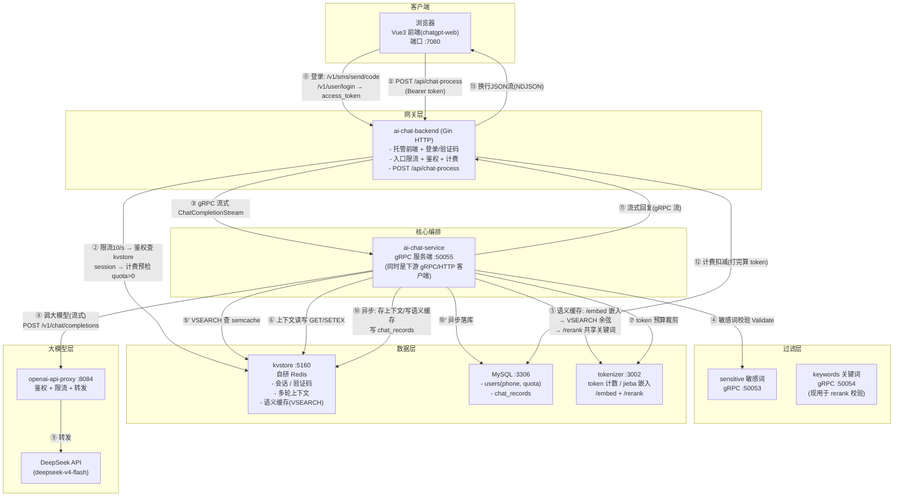

---

## 2. 完整时序图（含登录 + 语义缓存分支）

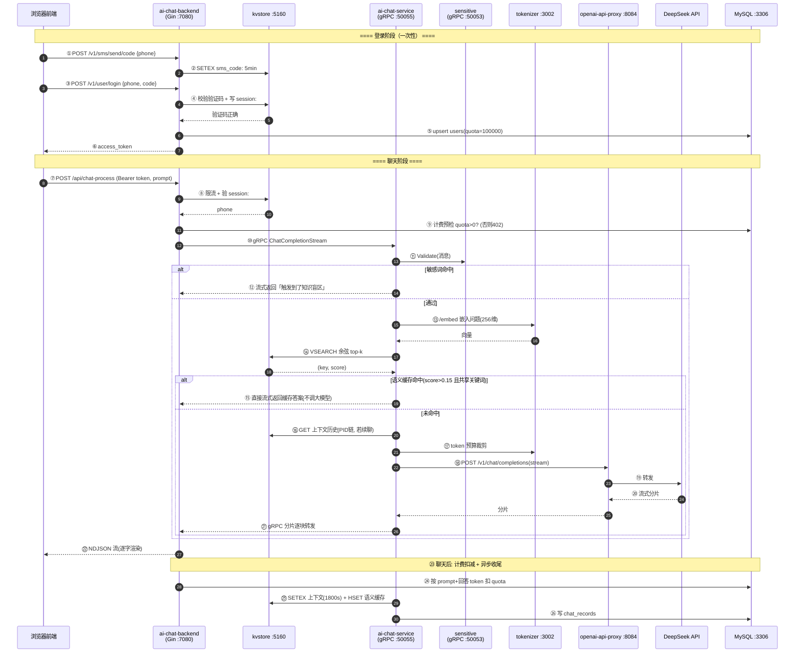

---

## 3. 分步详解

### 3.0 登录（新增，前端 → backend → kvstore/MySQL）

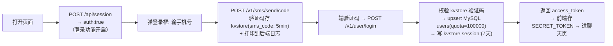

- 前端 `needPermission = session.auth && !token`：auth 开启且无 token → 弹登录框
- 验证码本地无短信商，打印到 `ai-chat-backend/runtime/logs/app.log`

### 3.1 前端发消息（浏览器 → backend）

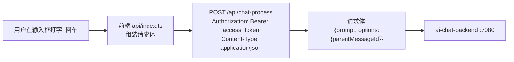

- `parentMessageId` 为空 = 新对话；有值 = 多轮续聊
- Authorization 头携带登录拿到的 access_token

### 3.2 backend 协议转换（限流 → 鉴权 → 计费 → gRPC）

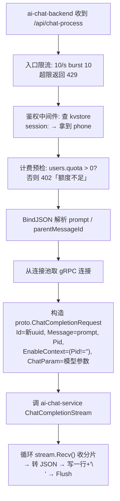

- 限流/鉴权/计费都在 backend（HTTP 网关层），请求到 ai-chat-service 前已完成
- 鉴权是**每次请求**验凭证 + 认人（计费要扣到具体 phone）

### 3.3 ai-chat-service 入口（鉴权 + 敏感词）

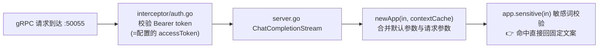

### 3.4 敏感词（内容安全）

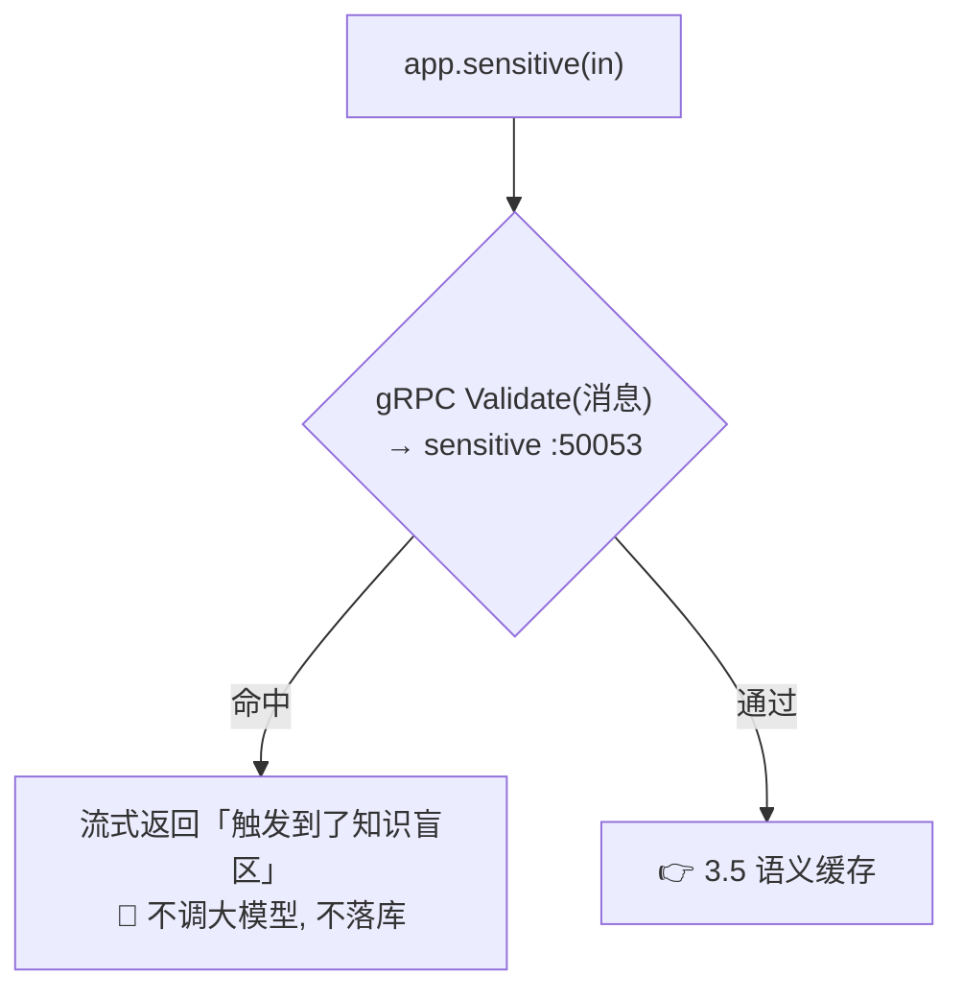

> 词库：sensitive 用 `dict.txt`（50053），keywords 用 `keyword-dict.txt`（50054），AC 自动机。

### 3.5 语义缓存（kvstore VSEARCH + jieba，命中就"抄答案"）

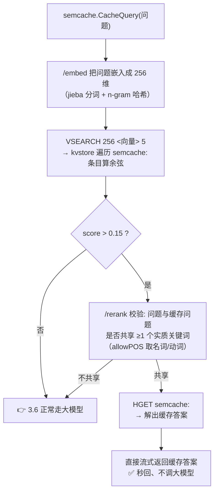

- 缓存条目 `semcache:<fnv32哈希>`，HSET 存二进制记录 `{问题, 答案, 256维向量}`
- **共享关键词门禁**防误命中：jieba 稀疏嵌入下无关问题可能分数反超，须"分数达标 + 共享实词"双条件
- 聊天后异步把本轮问答写入缓存（CacheWrite）

### 3.6 构建上下文 + token 预算（kvstore + tokenizer）

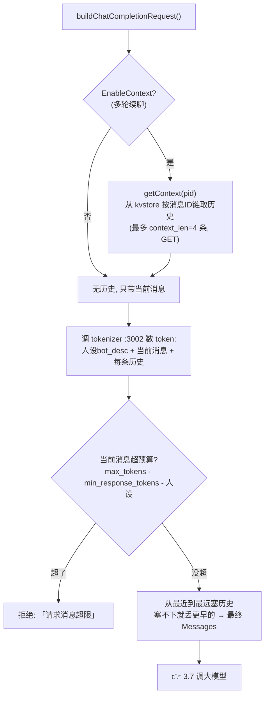

> 上下文 = 当前对话的**短期记忆**（存 kvstore，30 分钟 TTL）；语义缓存 = 跨对话的**问答复用**（长期）。

### 3.7 调大模型（真实 DeepSeek）

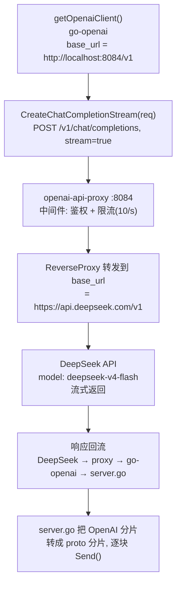

- 模型名 `deepseek-v4-flash`（proxy 的 `chat.api_keys` 是真实 key）
- 之前 mock(8083) 已废弃；tokenizer 需把模型加进 `support_models` 才能数 token

> **openai-api-proxy 的角色定位**
> 单实例本地部署下，proxy 功能上**冗余**（ai-chat-service 改 `base_url` 就能直连 DeepSeek，backend 已做了用户鉴权+限流，proxy 的静态 token 鉴权与 10/s 限流只是第二层）。但它的价值：
> - **集中管真实 key**：真 DeepSeek key 只在 proxy 配置，ai-chat-service 用假 token，服务不碰真 key（"钥匙保管箱"）
> - **供应商适配层**：换模型/厂商只改 proxy 的 `base_url`+`api_keys`，编排服务零改动（mock → DeepSeek → 将来其他）
> - **扩展挂载点**：将来可加重试、超时、多 key 轮换、按模型成本统计、调用日志，都不用动 service
> - **LLM 调用边界兜底**：就算 backend 限流被绕过，proxy 在"花钱的 API 调用"这层再兜一道

### 3.8 流式回复回到客户端

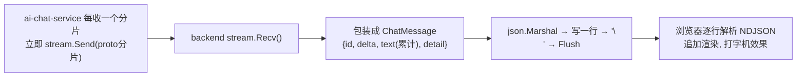

### 3.9 计费 + 异步收尾（不阻塞回复）

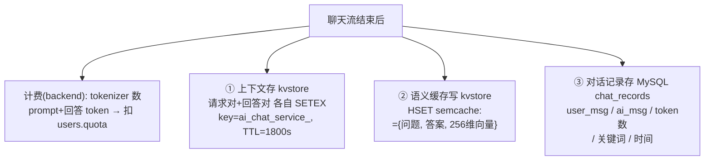

- 上下文/语义缓存/记录各自独立异步，互不影响
- **kvstore 管临时（会话/上下文/缓存），MySQL 管永久（用户额度/聊天历史）**

---

## 4. 回答路径速览（用户视角）

| 路径            | 触发条件                    | 耗时/成本  | 走过哪些节点                                                                             |
| --------------- | --------------------------- | ---------- | ---------------------------------------------------------------------------------------- |
| ① 敏感词拦截   | 消息命中敏感词              | 最快       | 前端→backend→service→sensitive→回                                                    |
| ② 语义缓存命中 | score>0.15 且共享实质关键词 | 秒回、免费 | 前端→backend→service→embed→VSEARCH→rerank→回                                       |
| ③ 大模型生成   | 都没命中                    | 慢、花钱   | 前端→backend→(限流/鉴权/计费)→service→(kvstore上下文/tokenizer)→proxy→DeepSeek→回 |

---

## 5. kvstore 与 MySQL 的分工

|            | kvstore :5160                           | MySQL :3306             |
| ---------- | --------------------------------------- | ----------------------- |
| 验证码     | `sms_code:<phone>`（5 分钟）            | —                      |
| 会话       | `session:<token>`（7 天）               | —                      |
| 多轮上下文 | `ai_chat_service_<id>`（30 分钟）       | —                      |
| 语义缓存   | `semcache:<hash>`（长期，HSET+VSEARCH） | —                      |
| 用户额度   | —                                      | `users`(phone, quota)   |
| 聊天历史   | —                                      | `chat_records`（永久）  |
| 特性       | 内存 + AOF，快、可过期                  | 磁盘，永久、可 SQL 查询 |

- 语义缓存和聊天历史**都每次对话写**，但前者是"机器检索的问答对+向量"（加速），后者是"人查的完整记录"（留痕）
