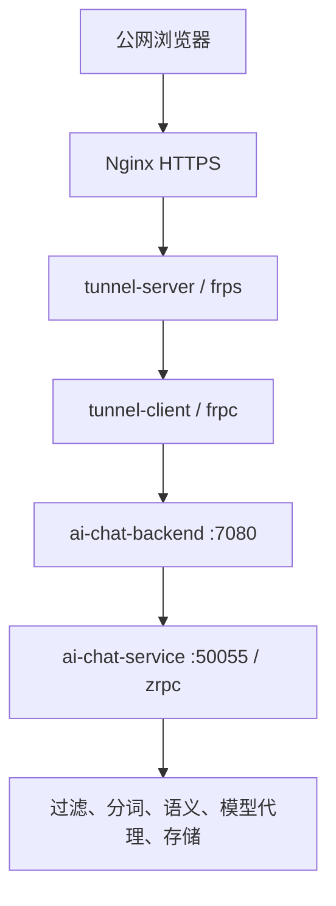

# ECHO-CHAT 结合 tunnel 的虚拟机公网部署实施方案

> 文档日期：2026-09-05  
> 适用仓库：[robotlover-1/ECHO-CHAT](https://github.com/robotlover-1/ECHO-CHAT)（`main` 分支）  
> tunnel 来源：用户提供的 `11.3-tunnel-master.zip`  
> 目标：将 ECHO-CHAT 部署在虚拟机或内网主机，通过 tunnel/FRP 安全暴露到公网，并支持流式聊天、域名和 HTTPS。

---

## 1. 结论与推荐路线

### 1.1 推荐结论

建议第一阶段采用下面的方式落地：

1. **ECHO-CHAT 应用节点**运行项目现有 Docker Compose，仅在本机暴露 `7080`。
2. **tunnel-client（frpc）**与 ECHO-CHAT 部署在同一台应用虚拟机，将 `127.0.0.1:7080` 映射到公网 tunnel-server。
3. **公网入口节点**运行 tunnel-server（frps）和 Nginx。
4. Nginx 监听 `80/443`、负责域名与 TLS，并把请求转发到 frps 的 HTTP 虚拟主机端口。
5. 公网只开放 `22`、`80`、`443` 和 frpc 控制连接端口；ECHO-CHAT 的 `7080`、内部 zrpc/RPC、MySQL、Redis、向量数据库均不暴露。

这一方案复用了 tunnel 项目的核心机制、FRP 0.62.1 镜像和配置模型，但不引入其管理控制面。对单个 ECHO-CHAT 实例而言，这是依赖最少、最容易排障、风险最低的方案。

### 1.2 为什么不建议第一阶段直接部署 tunnel 全平台

对源码检查后，`11.3-tunnel-master` 中的 tunnel 并非单独的 frpc 工具，而是一套动态管理平台：

- `cmd/tunnel`：Web/API 管理端；
- `cmd/gateway`：周期生成并部署 Nginx Gateway；
- `controller/deploy_k8s.go`：动态创建 frps Deployment、ConfigMap 和 NodePort Service；
- `nginx-gateway/nginx_gateway_k8s.go`：动态创建 Nginx DaemonSet 和 Service；
- 依赖 Kubernetes、MySQL、Redis、阿里云 DNS API；
- 鉴权依赖外部 `user` 服务；
- 每个用户动态分配 39000～49000 范围内的端口。

若只是让一个 ECHO-CHAT 实例可公网访问，直接引入上述依赖会显著增加部署和安全成本。完整 tunnel 平台适合第二阶段的“多用户、多应用、动态创建隧道”场景。

---

## 2. 已核对的项目现状

### 2.1 ECHO-CHAT 对外入口

ECHO-CHAT 当前 Docker 方案已经把前端静态资源合入 `ai-chat-backend` 镜像：

- `docker/backend.Dockerfile` 构建 `ai-chat-web`，并复制到 `/app/www`；
- `ai-chat-backend` 同时提供前端页面和 `/api/*`；
- Compose 将宿主机 `7080` 映射到容器 `7080`；
- 前端生产配置使用相对路径 `VITE_GLOB_API_URL=/api`；
- 聊天接口为 `POST /api/chat-process`，以流式响应持续输出。

因此 tunnel **只需代理 ECHO-CHAT 的统一入口 `7080`**。不要分别暴露前端、`ai-chat-service:50055`、tokenizer、semantic、keyword、sensitive、proxy、kvstore 等内部端口。

### 2.2 ECHO-CHAT 内部调用关系



这里的 zrpc 是 ECHO-CHAT 内部服务间协议，与公网 tunnel 是两个不同层次：

- zrpc 负责应用内部 RPC；
- tunnel/FRP 负责把 HTTP 入口穿透到公网；
- 不需要修改 zrpc 帧格式，也不应让 zrpc 端口直接暴露到公网。

### 2.3 tunnel 的配置生成方式

tunnel 源码生成的 FRP YAML 主要字段如下：

- 服务端：`bindPort`、`vhostHTTPPort`、`auth.method`、`auth.token`；
- 客户端：`serverAddr`、`serverPort`、`auth`、`proxies`；
- HTTP 应用代理：`type: http`、`localIP`、`localPort`、`customDomains`；
- SSH 应用代理：`type: tcpmux`、`multiplexer: httpconnect`。

本方案沿用这套字段，避免配置格式偏离现有 tunnel 项目。

---

## 3. 部署拓扑与适用条件

### 3.1 推荐双节点拓扑

| 节点 | 网络条件 | 部署内容 | 公开端口 |
| --- | --- | --- | --- |
| 公网入口虚拟机 | 有固定公网 IPv4；域名可解析到它 | Nginx、frps | `22`、`80`、`443`、`39000` |
| ECHO-CHAT 应用虚拟机 | 可在内网、NAT 后或仅能主动出网 | ECHO-CHAT Compose、frpc、MySQL（或外部 MySQL） | 不需要公网入站 |

建议规格：

- 公网入口 VM：1～2 vCPU、1～2 GB RAM、20 GB 磁盘；
- 应用 VM：至少 4 vCPU、8 GB RAM、40 GB 磁盘；若本地运行语义模型，建议 8～16 GB RAM；
- 操作系统：Ubuntu 22.04/24.04 LTS x86_64；
- Docker Engine 24+，Docker Compose v2；
- 域名示例：`chat.example.com`；
- 公网 IP 示例：`203.0.113.10`。示例值必须替换为真实值。

### 3.2 单台公网虚拟机的处理

如果 ECHO-CHAT 与公网入口都在同一台、且该 VM 已有公网 IP，技术上无需内网穿透。仍要展示 tunnel 时，可以让 frpc 连接本机 frps，但会增加一次转发，主要用于演示，不建议作为生产必需链路。

单机演示时：

- ECHO-CHAT 监听 `127.0.0.1:7080`；
- frpc 的 `serverAddr` 可使用 Docker 服务名 `frps`，或宿主机网关；
- Nginx、frps、frpc 放入同一 Compose 网络；
- 生产文档和网络图仍按逻辑上的“入口节点/应用节点”区分。

---

## 4. 目录与代码改造建议

在 ECHO-CHAT 仓库新增以下内容：

```text
deploy/
├── app/
│   ├── compose.override.yaml
│   ├── .env.example
│   └── tunnel/
│       └── frpc.yaml
├── edge/
│   ├── compose.yaml
│   ├── .env.example
│   ├── tunnel/
│   │   └── frps.yaml
│   └── nginx/
│       └── echo-chat.conf
└── scripts/
    ├── deploy-app.sh
    ├── deploy-edge.sh
    └── smoke-test.sh
```

同时修改：

1. `docker/compose.yaml`：不要把 `7080` 绑定到所有网卡；改为仅绑定回环地址。
2. `docker/config/*.yaml`：移除源码中的真实密钥和密码，改成部署时生成的文件或环境变量模板。
3. `ai-chat-backend`：补充可信代理配置或至少正确处理 `X-Forwarded-Proto`、`X-Forwarded-For`。
4. Nginx：关闭响应缓冲，确保 `/api/chat-process` 流式响应不被积压。
5. tunnel：第一阶段不调用其 K8s 动态部署 API，直接使用 FRP YAML。

---

## 5. 第一阶段：推荐的可执行部署方案

## 5.1 准备域名与网络

在 DNS 服务商创建记录：

```text
类型: A
主机记录: chat
记录值: <公网入口VM的IPv4>
TTL: 600
```

等待解析生效：

```bash
dig +short chat.example.com
```

结果必须等于公网入口 VM 的 IP。

云安全组/宿主机防火墙建议：

| 端口 | 来源 | 用途 |
| --- | --- | --- |
| TCP 22 | 管理员固定 IP | SSH 管理 |
| TCP 80 | `0.0.0.0/0` | HTTP 跳转、ACME 验证 |
| TCP 443 | `0.0.0.0/0` | ECHO-CHAT HTTPS |
| TCP 39000 | 最好限制为应用 VM 的出口 IP | frpc 到 frps 控制/数据连接 |
| TCP 7080 | 不开放 | ECHO-CHAT 本地入口 |
| TCP 39001 | 不对公网开放 | frps HTTP 虚拟主机端口，仅供本机 Nginx 使用 |
| TCP 3306/5160/50055/3002/3003/50053/50054/8084 | 不开放 | 内部依赖 |

Ubuntu UFW 示例：

```bash
sudo ufw default deny incoming
sudo ufw default allow outgoing
sudo ufw allow from <ADMIN_IP> to any port 22 proto tcp
sudo ufw allow 80/tcp
sudo ufw allow 443/tcp
sudo ufw allow from <APP_VM_EGRESS_IP> to any port 39000 proto tcp
sudo ufw enable
sudo ufw status verbose
```

> 如果应用 VM 的出口 IP 不固定，可暂时开放 `39000/tcp`，但必须使用高强度随机 token，并结合 fail2ban、日志告警和定期轮换。

## 5.2 生成部署密钥

在可信终端生成，不要把值提交到 Git：

```bash
openssl rand -hex 32
```

将结果作为 `FRP_AUTH_TOKEN`。再分别生成数据库密码、内部 RPC token、应用密钥。不同用途必须使用不同值。

建议建立 `.env`：

```dotenv
PUBLIC_DOMAIN=chat.example.com
FRP_SERVER_ADDR=203.0.113.10
FRP_BIND_PORT=39000
FRP_VHOST_HTTP_PORT=39001
FRP_AUTH_TOKEN=<64位随机十六进制字符串>
DEEPSEEK_API_KEY=<真实API密钥>
MYSQL_PASSWORD=<随机数据库密码>
```

`.env` 文件权限：

```bash
chmod 600 .env
```

## 5.3 公网入口 VM：部署 frps

`deploy/edge/tunnel/frps.yaml`：

```yaml
bindAddr: 0.0.0.0
bindPort: 39000

# HTTP 虚拟主机只供本机 Nginx 访问。
vhostHTTPPort: 39001

auth:
  method: token
  token: "REPLACE_WITH_RANDOM_TOKEN"

transport:
  tcpMux: true
  maxPoolCount: 5

webServer:
  addr: 127.0.0.1
  port: 7500
  user: "frpadmin"
  password: "REPLACE_WITH_ANOTHER_RANDOM_PASSWORD"

log:
  to: console
  level: info
  maxDays: 7
```

与 tunnel 源码相比，这里做了两项安全收紧：

- Dashboard 仅监听 `127.0.0.1`；
- `vhostHTTPPort` 通过容器端口绑定限制在宿主机回环地址。

`deploy/edge/compose.yaml`：

```yaml
name: echo-chat-edge

services:
  frps:
    image: quay.io/0voice/tunnel-server:0.62.1
    restart: unless-stopped
    command: ["-c", "/app/config.yaml"]
    volumes:
      - ./tunnel/frps.yaml:/app/config.yaml:ro
    ports:
      - "39000:39000"
      - "127.0.0.1:39001:39001"
      - "127.0.0.1:7500:7500"
    healthcheck:
      test: ["CMD-SHELL", "wget -qO- http://127.0.0.1:7500/ >/dev/null || exit 1"]
      interval: 15s
      timeout: 3s
      retries: 5

  nginx:
    image: nginx:1.27-alpine
    restart: unless-stopped
    network_mode: host
    volumes:
      - ./nginx/echo-chat.conf:/etc/nginx/conf.d/echo-chat.conf:ro
      - /etc/letsencrypt:/etc/letsencrypt:ro
      - /var/www/certbot:/var/www/certbot:ro
    depends_on:
      - frps
```

> 注意：不同 FRP 镜像的二进制入口可能是 `frps`、`/app/frps` 或已在镜像 ENTRYPOINT 中定义。首次部署前执行 `docker image inspect quay.io/0voice/tunnel-server:0.62.1` 验证。若该镜像不可拉取，使用官方 `snowdreamtech/frps:0.62.1` 或从固定源码版本自建镜像，并保持客户端/服务端版本一致。

启动 frps：

```bash
cd /opt/echo-chat-edge
docker compose config
docker compose up -d frps
docker compose ps
docker compose logs --tail=100 frps
ss -lntp | grep -E '39000|39001|7500'
```

期望：

- `0.0.0.0:39000` 可见；
- `127.0.0.1:39001`、`127.0.0.1:7500` 可见；
- frps 日志没有 YAML 字段错误或 token 初始化错误。

## 5.4 应用 VM：部署 ECHO-CHAT

克隆并初始化子模块：

```bash
git clone https://github.com/robotlover-1/ECHO-CHAT.git
cd ECHO-CHAT
git submodule update --init --recursive
```

### 5.4.1 MySQL

当前 `docker/compose.yaml` 假设 MySQL 位于宿主机 `3306`，容器通过 `host.docker.internal` 访问。应用 VM 上可安装 MySQL 8：

```sql
CREATE DATABASE ai_chat CHARACTER SET utf8mb4 COLLATE utf8mb4_unicode_ci;
CREATE USER 'echo_chat'@'%' IDENTIFIED BY '<STRONG_PASSWORD>';
GRANT ALL PRIVILEGES ON ai_chat.* TO 'echo_chat'@'%';
FLUSH PRIVILEGES;
```

把 `docker/config/backend.yaml` 和 `docker/config/service.yaml` 中的 DSN 改成专用账号，不使用 root：

```yaml
mysql:
  dsn: "echo_chat:<STRONG_PASSWORD>@tcp(host.docker.internal:3306)/ai_chat?collation=utf8mb4_unicode_ci&charset=utf8mb4&parseTime=true"
```

更好的长期方式是在 Compose 中加入 MySQL，并使用 Docker Secret 或只读配置文件注入凭据。

### 5.4.2 仅在本机暴露 7080

把 ECHO-CHAT `docker/compose.yaml` 中：

```yaml
ports:
  - "7080:7080"
```

改为：

```yaml
ports:
  - "127.0.0.1:7080:7080"
```

这样即使云安全组误开放，公网也不能绕过 Nginx/tunnel 直接访问应用。

### 5.4.3 启动

```bash
cd ECHO-CHAT/docker
export DEEPSEEK_API_KEY='<YOUR_KEY>'
docker compose config >/tmp/echo-chat-compose.rendered.yaml
docker compose build
docker compose up -d
docker compose ps
curl -fsS http://127.0.0.1:7080/api/health
```

再验证前端：

```bash
curl -I http://127.0.0.1:7080/
curl -sS -X POST http://127.0.0.1:7080/api/config \
  -H 'Content-Type: application/json' -d '{}'
```

只有本地健康检查通过后再启动 frpc。

## 5.5 应用 VM：部署 frpc

`deploy/app/tunnel/frpc.yaml`：

```yaml
serverAddr: 203.0.113.10
serverPort: 39000

auth:
  method: token
  token: "REPLACE_WITH_THE_SAME_RANDOM_TOKEN"

transport:
  protocol: tcp
  tcpMux: true
  poolCount: 2
  heartbeatInterval: 30
  heartbeatTimeout: 90
  tls:
    enable: true

loginFailExit: false

log:
  to: console
  level: info
  maxDays: 7

proxies:
  - name: echo-chat-web
    type: http
    localIP: 127.0.0.1
    localPort: 7080
    customDomains:
      - chat.example.com
```

frpc Compose：

```yaml
services:
  frpc:
    image: quay.io/0voice/tunnel-client:0.62.1
    restart: unless-stopped
    network_mode: host
    command: ["-c", "/app/config.yaml"]
    volumes:
      - ./tunnel/frpc.yaml:/app/config.yaml:ro
    depends_on:
      - ai-chat-backend
```

这里采用 `network_mode: host`，因此 `localIP: 127.0.0.1` 能访问应用 VM 宿主机映射的 `7080`。如果 frpc 加入 ECHO-CHAT Compose 默认网络，则改成：

```yaml
localIP: ai-chat-backend
localPort: 7080
```

并删除 `network_mode: host`。两种模式只能选一种，推荐同一 Compose 网络模式，以减少对宿主网络的依赖。

启动并检查：

```bash
docker compose up -d frpc
docker compose logs --tail=100 frpc
```

期望日志包含成功登录和 `echo-chat-web` proxy 启动成功。

## 5.6 公网入口 VM：配置 Nginx

Nginx 不能直接使用 tunnel 项目中当前的简化模板。该模板只有 `proxy_pass`，没有流式响应、真实客户端 IP、超时、TLS 和安全响应头配置。ECHO-CHAT 的聊天接口会长时间流式输出，必须关闭缓冲。

先用 HTTP 配置申请证书：

```nginx
server {
    listen 80;
    listen [::]:80;
    server_name chat.example.com;

    location /.well-known/acme-challenge/ {
        root /var/www/certbot;
    }

    location / {
        return 301 https://$host$request_uri;
    }
}
```

获取证书后使用完整配置 `deploy/edge/nginx/echo-chat.conf`：

```nginx
limit_req_zone $binary_remote_addr zone=echo_api:10m rate=10r/s;

server {
    listen 80;
    listen [::]:80;
    server_name chat.example.com;

    location /.well-known/acme-challenge/ {
        root /var/www/certbot;
    }

    location / {
        return 301 https://$host$request_uri;
    }
}

server {
    listen 443 ssl http2;
    listen [::]:443 ssl http2;
    server_name chat.example.com;

    ssl_certificate /etc/letsencrypt/live/chat.example.com/fullchain.pem;
    ssl_certificate_key /etc/letsencrypt/live/chat.example.com/privkey.pem;
    ssl_protocols TLSv1.2 TLSv1.3;
    ssl_session_cache shared:SSL:10m;
    ssl_session_timeout 1d;

    client_max_body_size 2m;

    add_header X-Content-Type-Options nosniff always;
    add_header Referrer-Policy strict-origin-when-cross-origin always;
    add_header X-Frame-Options SAMEORIGIN always;
    add_header Strict-Transport-Security "max-age=31536000" always;

    location /api/ {
        limit_req zone=echo_api burst=30 nodelay;

        # 必须把原始 Host 传给 frps，frps 依赖 Host 选择 customDomains。
        proxy_set_header Host $host;
        proxy_set_header X-Real-IP $remote_addr;
        proxy_set_header X-Forwarded-For $proxy_add_x_forwarded_for;
        proxy_set_header X-Forwarded-Proto https;

        proxy_http_version 1.1;
        proxy_set_header Connection "";

        # ECHO-CHAT 为流式响应，禁止缓存和代理缓冲。
        proxy_buffering off;
        proxy_cache off;
        gzip off;
        add_header X-Accel-Buffering no;

        proxy_connect_timeout 10s;
        proxy_send_timeout 600s;
        proxy_read_timeout 600s;

        proxy_pass http://127.0.0.1:39001;
    }

    location / {
        proxy_set_header Host $host;
        proxy_set_header X-Real-IP $remote_addr;
        proxy_set_header X-Forwarded-For $proxy_add_x_forwarded_for;
        proxy_set_header X-Forwarded-Proto https;
        proxy_http_version 1.1;
        proxy_set_header Connection "";
        proxy_connect_timeout 10s;
        proxy_read_timeout 60s;
        proxy_pass http://127.0.0.1:39001;
    }
}
```

验证并热加载：

```bash
docker compose exec nginx nginx -t
docker compose exec nginx nginx -s reload
curl -I https://chat.example.com/
curl -fsS https://chat.example.com/api/health
```

## 5.7 TLS 证书

可采用 Certbot：

```bash
sudo apt-get update
sudo apt-get install -y certbot
sudo mkdir -p /var/www/certbot
sudo certbot certonly --webroot \
  -w /var/www/certbot \
  -d chat.example.com \
  --email <ADMIN_EMAIL> \
  --agree-tos --no-eff-email
```

自动续期后重新加载 Nginx：

```bash
sudo certbot renew --dry-run
```

可在 `/etc/letsencrypt/renewal-hooks/deploy/reload-echo-nginx.sh` 中调用：

```bash
#!/usr/bin/env bash
docker compose -f /opt/echo-chat-edge/compose.yaml exec -T nginx nginx -s reload
```

---

## 6. ECHO-CHAT 与 tunnel 的关键配置映射

| ECHO-CHAT 项 | tunnel/frpc 项 | 公网入口项 | 说明 |
| --- | --- | --- | --- |
| `ai-chat-backend:7080` | `localIP/localPort` | Nginx → frps `39001` | 唯一公网业务入口 |
| 前端 `/api` | 不改写 | 保留 URI 原样 | 前端生产配置已使用 `/api` |
| `POST /api/chat-process` | HTTP proxy | `proxy_buffering off` | 支持流式回复 |
| 请求 `Host` | `customDomains` | `proxy_set_header Host $host` | frps 根据 Host 路由 |
| `ai-chat-service:50055` | 不配置 | 不开放 | 内部 zrpc 服务 |
| tokenizer/semantic/filter | 不配置 | 不开放 | 内部服务 |
| MySQL/kvstore/vectorDB | 不配置 | 不开放 | 数据服务不得穿透公网 |

---

## 7. 第二阶段：保留 tunnel Web 管理平台的完整接入

当目标升级为“通过 tunnel 页面新增 ECHO-CHAT 应用，自动创建 frps、域名和网关”时，再部署完整控制面。

### 7.1 必要组件

| 组件 | 用途 |
| --- | --- |
| Kubernetes 1.27+ | tunnel 动态创建 frps Deployment/Service 和 Nginx DaemonSet |
| MySQL 8 | `tunnel_server`、`tunnel_app`、`tunnel_addr`、`tunnel_port_range` |
| Redis | HTTP 域名路由缓存和 Gateway 部署状态 |
| tunnel API/Web | 应用新增、修改、发布 |
| gateway cron | 根据 Redis 缓存生成 Nginx 配置并部署 |
| 用户中心 | 校验 Bearer token，返回用户 ID |
| DNS API | 自动创建应用子域名 A 记录 |

### 7.2 推荐配置

`tunnel/dev.config.yaml` 应改为：

```yaml
http:
  ip: 0.0.0.0
  port: 8081
  mode: release

dependOnServices:
  user:
    address: "https://user.example.com"

mysql:
  dsn: "tunnel:<PASSWORD>@tcp(mysql.tunnel.svc.cluster.local:3306)/tunnel?collation=utf8mb4_unicode_ci&charset=utf8mb4&parseTime=true"
  maxLifeTime: 3600
  maxOpenConn: 20
  maxIdleConn: 10

redis:
  host: redis.tunnel.svc.cluster.local
  port: 6379
  pwd: "<REDIS_PASSWORD>"

log:
  level: info
  logPath: runtime/logs/app.log

tunnelServer:
  ip: <PUBLIC_IP>
  minPort: 39000
  maxPort: 49000
  image: quay.io/0voice/tunnel-server:0.62.1
  appName: tunnel-server
  configName: /app/config.yaml
  replicas: 1
  namespace: tunnel

tunnelClient:
  image: quay.io/0voice/tunnel-client:0.62.1
  appName: tunnel-client
  configName: /app/config.yaml
  rootDomain: tunnel.example.com

aliYunDomain:
  accessKeyID: "${ALIYUN_ACCESS_KEY_ID}"
  accessKeySecret: "${ALIYUN_ACCESS_KEY_SECRET}"
  rootDomain: example.com
  endpoint: alidns.cn-hangzhou.aliyuncs.com

nginxGateway:
  image: nginx:1.27-alpine
  appName: tunnel-gateway
  configPath: /etc/nginx/conf.d
  port: 30080
  namespace: tunnel
```

### 7.3 创建 ECHO-CHAT 应用

tunnel API 接收表单参数：

```bash
curl -X POST 'https://tunnel-admin.example.com/api/v1/app' \
  -H 'Authorization: Bearer <USER_ACCESS_TOKEN>' \
  -H 'Content-Type: application/x-www-form-urlencoded' \
  --data-urlencode 'name=echo-chat' \
  --data-urlencode 'type=http' \
  --data-urlencode 'local_ip=127.0.0.1' \
  --data-urlencode 'local_port=7080'
```

然后发布：

```bash
curl -X POST 'https://tunnel-admin.example.com/api/v1/app/deploy' \
  -H 'Authorization: Bearer <USER_ACCESS_TOKEN>'
```

返回内容中的 `client_config` 写入应用 VM 的 frpc 配置文件，再启动 tunnel-client。

### 7.4 完整平台必须修复的问题

在用于生产前至少完成以下修改：

1. **删除明文凭据**：源码配置中存在云 DNS、数据库、RPC、模型或数据服务凭据痕迹，全部撤销并轮换。
2. **禁止日志打印 Bearer token**：`middleware/auth.go` 当前打印 token，必须删除。
3. **修正 NodePort 范围**：示例使用 `8081`、`9080` 作为 NodePort，而 Kubernetes 默认范围是 `30000-32767`。不要为了示例扩大整个集群范围；改用合法 NodePort、Ingress 或 LoadBalancer。
4. **避免端口大范围暴露**：动态 `39000-49000` 不应整体对互联网放行。HTTP 业务只公开 Gateway 的 `80/443`；frps 控制端口按客户端来源限制。
5. **补充数据库约束**：`tunnel_addr(ip, port)` 建议使用唯一索引，避免并发分配重复。
6. **修复端口游标更新**：更新 `tunnel_port_range` 时应写入当前时间，而不是可能为零的 `portRange.UpdateAt`。
7. **补充事务边界**：配置生成会逐条更新 app，后续 DNS/K8s 失败时可能留下半完成状态，应改成状态机并支持幂等重试。
8. **修正 HTTPS 语义**：frps 配置只有 `vhostHTTPPort`，实际是 HTTP。`EntryDomain` 标为 `https://` 必须由外层 Gateway 终止 TLS，且应明确 `http://frps:port` 的内部上游。
9. **升级 Nginx 模板**：增加 Host、真实 IP、超时、流式缓冲关闭、TLS 和安全头。
10. **限制 RBAC**：现有 Role 可创建/更新 Deployment、DaemonSet、Service、ConfigMap；应限定 namespace，并增加资源名或 admission policy。
11. **镜像固定 digest**：不能只使用可变 tag；为 tunnel、frps、frpc、Nginx 固定镜像摘要并执行漏洞扫描。
12. **外部用户中心解耦**：若没有 `user.example.com`，必须实现本地鉴权或静态管理员模式，否则所有 `/api/v1/*` 均无法正常使用。
13. **域名策略**：优先使用 `*.tunnel.example.com` 通配 DNS 和通配证书，减少每次发布都调用 DNS API。
14. **配置校验**：发布前调用 frps/frpc verify 命令，错误配置不得进入 K8s。

### 7.5 对 tunnel Nginx Gateway 的建议改造

建议把当前字符串拼接模板升级为 Go `text/template`，至少生成：

```nginx
server {
    listen 80;
    server_name {{ .Domain }};

    location / {
        proxy_http_version 1.1;
        proxy_set_header Host $host;
        proxy_set_header X-Real-IP $remote_addr;
        proxy_set_header X-Forwarded-For $proxy_add_x_forwarded_for;
        proxy_set_header X-Forwarded-Proto $scheme;
        proxy_buffering off;
        proxy_read_timeout 600s;
        proxy_send_timeout 600s;
        proxy_pass {{ .Upstream }};
    }
}
```

同时对 `.Domain` 和 `.Upstream` 做白名单校验，防止通过数据库内容注入非法 Nginx 指令。

---

## 8. 安全整改清单

源码检查发现配置文件中包含疑似真实的以下信息：

- 阿里云 DNS AccessKey；
- 模型/API key；
- MySQL/Redis 默认密码；
- 内部 RPC access token；
- 向量数据库地址、用户名和密码。

由于这些值已经进入源码/压缩包，**仅从最新文件删除并不够**。上线前应：

1. 在对应平台立即撤销并重建密钥；
2. 检查 Git 历史、镜像层、CI 日志和发布包；
3. 用 `git filter-repo` 或 BFG 清理历史后强制更新，但仍以轮换为首要措施；
4. 使用环境变量、Docker Secret、Kubernetes Secret 或云密钥服务；
5. 应用启动日志不得输出完整配置对象，因为当前部分服务可能打印配置；
6. 为公网登录/API 添加速率限制、审计日志和失败告警；
7. 数据库只允许来自应用网络的连接；
8. 备份数据库并测试恢复；
9. 定期更新基础镜像和依赖；
10. 禁止在公网开放 frps Dashboard。

生产环境建议把配置拆成：

- 可提交：端口、服务名、超时等非敏感模板；
- 不可提交：token、密码、API key、证书私钥；
- 运行时渲染：由 CI/CD 或部署脚本把 Secret 注入最终配置。

---

## 9. 健康检查、验收与故障定位

### 9.1 分层验收顺序

不要直接从公网页面开始排查，应按下面顺序逐层验证：

1. 应用 VM 本机访问 ECHO-CHAT；
2. frpc 登录 frps；
3. 公网入口本机通过 Host 访问 frps vhost；
4. Nginx HTTP；
5. Nginx HTTPS；
6. 登录、普通 API；
7. 长文本流式聊天；
8. 断线重连与服务重启。

### 9.2 检查命令

应用 VM：

```bash
curl -fsS http://127.0.0.1:7080/api/health
docker compose ps
docker compose logs --tail=100 ai-chat-backend ai-chat-service frpc
```

公网入口 VM，绕过 Nginx直接验证 frps 的 Host 路由：

```bash
curl -v -H 'Host: chat.example.com' http://127.0.0.1:39001/api/health
```

公网端到端：

```bash
curl -v https://chat.example.com/api/health
curl -sS -X POST https://chat.example.com/api/config \
  -H 'Content-Type: application/json' -d '{}'
```

### 9.3 流式接口验收

用浏览器开发者工具检查 `/api/chat-process`：

- 响应应持续收到 chunk，而不是结束时一次性返回；
- 首字节时间合理；
- Nginx 响应没有缓冲；
- 请求中途取消后，后端能感知 context cancel，并释放上游模型调用；
- 运行 5～10 分钟的响应不会被 60 秒超时截断。

命令行可以使用 `curl -N`：

```bash
curl -N 'https://chat.example.com/api/chat-process' \
  -H 'Content-Type: application/json' \
  -H 'Authorization: <LOGIN_RETURNED_TOKEN>' \
  --data '{"prompt":"请分步骤解释红黑树的插入过程","options":{}}'
```

### 9.4 常见故障

| 现象 | 优先检查 | 处理 |
| --- | --- | --- |
| frpc 一直重连 | `39000` 防火墙、token、服务端地址 | 核对安全组和两端 token，检查 frps 日志 |
| frps 返回 404 | Host 与 `customDomains` 不一致 | Nginx 必须传递原始 `$host` |
| 502 Bad Gateway | frpc 未注册、应用 `7080` 不通 | 从 frpc 所在网络访问目标地址 |
| 页面打开但 API 失败 | `/api` 被错误 rewrite | 保留 URI，不要删掉 `/api` 前缀 |
| 回复最后一次性出现 | Nginx/中间 CDN 缓冲 | `proxy_buffering off`、`X-Accel-Buffering: no`，检查 CDN |
| 60 秒后中断 | Nginx/CDN/LB 超时 | 将读写超时提高到 600 秒，并核对上游限制 |
| 登录循环或 401 | Authorization 头、应用 auth 配置 | 检查浏览器请求头与 backend 日志 |
| frps 能通但域名不通 | DNS/证书/Nginx server_name | 用 `dig`、`curl --resolve` 分层验证 |
| 容器内 `127.0.0.1:7080` 不通 | 网络命名空间错误 | 改用服务名或使用 host 网络 |

---

## 10. 可观测性与运维

最低限度应采集：

- Nginx：状态码、请求量、P95/P99 延迟、上游响应时间、499/502/504；
- frps/frpc：在线状态、重连次数、连接数、流量；
- ECHO-CHAT：健康状态、请求量、流式首包时间、完整响应时间、上游模型错误率；
- 主机：CPU、内存、磁盘、网络、容器重启次数；
- MySQL：连接数、慢查询、磁盘和备份状态。

日志中必须脱敏：

- `Authorization`；
- FRP token；
- API key；
- 用户输入中的敏感信息；
- 数据库 DSN。

建议告警：

- frpc 离线超过 1 分钟；
- 5 分钟内 502/504 超过 5%；
- 容器 10 分钟内重启 3 次；
- 磁盘使用率超过 80%；
- TLS 证书不足 14 天；
- MySQL 备份连续失败。

---

## 11. 发布、回滚与备份

### 11.1 发布顺序

1. 备份 MySQL；
2. 拉取固定 commit，不直接部署浮动 `main`；
3. 构建新镜像并记录 digest；
4. 在应用 VM 本机验证；
5. 更新 frpc；
6. 从公网入口绕过 Nginx验证 frps；
7. 更新 Nginx；
8. 端到端冒烟测试；
9. 观察 15～30 分钟再结束变更窗口。

### 11.2 回滚

- 保留上一版 ECHO-CHAT 镜像 digest 和配置；
- tunnel 配置每次修改前复制带时间戳的备份；
- Nginx 配置先 `nginx -t`，失败不得 reload；
- 数据库结构变更必须提供向下兼容窗口和回滚脚本；
- 回滚应用时通常无需修改域名和 TLS。

示例：

```bash
docker compose pull
docker compose up -d
# 失败时将 IMAGE_TAG/DIGEST 切回上一版，再执行：
docker compose up -d
```

---

## 12. 实施任务拆分

### P0：上线前必须完成

- [ ] 轮换源码中出现过的所有凭据；
- [ ] 确认公网域名和固定 IP；
- [ ] ECHO-CHAT `7080` 仅绑定 `127.0.0.1`；
- [ ] 公网 frps 使用随机 token；
- [ ] 部署 Nginx 与 HTTPS；
- [ ] Nginx 针对聊天接口关闭缓冲；
- [ ] 安全组只开放必要端口；
- [ ] 完成本地、隧道、HTTPS、流式聊天四层验收；
- [ ] 配置自动重启和日志轮转；
- [ ] 完成 MySQL 备份与恢复测试。

### P1：稳定性增强

- [ ] 镜像固定 digest；
- [ ] 增加 Prometheus/Grafana 监控；
- [ ] 增加 frpc 离线和 5xx 告警；
- [ ] 实现 Secret 注入，清除镜像层和日志中的敏感值；
- [ ] 增加 CI 中的配置校验、镜像扫描和冒烟测试；
- [ ] 增加限流、审计与 WAF/CDN 策略。

### P2：完整 tunnel 平台化

- [ ] 部署 Kubernetes、MySQL、Redis、用户中心；
- [ ] 修复 tunnel 源码问题；
- [ ] 使用通配 DNS/证书；
- [ ] 将 ECHO-CHAT 注册为 HTTP 应用；
- [ ] 自动下发 frpc 配置或接入安全配置分发；
- [ ] 增加租户隔离、配额、审计、回收和幂等发布。

---

## 13. 最终验收标准

满足以下条件才算完成：

1. 用户可通过 `https://chat.example.com` 打开前端；
2. HTTP 自动跳转 HTTPS，证书链有效；
3. 登录、会话、配置接口工作正常；
4. 聊天回复逐块输出，无明显缓冲；
5. 浏览器断开后，上游调用能够被取消；
6. 应用 VM 无需公网入站端口；
7. 公网无法直接访问 `7080`、内部 zrpc、MySQL、Redis和向量数据库；
8. frpc/frps 任意一端重启后能够自动恢复；
9. 日志不出现 token、密码、API key；
10. 监控能发现隧道离线、应用 5xx 和证书到期；
11. 数据库备份可恢复；
12. 有明确的上一版本镜像和配置回滚路径。

---

## 14. 方案边界

- 本方案以用户提供的 `11.3-tunnel-master.zip` 为 tunnel 实现依据；GitHub 当前 ECHO-CHAT 根目录未发现 `sources/` 目录。
- `zrpc-main.zip` 不参与公网穿透配置；ECHO-CHAT 当前仓库已经包含 zrpc 迁移相关实现和文档，公网只代理 HTTP 入口。
- 文档中的域名、公网 IP、token、密码均为占位符，部署时必须替换。
- FRP 镜像的具体 ENTRYPOINT 需要在目标 VM 上通过 `docker image inspect` 最终确认。
- 如果目标 VM 本身已有公网 IP 且无需穿透，生产环境可直接使用 Nginx → `127.0.0.1:7080`，tunnel 仅保留为教学或多网络环境演示。

