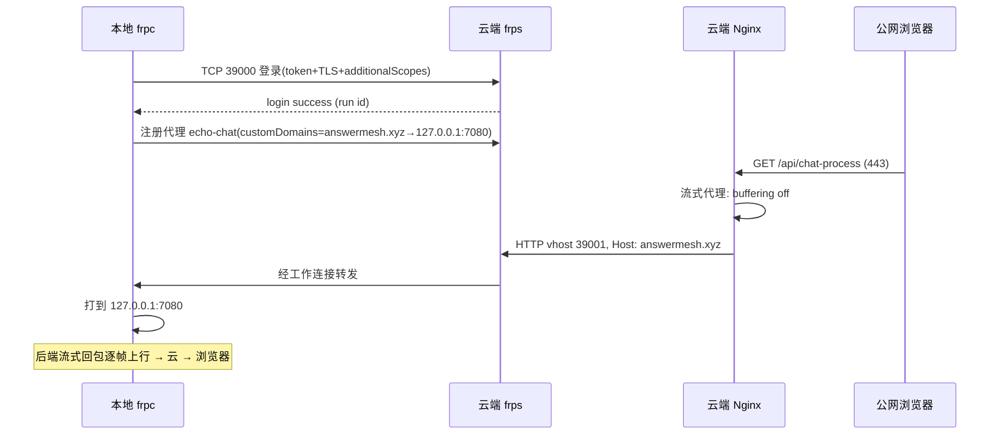
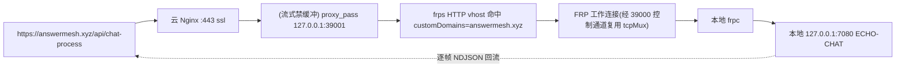
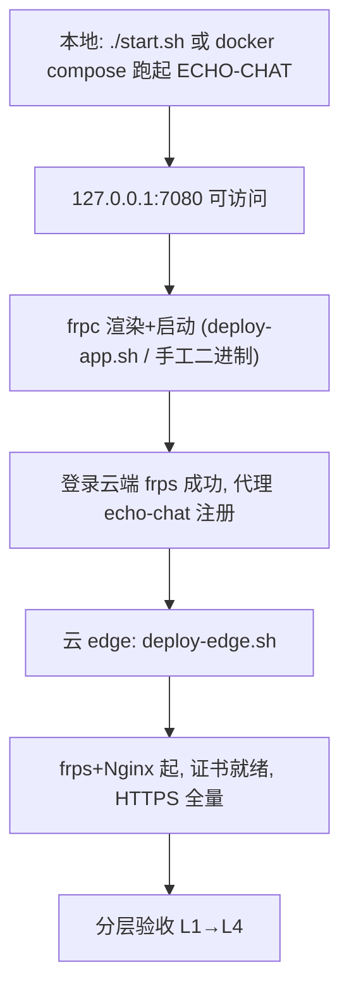
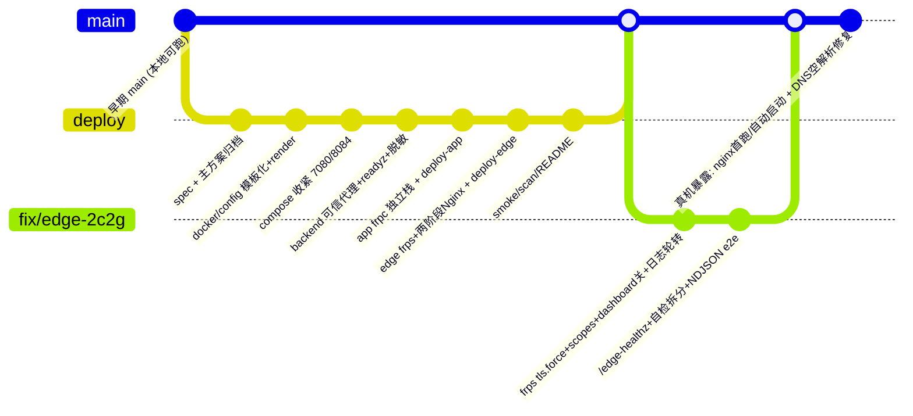

# ECHO-CHAT 基于 FRP 的内网穿透与公网部署 —— 技术路线与项目迭代

> 日期：2026-09-06
> 适用：`robotlover-1/ECHO-CHAT`（main）
> 本文讲清三件事：① 怎么用 FRP 把"只跑在本地的完整 ECHO-CHAT"安全暴露到公网；② FRP 在本项目里具体怎么配置/运转；③ 对原项目做了哪些迭代（仓库结构、配置模板化、后端最小改动、安全收紧、部署脚本），并附流程图与关键代码。

---

## 1. 为什么需要"内网穿透"，为什么选 FRP

ECHO-CHAT 是一个**全栈单体服务群**：Go 后端（ai-chat-backend/ai-chat-service/zrpc）、tokenizer、semantic、kvstore、proxy、MySQL、向量库等，通常跑在**本地或内网机器**上，监听 `127.0.0.1:7080`。它没有公网 IP / 路由器端口映射，公网用户进不来。

要对外提供访问，候选路线有三条：

| 路线 | 结论 | 原因 |
|---|---|---|
| 完整 tunnel 多用户管理平台（`11.3-tunnel-master`） | **不采用** | 它本质是 FRP 上层多租户平台：Web/API、K8s、动态分配子域、DNS 自动化、MySQL/Redis 状态库。本项目只有一个固定应用、固定域名，用不到，徒增复杂度与攻击面 |
| 把 ECHO-CHAT 整体部署到 2核2G 云服务器 | **不采用** | 资源不够（语义模型、MySQL、多服务），且 2C2G 只该当"入口" |
| **轻量固定 FRP：云上只跑 frps+Nginx，本地跑 frpc** | ✅ **采用** | 复用 FRP 底层能力，不部署管理平台；本地无公网 IP 也能主动上连 |

```mermaid
flowchart LR
    U[公网用户] -->|"https://answermesh.xyz:443"| NG[云 edge 2C2G<br/>Nginx(TLS/限流/流式)]
    NG -->|"http 127.0.0.1:39001<br/>frps HTTP vhost"| FRPS[frps]
    FRPS -->|"FRP 隧道(39000/TCP, frps←frpc 主动上行)"| FRPC[frpc]
    FRPC -->|"http 127.0.0.1:7080"| E[完整 ECHO-CHAT<br/>backend/tokenizer/semantic/kvstore/MySQL...]
    subgraph 云 [公网云服务器 华东2-上海 2C2G]
        NG; FRPS
    end
    subgraph 本 [本地应用节点(无公网IP)]
        FRPC; E
    end
```

> 一句话：**frpc 主动连 frps，公网流量经"云入口 → 隧道 → 本地"抵达服务**。本地无需公网 IP、无需路由器端口映射。

---

## 2. FRP 在本项目的角色与配置

### 2.1 控制面 / 数据面

FRP 分两个通道（对用户透明）：
- **控制连接**：frpc 启动即向 `frps:39000` 建立长连接并登录（token 鉴权、心跳）。控制连接上注册"代理"（proxy）。
- **工作连接**：云 nginx 把请求打到 `frps:39001`（HTTP vhost）时，frps 按 `Host/customDomains` 找到代理，在工作连接上转发给 frpc，frpc 再打到本地 `127.0.0.1:7080`。



### 2.2 关键配置（仓库里是 envsubst 模板，部署时注入）

`deploy/app/tunnel/frpc.yaml.envsubst`（本地端，要点）：

```yaml
serverAddr: "${FRP_SERVER_ADDR}"     # 云服务器公网IP/域名，如 8.133.213.251
serverPort: ${FRP_BIND_PORT}         # 39000
auth:
  method: token
  additionalScopes: [HeartBeats, NewWorkConns]   # 鉴权覆盖心跳/新工作连接
  token: "${FRP_AUTH_TOKEN}"                     # 两端一致(openssl rand -hex 32)
transport:
  protocol: tcp
  tcpMux: true
  tls:
    enable: true                                 # 客户端启用 TLS
proxies:
  - name: echo-chat
    type: http
    localIP: 127.0.0.1
    localPort: 7080                              # 本机 ECHO-CHAT
    customDomains:
      - "${PUBLIC_DOMAIN}"                        # answermesh.xyz
```

`deploy/edge/tunnel/frps.yaml.envsubst`（云端端，要点）：

```yaml
bindPort: ${FRP_BIND_PORT}           # 39000 公网控制口
vhostHTTPPort: ${FRP_VHOST_HTTP_PORT} # 39001 仅回环，供本机 Nginx
auth:
  method: token
  additionalScopes: [HeartBeats, NewWorkConns]
  token: "${FRP_AUTH_TOKEN}"
transport:
  tcpMux: true
  tls:
    force: true                       # 服务端强制 TLS，拒非 TLS 客户端(公网口安全)
# webServer(Dashboard) 默认关闭——最小暴露；监控补位见 deploy/README
```

**配套的安全要求**：`customDomains` == Nginx `server_name` == DNS A 记录（`answermesh.xyz → 云IP`）；frps/frpc 版本一致（本项目 0.62.1）；39001/7500 只绑云回环，公网不可达。

### 2.3 完整请求链（公网 HTTPS）



> Nginx 一侧为了流式不聚合，用了 `proxy_buffering off; gzip off; add_header X-Accel-Buffering no;` 并把 `X-Forwarded-For` **覆盖式**写为 `$remote_addr`（防伪造来源，P0-3 评审项）。

---

## 3. 内网穿透"怎么用" —— 部署/启动/验收三层

### 3.1 两个一键脚本

| 端 | 脚本 | 干的事 |
|---|---|---|
| 云 edge | `sudo bash deploy/scripts/deploy-edge.sh` | 预检(1536MB/20GB) → 渲染 frps → `frps verify` → 起 frps → **两阶段 TLS**：无证书→bootstrap Nginx(80)→certbot webroot→全量 HTTPS conf→reload；有证书→直接全量；结尾自检 `/edge-healthz`(必 200) + `/api/health` 分类 |
| 本地 app | `sudo bash deploy/scripts/deploy-app.sh` | 预检 → 渲染 docker/config + frpc → 主 compose up → 等 `/api/readyz` → frpc verify(bind-mount) → 起 frpc 栈 |



### 3.2 分层验收（smoke-test.sh 语义）


- L1 失败查本地服务；L2 失败查 frpc/frps token、customDomains、39000 安全组；L3 失败查 DNS/证书/Nginx/80·443；L4 用真实浏览器验证。

### 3.3 本真机验证结果（2026-09-06）

| 项 | 结果 |
|---|---|
| 云主机 | 华东2(上海) 2C2G、Ubuntu20.04、docker 28.1.1(阿里云镜像源)+compose v2.35 |
| frps verify | 0.62.1 真实接受 `tls.force`/`additionalScopes` |
| frpc→frps | `login to server success` + `start proxy success` |
| L2 | 云 `curl 127.0.0.1:39001 -H Host:answermesh.xyz /api/readyz` → 200 |
| L3(海外/代理) | `https://answermesh.xyz` 的 health/edge-healthz/首页均 200 |
| 证书 | Let's Encrypt 已签发（2026-12-05 到期） |
| **大陆直连** | ⛔ 因 **ICP 备案未合规**被阿里云拦截（http 备案页 / https RST）——非代码问题，备案通过后自动解除 |

---

## 4. 对原项目怎么迭代的 —— 仓库演进

### 4.1 迭代总览

原项目（`main` 早期）本身可本地/`start.sh`/docker 跑，但**面向部署的制品是散的**、`docker/config/*.yaml` 里**含真实云凭据**、`7080` 全端口暴露、无就绪检查、无日志/密钥治理。我们做的是**在不动业务的前提下**，加一层"可部署到公网"的工程外壳：



### 4.2 改动面明细

**A. 新增 `deploy/`（双节点制品）**

```text
deploy/
├── README.md                  # 角色/资源/请求链/安全/监控/上线门禁
├── app/                       # 本地应用节点
│   ├── compose.yaml           # frpc 独立栈(network_mode: host)
│   ├── .env.example           # common+app 变量
│   └── tunnel/frpc.yaml.envsubst
├── edge/                      # 公网入口节点
│   ├── compose.yaml           # frps + nginx(host 网络) + 日志轮转
│   ├── .env.example
│   ├── tunnel/frps.yaml.envsubst
│   └── nginx/{echo-chat.bootstrap.conf, echo-chat.conf}.envsubst
└── scripts/
    ├── lib.sh                 # 安全 .env 加载/受限 envsubst/必填守卫/原子写/stream_frame_count
    ├── render-config.sh app|edge
    ├── deploy-app.sh
    ├── deploy-edge.sh
    ├── smoke-test.sh          # L1-L4 + NDJSON 流式断言
    └── scan-secrets.sh
```

**B. 密钥与配置模板化（解决"云凭据进 git"）**

- `docker/config/backend.yaml|service.yaml` → `git rm` 改 `*.envsubst` 模板 + 渲染产物（gitignore），向量库等真实腾讯 CLB 凭据从 git 清除。
- 部署时 `render-config.sh app` 读 `.env` → **受限 envsubst 白名单** → 0600 原子写，产物不可残留 `${VAR}`；必填项为空/占位即退出。

```bash
# deploy/scripts/lib.sh 关键片段
guard_required() { :; }            # 缺秘密/占位 → die
render_restricted() {              # umask 077 → envsubst 白名单 → 残留检查 → mv
  tmp="$(mktemp "${out}.XXXXXX")"; trap '[ -n "${tmp:-}" ] && rm -f "${tmp}"' EXIT
  envsubst "$varlist" < "$tpl" > "$tmp" && guard_no_residue "$tmp" && mv "$tmp" "$out"; chmod 600 "$out"
}
```

**C. `docker/compose.yaml` 收紧**
- `7080:7080` → `127.0.0.1:7080:7080`（仅回环，公网边界靠 frp）。
- `proxy` 删除宿主 8084 映射（仅 Compose 网内 `proxy:8084` 可达）。

**D. backend 最小安全改动（Go）**
- `middlewares.NewEngine([]string)`：gin **显式可信代理**（默认 `127.0.0.1/::1`，非法即 fatal，不静默信任全部）。
- 删 `fmt.Printf("%+v", cnf)` 全文打印 → 脱敏摘要日志。
- 新增 `GET /api/readyz`（并行探测 mysql/kvstore/tokenizer/zrpc，503+fail；不泄露内网地址），`deploy-app.sh` 以 readyz 为就绪判据。

```go
// ai-chat-backend/pkg/middlewares/engine.go
func NewEngine(configured []string) (*gin.Engine, error) {
    trusted := configured
    if len(trusted) == 0 { trusted = []string{"127.0.0.1", "::1"} }
    engine := gin.New()
    engine.Use(gin.Logger(), gin.Recovery(), Cors())
    if err := engine.SetTrustedProxies(trusted); err != nil { return nil, err }
    return engine, nil
}
```

**E. 云端两阶段 TLS（edge）与确定性自检**
- 首次无证书：bootstrap(80) → certbot webroot → 原子换全量 HTTPS conf → reload（进程不中断、80 全程在线、幂等）。
- 新增 `location = /edge-healthz`（纯静态 200，不依赖隧道）用于区分"云坏了"与"本地没上线"：

```bash
# deploy-edge.sh 结尾：先 TLS/Nginx 自检，再业务码分类
curl -fsS --max-time 15 "https://${PUBLIC_DOMAIN}/edge-healthz" >/dev/null || die "DNS/TLS/Nginx 自检失败"
code="$(curl -sS -o /dev/null -w '%{http_code}' --max-time 15 "https://${PUBLIC_DOMAIN}/api/health" 2>/dev/null)" || code=000
case "$code" in
  200)            info "ECHO-CHAT 链路已连通" ;;
  502|503|504)    info "edge 正常; 本地未就绪(frpc 上线后再测)" ;;
  000)            die "HTTPS 连接失败" ;;
  *)              die "非预期状态 ${code}, 查 Nginx 路由" ;;
esac
```

- 容器状态守卫用 `ps -q + docker inspect`（不依赖 `compose ps` 退出码）+ 宿主机 `wait_tcp`（/dev/tcp，不依赖镜像工具）——**这是真机逼出的关键修复**（首次部署 nginx 曾不自启）。

**F. smoke e2e 按真实协议断言**
后端流式帧 = `pkg/controllers/chat.go` 每 chunk `json.Marshal` + `\n`（NDJSON）。故 e2e 用 `stream_frame_count`（python3 逐行 `json.loads`，缺省结构回退）要求 HTTP 200 + **有效帧数 ≥2** + 首字节<30s，替代旧的 `grep '^\n'` 启发式。

**G. 真机暴露的两个仓库级 bug（已修并合 main）**

| Bug | 表现 | 修复 |
|---|---|---|
| nginx 首跑不自启 | `compose ps --status running` 对未创建服务返回 0 → 误走 reload，nginx 不起来 | 新增 `nginx_up()` = `ps -q` 非空 + inspect==running |
| DNS 空解析漏判 | `PUBLIC_IP` 已设但 dig 无记录时仍去 certbot | 显式 `PUBLIC_IP` → 要求 dig 精确命中否则 die |

### 4.3 分支/评审节奏

整个迭代按 **brainstorming(spec) → writing-plans(计划) → subagent-driven(执行+逐任务评审) → whole-branch 终审** 推进；中间插入外部评审（两轮 P0/P1），逐条修订 spec。相关文档：

- 主方案归档：`docs/deploy/2026-09-05-echo-chat-tunnel-vm-public-deployment-design.md`、`docs/deploy/2026-09-06-echo-chat-direct-public-deployment-and-tunnel-removal.md`
- spec：`docs/superpowers/specs/2026-09-05-*`、`docs/superpowers/specs/2026-09-06-echo-chat-edge-2c2g-frp-revision-design.md`
- 计划：`docs/superpowers/plans/2026-09-05-*`、`docs/superpowers/plans/2026-09-06-echo-chat-edge-2c2g-frp-revision.md`

---

## 5. 安全与运维要点（部署后必读）

1. **FRP token**：`openssl rand -hex 32`，两端一致；勿提交。
2. **39000** 只对 frpc；**39001/7500** 只绑云回环；`7080` 只绑本地回环。
3. 云端 **frps 强制 TLS** + **additionalScopes**；frps/frpc 同版本（0.62.1）。
4. Dashboard 默认关闭；监控补位见 `deploy/README.md`（/edge-healthz、端口、5xx、frpc 离线）。
5. `.env`/渲染产物 0600 + gitignore；`scan-secrets.sh` 提交流程。
6. **ICP**：域名做大陆公网"网站"必须备案接入这台上海机；否则大陆直连被拦（本次即此）。备案通过后自动解封。
7. 公网体验上限 = **本地节点上行带宽与在线时长**（本架构里本机即服务器）。

---

## 6. 落地建议（后续）

- 本地 frpc 用 systemd 托管自启；ECHO-CHAT 放到常开、上行好的机器；
- 给 certbot 加 renew 后自动 `nginx -s reload` 的 hook（README 有模板）；
- 大陆公网：等 ICP 或把入口移到境外节点；
- 彻底生产化前可把镜像固定 digest、加 Prometheus/告警（见 spec 的 follow-up）。
