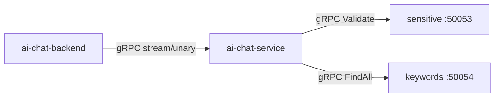
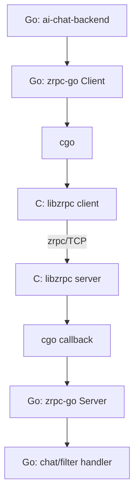

# ECHO-CHAT 基于 C zrpc 的跨语言 RPC 改造实施方案

- 日期：2026-09-04
- 状态：实施设计稿
- 目标仓库：[`robotlover-1/ECHO-CHAT`](https://github.com/robotlover-1/ECHO-CHAT)
- 代码基线：`main@ddc9447014e391448783223b36723811a594de71`
- 参考源码：`zrpc-main.zip`（C zrpc + cJSON + NtyCo）
- 核心目标：以 C zrpc 作为协议编解码与 TCP 通信核心，通过 cgo 接入 Go，完成 ECHO-CHAT 三条 gRPC 链路的跨语言替换

## 1. 项目目标与边界

### 1.1 改造目标

本项目不是简单删除 gRPC，也不是重新实现一套纯 Go RPC，而是展示一条完整的跨语言基础设施改造链路：

1. 在 C zrpc 基础上完成生产可用性加固。
2. 将 C zrpc 封装为稳定的 C ABI 静态库 `libzrpc.a`。
3. 通过 cgo 建立 Go ↔ C 请求、响应、流式回调、取消和错误映射。
4. 替换以下 gRPC 调用：
   - `ai-chat-backend → ai-chat-service`：`ChatCompletion`。
   - `ai-chat-backend → ai-chat-service`：`ChatCompletionStream`。
   - `ai-chat-service → keywords-filter:50053`：`Validate`。
   - `ai-chat-service → keywords-filter:50054`：`FindAll`。
5. 保持 Web API、前端逐块输出、OpenAI API、数据库、Redis、语义缓存及 token 计费逻辑不变。
6. 提供可观测、可测试、可灰度、可回滚的工程闭环。

### 1.2 非目标

- 不要求与原始 zrpc 示例程序保持字节级兼容。
- 不把 Go 业务逻辑重写为 C。
- 第一版不在同一 TCP 连接中复用多个 Chat stream。
- 第一版不实现服务发现、负载均衡、TLS、双向流和客户端流。
- 不修改前端协议和 OpenAI 流式格式。
- 不以“必然比 gRPC 快”作为预设结论；性能收益由基准测试决定。

### 1.3 成功标准

改造完成必须同时满足：

- 四个 RPC 方法功能一致。
- Chat 流式内容、顺序、来源标识、结束语义及计费行为一致。
- 浏览器断开能够取消 chat-service 中的上游 LLM HTTP 请求。
- 异常帧、半包、短写、超长帧和连接中断不会触发 panic 或持续泄漏。
- 本地构建、Docker 构建、健康检查、滚动更新与回滚全部通过。
- 输出 gRPC 与 zrpc 的对比 benchmark，而不是仅给主观结论。

## 2. 当前系统与目标架构

### 2.1 当前调用链



### 2.2 改造后架构



### 2.3 第一版连接模型

| 链路 | 连接模型 | 原因 |
|---|---|---|
| `Validate` | 小型长连接池或一请求一连接 | 请求短、幂等，先保证实现清晰 |
| `FindAll` | 小型长连接池或一请求一连接 | 同上 |
| `ChatCompletion` | unary 连接池 | 非流式，便于复用 |
| `ChatCompletionStream` | 一请求一独占连接 | 取消时直接断连，不影响其他请求；避免多流队头阻塞 |

建议第一阶段统一采用“一请求一连接”完成正确性闭环；第二阶段仅对 unary 增加连接池。Chat stream 在本项目内保持独占连接即可。

## 3. 目录与模块设计

在仓库根目录新增：

```text
ECHO-CHAT/
├── third_party/
│   └── zrpc/
│       ├── LICENSE-NOTICE.md
│       ├── include/
│       │   ├── zrpc.h
│       │   ├── zrpc_protocol.h
│       │   ├── zrpc_client.h
│       │   └── zrpc_server.h
│       ├── src/
│       │   ├── zrpc_frame.c
│       │   ├── zrpc_io.c
│       │   ├── zrpc_json.c
│       │   ├── zrpc_client.c
│       │   ├── zrpc_server.c
│       │   ├── zrpc_stream.c
│       │   ├── zrpc_error.c
│       │   ├── cJSON.c
│       │   └── cJSON.h
│       ├── tests/
│       │   ├── test_frame.c
│       │   ├── test_io.c
│       │   └── test_protocol.c
│       └── Makefile
├── zrpc-go/
│   ├── go.mod
│   ├── bridge.c
│   ├── bridge.h
│   ├── client.go
│   ├── server.go
│   ├── stream.go
│   ├── callback.go
│   ├── registry.go
│   ├── status.go
│   ├── options.go
│   ├── health.go
│   ├── metrics.go
│   ├── contract/
│   │   ├── chat.go
│   │   ├── filter.go
│   │   └── methods.go
│   └── tests/
├── Makefile
└── Dockerfile.*
```

原则：

- C 层只负责协议、socket、连接生命周期和回调触发，不感知 ECHO-CHAT 业务结构。
- Go bridge 负责 JSON 序列化、context、handler 注册、channel 和错误映射。
- 业务 contract 只保留一份，backend、chat-service、keywords-filter 共同依赖。
- C 层永远不保存 Go 指针，只保存无符号整数 handle。

## 4. C zrpc 协议升级

原版 zrpc 的 `CRC32(4B) + length(2B)`、固定 caller ID、单次 `send/recv` 和 unary-only 模型不能直接满足需求。应在保留“CRC + 长度帧 + JSON + 注册式方法表”思想的基础上升级为 zrpc v2。

### 4.1 帧格式

```text
+----------+---------+-------+-------------+-------------+----------+
| magic 2B | ver 1B  | type 1B | request_id 8B | length 4B | crc32 4B |
+----------+---------+-------+-------------+-------------+----------+
|                    payload: length bytes                       |
+----------------------------------------------------------------+
```

固定定义：

| 字段 | 约束 |
|---|---|
| magic | `0x5A52`，ASCII `ZR` |
| version | `2` |
| type | 请求、响应、流数据、流结束、错误、取消、ping、pong |
| request_id | uint64，网络字节序；同连接内唯一 |
| length | uint32，网络字节序 |
| crc32 | payload 的 IEEE CRC32；不作为认证机制 |
| payload | UTF-8 JSON；控制帧可以为空 |

默认配置：

```c
#define ZRPC_MAX_FRAME_SIZE (4U * 1024U * 1024U)
#define ZRPC_HEADER_SIZE 20U
#define ZRPC_DEFAULT_TIMEOUT_MS 30000U
#define ZRPC_MAX_INFLIGHT_PER_CONN 64U
```

在任何 `malloc(length)` 之前执行：

```c
if (length > ZRPC_MAX_FRAME_SIZE) {
    return ZRPC_STATUS_FRAME_TOO_LARGE;
}
```

### 4.2 消息类型

```c
typedef enum {
    ZRPC_MSG_REQUEST = 1,
    ZRPC_MSG_RESPONSE = 2,
    ZRPC_MSG_STREAM_DATA = 3,
    ZRPC_MSG_STREAM_END = 4,
    ZRPC_MSG_ERROR = 5,
    ZRPC_MSG_CANCEL = 6,
    ZRPC_MSG_PING = 7,
    ZRPC_MSG_PONG = 8
} zrpc_msg_type_t;
```

### 4.3 JSON 信封

请求：

```json
{
  "method": "chat.completion_stream",
  "auth": "Bearer <token>",
  "deadline_unix_ms": 1788547200000,
  "payload": {}
}
```

响应和流数据：

```json
{
  "payload": {}
}
```

错误：

```json
{
  "code": 7,
  "message": "deadline exceeded",
  "retryable": false
}
```

### 4.4 终态规则

- unary：`REQUEST → RESPONSE` 或 `REQUEST → ERROR`。
- stream：`REQUEST → STREAM_DATA×N → STREAM_END`，或任意阶段进入 `ERROR`。
- 同一 request ID 只能出现一个终态。
- 收到终态后客户端必须删除 pending。
- 连接中断时，连接上的全部 pending 映射为 `UNAVAILABLE`。
- Chat 业务最后一个 `finish_reason=stop` chunk 是 `STREAM_DATA`；其后再发一个空的 `STREAM_END`。

### 4.5 错误码

```c
typedef enum {
    ZRPC_STATUS_OK = 0,
    ZRPC_STATUS_CANCELLED = 1,
    ZRPC_STATUS_INVALID_ARGUMENT = 2,
    ZRPC_STATUS_UNAUTHENTICATED = 3,
    ZRPC_STATUS_NOT_FOUND = 4,
    ZRPC_STATUS_DEADLINE_EXCEEDED = 5,
    ZRPC_STATUS_RESOURCE_EXHAUSTED = 6,
    ZRPC_STATUS_UNAVAILABLE = 7,
    ZRPC_STATUS_INTERNAL = 8,
    ZRPC_STATUS_PROTOCOL_ERROR = 9,
    ZRPC_STATUS_FRAME_TOO_LARGE = 10
} zrpc_status_t;
```

内部堆栈、数据库错误和配置值不得直接进入返回消息。

## 5. C 层实现要求

### 5.1 安全收发

新增 `zrpc_io.c`：

```c
ssize_t zrpc_read_full(int fd, void *buf, size_t len, int timeout_ms);
ssize_t zrpc_write_full(int fd, const void *buf, size_t len, int timeout_ms);
```

必须处理：

- `EINTR` 后继续。
- `EAGAIN/EWOULDBLOCK` 配合 `poll` 等待。
- 对端关闭返回明确状态。
- 超时返回 `DEADLINE_EXCEEDED`。
- 写入 0 字节视为连接异常。
- 所有 fd 在任何失败路径均关闭。

不得再使用：

```c
assert(recv(fd, payload, len, 0) == len);
```

### 5.2 帧编解码

新增：

```c
int zrpc_frame_encode(
    zrpc_msg_type_t type,
    uint64_t request_id,
    const void *payload,
    uint32_t payload_len,
    zrpc_buffer_t *out
);

int zrpc_frame_read(
    int fd,
    zrpc_frame_t *out,
    int timeout_ms
);

void zrpc_frame_free(zrpc_frame_t *frame);
```

禁止通过未对齐指针强转读写整数；统一使用 `memcpy + htonl/ntohl`，64 位提供 `htonll/ntohll` 辅助函数。

### 5.3 客户端 C ABI

```c
typedef struct zrpc_client zrpc_client_t;

typedef void (*zrpc_stream_callback_t)(
    uint64_t callback_handle,
    uint64_t request_id,
    int event_type,
    int status,
    const void *data,
    uint32_t data_len
);

zrpc_client_t *zrpc_client_new(
    const char *host,
    uint16_t port,
    const char *token,
    int connect_timeout_ms,
    int io_timeout_ms
);

int zrpc_client_call_unary(
    zrpc_client_t *client,
    const char *method,
    const void *request,
    uint32_t request_len,
    uint64_t deadline_unix_ms,
    zrpc_buffer_t *response
);

int zrpc_client_call_stream(
    zrpc_client_t *client,
    const char *method,
    const void *request,
    uint32_t request_len,
    uint64_t deadline_unix_ms,
    uint64_t callback_handle,
    zrpc_stream_callback_t callback
);

int zrpc_client_cancel(zrpc_client_t *client, uint64_t request_id);
void zrpc_client_close(zrpc_client_t *client);
void zrpc_client_free(zrpc_client_t *client);
void zrpc_buffer_free(zrpc_buffer_t *buffer);
```

第一版 `call_stream` 为阻塞调用，由 Go bridge 在独立 goroutine 中执行；每个 stream client 对应一个 TCP 连接。

### 5.4 服务端 C ABI

```c
typedef struct zrpc_server zrpc_server_t;

typedef int (*zrpc_request_callback_t)(
    uint64_t handler_handle,
    uint64_t request_id,
    int client_fd,
    const void *request,
    uint32_t request_len,
    uint64_t deadline_unix_ms
);

zrpc_server_t *zrpc_server_new(const zrpc_server_options_t *options);

int zrpc_server_register(
    zrpc_server_t *server,
    const char *method,
    int stream,
    uint64_t handler_handle,
    zrpc_request_callback_t callback
);

int zrpc_server_send_response(...);
int zrpc_server_send_stream_data(...);
int zrpc_server_send_stream_end(...);
int zrpc_server_send_error(...);
int zrpc_server_serve(zrpc_server_t *server);
int zrpc_server_shutdown(zrpc_server_t *server, int grace_ms);
void zrpc_server_free(zrpc_server_t *server);
```

服务端约束：

- 所有写操作必须经过连接级互斥或单 writer 队列，不能从多个 Go callback 并发写 socket。
- 发送队列必须有界；队列满返回 `RESOURCE_EXHAUSTED`。
- 设置 `SO_REUSEADDR`，检查 `socket/bind/listen/accept` 全部返回值。
- 限制最大连接数和每连接在途数。
- 收到 `CANCEL` 时通过 callback 通知 Go bridge 取消对应 context。
- `PING` 不进入业务 handler，直接返回 `PONG`。

### 5.5 NtyCo 使用边界

为体现原 zrpc 技术路线，可继续使用 NtyCo 承担 accept/read 调度，但不得把 NtyCo coroutine 直接等同于 Go goroutine：

- C callback 进入 Go 后不得长期阻塞 NtyCo 调度线程。
- callback 只复制请求、投递到 Go worker，然后返回。
- Go handler 完成后通过线程安全的 C send API 回写。
- 若 NtyCo 与 cgo 回调稳定性难以验证，允许 C server 改为 pthread/epoll；但需要在报告中说明对原 zrpc 的加固调整。

## 6. Go cgo 桥接层设计

### 6.1 cgo 编译声明

`zrpc-go/client.go`：

```go
/*
#cgo CFLAGS: -I${SRCDIR}/../third_party/zrpc/include
#cgo LDFLAGS: ${SRCDIR}/../third_party/zrpc/build/libzrpc.a -lpthread -ldl
#include "zrpc.h"
#include "bridge.h"
*/
import "C"
```

构建时必须设置 `CGO_ENABLED=1`。

### 6.2 Go 客户端 API

```go
type Client interface {
    Unary(ctx context.Context, method string, req, resp any) error
    Stream(ctx context.Context, method string, req any) (*Stream, error)
    Ping(ctx context.Context) error
    Close() error
}

type Stream struct {
    recvCh chan streamEvent
    cancel context.CancelFunc
    once   sync.Once
}

func (s *Stream) Recv(out any) error
func (s *Stream) Close() error
```

`Recv` 语义：

- `STREAM_DATA`：JSON 反序列化到 `out`，返回 nil。
- `STREAM_END`：返回 `io.EOF`。
- `ERROR`：返回 `*StatusError`。
- 本地 context 结束：发送 cancel 或关闭独占连接，返回 `ctx.Err()`。

这样 backend 现有 `for { rsp, err := stream.Recv() }` 逻辑可基本保留。

### 6.3 Go 服务端 API

```go
type UnaryHandler func(context.Context, json.RawMessage) (any, error)
type StreamHandler func(context.Context, json.RawMessage, *StreamWriter) error

type Server struct { /* C server + registry + contexts */ }

func NewServer(opts ServerOptions) (*Server, error)
func (s *Server) RegisterUnary(method string, h UnaryHandler) error
func (s *Server) RegisterStream(method string, h StreamHandler) error
func (s *Server) Serve() error
func (s *Server) Shutdown(ctx context.Context) error

type StreamWriter struct { /* server, fd, requestID, terminal once */ }
func (w *StreamWriter) Send(v any) error
func (w *StreamWriter) End() error
func (w *StreamWriter) Error(err error) error
```

### 6.4 Go handle 注册表

C 层不得保存 Go 指针。使用：

```go
var handles sync.Map
var nextHandle atomic.Uint64
```

映射关系：

```text
handler_handle  → Go handler
callback_handle → Go Stream
request key     → context.CancelFunc
```

每条完成、失败、取消和断连路径都必须删除 handle；测试需检查注册表最终为空。

### 6.5 C → Go 回调

```go
//export goZRPCOnStreamEvent
func goZRPCOnStreamEvent(
    handle C.uint64_t,
    requestID C.uint64_t,
    eventType C.int,
    status C.int,
    data unsafe.Pointer,
    dataLen C.uint32_t,
) {
    b := C.GoBytes(data, C.int(dataLen))
    // 查询 handle，投递复制后的 b；不得保留 data 指针
}
```

回调必须：

- 先复制 C 内存再返回。
- 不在 callback 中执行数据库、HTTP 或复杂 JSON 业务。
- 捕获 panic，避免跨越 C 边界。
- channel 满时按有界背压策略处理，不能无限分配。

## 7. 共享业务契约

### 7.1 方法常量

`zrpc-go/contract/methods.go`：

```go
const (
    MethodChatCompletion       = "chat.completion"
    MethodChatCompletionStream = "chat.completion_stream"
    MethodFilterValidate       = "filter.validate"
    MethodFilterFindAll        = "filter.find_all"
)
```

### 7.2 Chat contract

逐字段复制当前 proto 的 `json_name`：

```go
type ChatCompletionRequest struct {
    Message       string     `json:"message"`
    ID            string     `json:"id"`
    PID           string     `json:"p_id"`
    EnableContext bool       `json:"enable_context"`
    ChatParam     *ChatParam `json:"chat_param,omitempty"`
}
```

还需定义：

- `ChatParam`
- `ChatCompletionResponse`
- `ChatCompletionChoice`
- `ChatCompletionMessage`
- `Usage`
- `ChatCompletionStreamResponse`
- `ChatCompletionStreamChoice`
- `ChatCompletionStreamChoiceDelta`

字段名称、数值类型和 nil/空数组行为必须用黄金 JSON 测试锁定。

### 7.3 Filter contract

```go
type FilterRequest struct {
    Text string `json:"text"`
}

type ValidateResponse struct {
    OK      bool   `json:"ok"`
    Keyword string `json:"keyword"`
}

type FindAllResponse struct {
    Keywords []string `json:"keywords"`
}
```

迁移观察期内保留 `.proto` 文件作为兼容基线；完成对比后再删除生成代码。

## 8. ECHO-CHAT 逐模块改造

### 8.1 keywords-filter

#### 修改文件

```text
keywords-filter/filter-server/main.go
keywords-filter/filter-server/server/server.go
keywords-filter/filter-server/interceptor/auth.go
keywords-filter/go.mod
keywords-filter/Dockerfile
keywords-filter/Makefile（新增）
```

#### 服务注册

```go
srv, err := zrpc.NewServer(zrpc.ServerOptions{
    Address:     fmt.Sprintf("%s:%d", cnf.Server.IP, cnf.Server.Port),
    AccessToken: cnf.Server.AccessToken,
})

srv.RegisterUnary(contract.MethodFilterValidate, service.Validate)
srv.RegisterUnary(contract.MethodFilterFindAll, service.FindAll)
```

#### handler 改造

```go
func (s *filterService) Validate(
    ctx context.Context,
    raw json.RawMessage,
) (any, error) {
    var req contract.FilterRequest
    if err := json.Unmarshal(raw, &req); err != nil {
        return nil, zrpc.InvalidArgument(err)
    }
    ok, word := s.filter.Validate(req.Text)
    return &contract.ValidateResponse{OK: ok, Keyword: word}, nil
}
```

`FindAll` 同构实现。业务 `pkg/filter` 不修改。

### 8.2 ai-chat-service 下游 filter client

#### 修改文件

```text
ai-chat-service/services/keywords-filter/keywords.go
ai-chat-service/services/keywords-filter/sensitive.go
ai-chat-service/services/grpc-client/*
ai-chat-service/services/services.go
ai-chat-service/chat-server/server/app.go
```

用两个 zrpc client 分别连接 50053/50054：

```go
res := new(contract.FindAllResponse)
err := keywordsClient.Unary(
    ctx,
    contract.MethodFilterFindAll,
    &contract.FilterRequest{Text: in.Message},
    res,
)
```

调用超时建议：

```go
ctx, cancel := context.WithTimeout(parent, 800*time.Millisecond)
defer cancel()
```

敏感词调用失败保持当前 fail-closed 行为：Chat 请求返回错误；关键词提取失败保持当前降级为空列表行为。

### 8.3 ai-chat-service 服务端

#### 修改文件

```text
ai-chat-service/chat-server/main.go
ai-chat-service/chat-server/server/server.go
ai-chat-service/chat-server/server/app.go
ai-chat-service/chat-server/metrics-app/metrics_app.go
ai-chat-service/interceptor/auth.go
ai-chat-service/proto/*（观察期后删除）
ai-chat-service/go.mod
ai-chat-service/Dockerfile
ai-chat-service/Makefile（新增）
```

#### unary handler

将：

```go
ChatCompletion(ctx context.Context, in *proto.ChatCompletionRequest)
```

改为 transport 无关业务方法：

```go
ChatCompletion(
    ctx context.Context,
    in *contract.ChatCompletionRequest,
) (*contract.ChatCompletionResponse, error)
```

再用 adapter 完成 `json.RawMessage` 解码。

#### stream handler

将：

```go
ChatCompletionStream(in, grpcStream)
```

改为：

```go
ChatCompletionStream(
    ctx context.Context,
    in *contract.ChatCompletionRequest,
    stream ChatStream,
) error
```

定义业务接口：

```go
type ChatStream interface {
    Context() context.Context
    Send(*contract.ChatCompletionStreamResponse) error
}
```

zrpc `StreamWriter` 实现该接口。这样核心业务不直接依赖 cgo，也便于单元测试。

`streamLLMContent` 的参数同步改为 `ChatStream`，原有 SSE 解析、`source`、重试、缓存写入和 token 统计不改。

#### 鉴权修正

当前 gRPC 只对 unary 安装鉴权 interceptor，stream 实际未校验。zrpc 迁移后应统一对所有业务方法校验 Bearer Token；`PING` 可免鉴权，仅返回存活状态。

#### 指标改造

现有 gRPC stream interceptor 改为通用 handler wrapper，保留指标名并增加：

- `zrpc_connections_current`
- `zrpc_requests_inflight`
- `zrpc_requests_total{method,code}`
- `zrpc_request_duration_ms{method}`
- `zrpc_cancel_total{method}`
- `zrpc_protocol_error_total{reason}`
- `zrpc_cgo_callback_total{event}`

### 8.4 ai-chat-backend

#### 修改文件

```text
ai-chat-backend/pkg/controllers/chat.go
ai-chat-backend/services/services.go
ai-chat-backend/services/ai-chat-service/ai-chat-service.go
ai-chat-backend/services/grpc-client/*
ai-chat-backend/services/ai-chat-service/proto/*（观察期后删除）
ai-chat-backend/go.mod
ai-chat-backend/Dockerfile
ai-chat-backend/Makefile（新增）
```

#### 流式调用适配

保持现有控制器结构：

```go
stream, err := client.Stream(ctx, contract.MethodChatCompletionStream, in)
if err != nil { /* 原错误处理 */ }
defer stream.Close()

for {
    var rsp contract.ChatCompletionStreamResponse
    err := stream.Recv(&rsp)
    if errors.Is(err, io.EOF) {
        // 保留现有最终 token 统计、扣费和末包逻辑
        return
    }
    if err != nil { /* 原错误处理 */ }
    // 保留现有逐块写前端逻辑
}
```

关键修正：不能再使用 `context.Background()` 作为 RPC 父 context，应从 Gin 请求派生：

```go
rpcCtx := ctx.Request.Context()
```

浏览器断开后，`rpcCtx.Done()` 触发 zrpc stream 取消，继而取消 chat-service 上游 HTTP 请求。

## 9. 构建系统改造

### 9.1 根 Makefile

新增目标：

```makefile
.PHONY: zrpc zrpc-test go-test build clean

zrpc:
	$(MAKE) -C third_party/zrpc

zrpc-test:
	$(MAKE) -C third_party/zrpc test

go-test: zrpc
	cd zrpc-go && CGO_ENABLED=1 go test -race ./...
	cd keywords-filter && CGO_ENABLED=1 go test ./...
	cd ai-chat-service && CGO_ENABLED=1 go test ./...
	cd ai-chat-backend && CGO_ENABLED=1 go test ./...

build: zrpc
	cd keywords-filter && CGO_ENABLED=1 go build -o ../bin/keywords-filter ./filter-server
	cd ai-chat-service && CGO_ENABLED=1 go build -o ../bin/ai-chat-service ./chat-server
	cd ai-chat-backend && CGO_ENABLED=1 go build -o ../bin/ai-chat-backend ./cmd/
```

### 9.2 Go 模块引用

三个模块增加：

```go
require echo-zrpc-go v0.0.0
replace echo-zrpc-go => ../zrpc-go
```

### 9.3 start.sh

必须修改增量构建判断：

- `third_party/zrpc/src/*.c/*.h` 更新时，重建 `libzrpc.a` 和三个 Go 服务。
- `zrpc-go/*.go/*.c/*.h` 更新时，重建三个 Go 服务。
- 执行 Go build 前保证 `libzrpc.a` 存在且比所有 C 源文件新。
- `--rebuild` 同时清理并重建 C 静态库。

不能继续只检查各服务目录中的 `*.go`。

### 9.4 Docker

Docker build context 必须改为仓库根：

```bash
docker build -f ai-chat-service/Dockerfile -t echo/ai-chat-service .
```

构建阶段示例：

```dockerfile
FROM golang:1.20-alpine AS build
RUN apk add --no-cache build-base linux-headers
WORKDIR /src
COPY third_party/zrpc ./third_party/zrpc
COPY zrpc-go ./zrpc-go
COPY ai-chat-service ./ai-chat-service
RUN make -C third_party/zrpc
RUN cd ai-chat-service && CGO_ENABLED=1 go build -o /out/ai-chat-service ./chat-server

FROM alpine:3.18
RUN apk add --no-cache libgcc
COPY --from=build /out/ai-chat-service /app/ai-chat-service
ENTRYPOINT ["/app/ai-chat-service"]
```

若 `libzrpc.a` 完全静态链接，则运行镜像无需复制 `.so`。必须在 CI 中用 `ldd` 验证最终依赖。

## 10. 健康检查与部署

建议不开发新的 C 探针，而是在两个 Go 服务增加独立 HTTP health server：

```text
GET /healthz：进程存活且 zrpc listener 正常
GET /readyz：方法注册完成；可选检查必要下游
```

修改：

```text
keywords-filter/Dockerfile
ai-chat-service/Dockerfile
ai-chat-stack/compose.yaml
docs/运行步骤.md
docs/项目结构与调用关系.md
docs/ai-chat 调用流程详解.md
```

compose healthcheck 示例：

```yaml
healthcheck:
  test: ["CMD", "wget", "-q", "-O", "-", "http://127.0.0.1:8081/readyz"]
  interval: 5s
  timeout: 2s
  retries: 3
  start_period: 5s
```

服务业务端口 50053、50054、50055 保持不变；健康检查 HTTP 端口建议配置为 8081，两个 keywords-filter 实例分别在各自容器内使用，不冲突。

## 11. 分阶段实施任务

### Task 0：源码准入和基线冻结

产出：

- 确认 zrpc 许可证或获得授权，新增 `LICENSE-NOTICE.md`。
- 将原始源码导入 `third_party/zrpc`，保留来源和原始提交信息。
- 记录 gRPC 功能与性能基线。

验证：

```bash
git diff --check
git status --short
```

退出条件：授权明确；基线数据可复现。

### Task 1：C I/O 与帧层

实施：

1. 实现 `read_full/write_full`。
2. 实现 v2 header 编解码。
3. 加入最大帧、magic、version、CRC 校验。
4. 清除网络路径中的 `assert`。

测试：

- 1 字节拆包。
- header/body 合并粘包。
- 随机短写。
- 0、最大长度和超长帧。
- CRC 错误、错误 magic、错误 version。
- 对端中途关闭。

退出条件：C 单元测试和 ASan/UBSan 通过。

### Task 2：C unary client/server

实施：

1. 建立稳定 C ABI。
2. 注册方法表。
3. 实现 request/response/error。
4. 实现 Bearer token 校验。
5. 实现 ping/pong。

退出条件：纯 C 示例可连续完成 10 万次 unary 调用，无 fd/内存持续增长。

### Task 3：zrpc-go unary bridge

实施：

1. 完成 cgo 编译。
2. 实现 Client.Unary。
3. 实现 Server.RegisterUnary。
4. 实现 status 映射和 context deadline。
5. 增加 handler handle 注册与释放。

测试：

```bash
cd zrpc-go
CGO_ENABLED=1 go test -race ./...
```

退出条件：Go client ↔ C server、C client ↔ Go handler 两个方向均有测试证据。

### Task 4：迁移 keywords-filter

实施顺序：

1. `Validate` 增加 zrpc handler。
2. chat-service 增加 zrpc client，可通过配置选择 gRPC/zrpc。
3. 双跑对比输出。
4. 迁移 `FindAll`。
5. 增加 HTTP healthcheck。

配置建议：

```yaml
dependOn:
  sensitive:
    transport: zrpc
  keywords:
    transport: zrpc
```

退出条件：黄金用例结果完全一致；错误和超时策略符合现状。

### Task 5：C stream 与取消

实施：

1. 实现 `STREAM_DATA/STREAM_END/ERROR/CANCEL`。
2. 每个流使用独占连接。
3. Go Stream 通过有界 channel 接收 C callback。
4. context 取消时关闭连接或发送 CANCEL。
5. 服务端维护 request ID → cancel func。

测试：

- 0 chunk 正常结束。
- 单 chunk、多 chunk、长流。
- data 后 error。
- 重复 end。
- 客户端中途取消。
- 服务端超时。
- 慢消费者和 channel 满。

退出条件：取消后服务端 handler、上游 HTTP 请求和所有 handle 在限定时间内释放。

### Task 6：迁移 Chat unary

实施：

- proto 类型替换为共享 contract。
- 保留语义缓存、上下文、关键词、数据库写入和 OpenAI 调用。
- 配置化选择 `grpc/zrpc`。

退出条件：请求/响应黄金 JSON、缓存命中和非命中测试通过。

### Task 7：迁移 Chat stream

实施：

- 引入业务 `ChatStream` 接口。
- zrpc StreamWriter 适配接口。
- backend 使用 `ctx.Request.Context()`。
- 保留前端逐行 JSON 和最终统计末包。
- 补全 source、finish_reason、token 和扣费回归测试。

退出条件：同一 mock LLM 输入下，gRPC 与 zrpc 输出语义一致。

### Task 8：构建、镜像与运维

实施：

- 根 Makefile 和 start.sh。
- 三个 Dockerfile。
- compose healthcheck。
- CI 增加 C 编译、sanitizer、race 和双架构构建。
- SIGTERM 优雅关闭。

退出条件：本机、镜像、compose/Swarm 三条路径全部成功。

### Task 9：灰度与清理

灰度顺序：

```text
filter Validate → filter FindAll → Chat unary → Chat stream
```

每条链路：

```text
shadow 对比 → 10% → 50% → 100% → 观察期 → 删除 gRPC
```

观察期内保留：

- gRPC 代码路径。
- proto 契约。
- 上一版镜像。
- `transport: grpc|zrpc` 配置开关。

## 12. 测试矩阵

### 12.1 C 层

| 类型 | 工具 | 重点 |
|---|---|---|
| 单元测试 | C test executable | frame、CRC、JSON、错误码 |
| 内存 | ASan/LSan | 越界、UAF、泄漏 |
| 未定义行为 | UBSan | 未对齐、整数溢出 |
| 模糊测试 | libFuzzer/AFL++ | header、payload、畸形 JSON |
| 网络故障 | socketpair/netem | 半包、断连、超时、乱序不可发生验证 |

推荐命令：

```bash
CFLAGS="-O1 -g -fsanitize=address,undefined -fno-omit-frame-pointer" \
  make -C third_party/zrpc test
```

### 12.2 Go/cgo 层

- 并行 unary 1000 次。
- context deadline/cancel。
- callback channel 背压。
- handle 清理。
- C 返回 nil、错误码和非法 JSON。
- server handler panic 转 INTERNAL。
- `go test -race ./...`。

### 12.3 业务端到端

| 场景 | 期望 |
|---|---|
| 敏感词命中 | 返回固定拦截文本，不调用 LLM |
| 关键词提取成功 | 写入 chat record |
| 关键词服务失败 | 降级为空列表，Chat 继续 |
| 语义缓存命中 | `source=cache`，不扣额度 |
| 缓存未命中 | `source=llm`，正常扣额度 |
| LLM 正常流 | chunk 顺序和文本完整 |
| LLM 空 content | 保留现有重试和兜底提示 |
| `finish_reason=length` | 返回截断提示，不写语义缓存 |
| 浏览器断开 | zrpc、chat handler、LLM HTTP 全链路取消 |
| 未授权请求 | unary 和 stream 均拒绝 |

### 12.4 性能测试

分别测试：

- 同机与跨 VM。
- 并发 1/10/50/100。
- filter unary。
- Chat 缓存命中短流。
- Chat LLM 长流。
- 1 KiB、16 KiB、64 KiB、1 MiB payload。

记录：

- QPS。
- 首 chunk P50/P95/P99。
- 完整响应 P50/P95/P99。
- CPU、RSS、FD、goroutine。
- cgo 调用次数与平均耗时。
- 每请求网络字节。
- 错误、超时和取消率。

## 13. 安全与可靠性要求

### 13.1 鉴权

- 所有业务请求校验 Bearer Token。
- 使用常量时间比较 token。
- 日志不得记录完整 token 和完整用户 Prompt。
- ping 只能暴露最小存活信息。

### 13.2 传输安全

CRC32 只检查帧损坏，不提供加密或防篡改。当前若仅运行在受控内网，可保持与原 gRPC insecure 相同边界；若跨不可信网络，必须增加 TLS 或通过 service mesh/mTLS 保护。

### 13.3 资源限制

- 最大帧 4 MiB。
- 最大连接数可配置。
- unary 最大在途数可配置。
- stream 每请求有界 channel，建议 64 个事件。
- 设置连接、读、写和空闲超时。
- 优雅停机最长等待时间可配置。

## 14. 灰度、回滚与故障策略

### 14.1 双栈配置

观察期使用：

```yaml
rpc:
  transport: zrpc
  connect_timeout_ms: 1000
  io_timeout_ms: 30000
  max_frame_bytes: 4194304
  unary_pool_size: 4
```

不同下游允许独立选择 transport，避免三条链路绑定切换。

### 14.2 回滚触发条件

满足任一条件立即切回 gRPC：

- zrpc 错误率连续 5 分钟高于 gRPC 基线 1 个百分点。
- P95 首 chunk 时延劣化超过 20%。
- 出现进程崩溃、C 内存持续增长或 fd 泄漏。
- 出现重复扣费、漏扣费、内容缺失或乱序。
- 健康检查连续失败，滚动更新无法完成。

### 14.3 回滚操作

1. 配置切回 `transport: grpc`。
2. 使用保留镜像执行滚动更新。
3. 不删除 zrpc 日志和指标，保留故障现场。
4. 回放相同 mock 请求定位 C frame、bridge、handler 或业务层问题。

## 15. 验收清单

### 协议与 C 层

- [ ] 无单次 `recv/send` 等于完整帧的错误假设。
- [ ] 所有长度在分配前校验。
- [ ] 网络字节序和 header 布局固定。
- [ ] 无网络输入可触发的 `assert`。
- [ ] ASan、LSan、UBSan、fuzz 测试通过。
- [ ] 所有 fd、frame、buffer 和 task 均有唯一释放路径。

### cgo 层

- [ ] C 不保存 Go 指针。
- [ ] callback 返回前复制 C buffer。
- [ ] handle 在成功、错误、取消、超时和断连路径全部清理。
- [ ] `go test -race` 通过。
- [ ] handler panic 被恢复并转换为 INTERNAL。

### 业务层

- [ ] 四个 RPC 方法完成迁移。
- [ ] Chat 流式顺序和终止语义一致。
- [ ] source、缓存、token、扣费、上下文和数据库行为无回归。
- [ ] 浏览器断开能够取消 LLM 请求。
- [ ] unary 和 stream 均执行鉴权。

### 工程层

- [ ] start.sh 能感知 C/zrpc-go 变化并重建。
- [ ] 三个 Docker 镜像可从仓库根构建。
- [ ] healthz/readyz 替换 grpc_health_probe。
- [ ] SIGTERM 优雅停机通过。
- [ ] 双栈灰度和回滚演练通过。
- [ ] gRPC/zrpc benchmark 报告完成。

## 16. 最终交付物

1. 加固后的 C zrpc 源码及来源/许可证说明。
2. `libzrpc.a` 构建脚本和 C 测试。
3. `zrpc-go` cgo bridge 与共享 contract。
4. keywords-filter、ai-chat-service、ai-chat-backend 改造代码。
5. C/Go 单元测试、fuzz、race、端到端测试。
6. 三个 Dockerfile、根 Makefile、start.sh 和 compose 更新。
7. healthcheck、Prometheus 指标和故障日志。
8. gRPC/zrpc 性能对比报告。
9. 灰度记录、回滚手册和最终架构文档。

## 17. 实施结论

该方案能够清晰展示以下技术能力：

- C 网络库协议加固。
- Go 与 C 的双向 cgo 调用。
- C 回调映射为 Go stream/channel。
- context 取消跨语言、跨进程传播。
- gRPC 到自定义 RPC 的契约迁移。
- CGO、静态链接、容器化和多服务灰度治理。

为降低失败风险，必须坚持“**先 C 帧与 unary，后 cgo，先 filter，后 Chat stream；先双栈，后删除 gRPC**”的顺序。第一版不实现多流复用，Chat stream 使用独占连接；这不会削弱跨语言改造的展示价值，却能显著降低并发、取消和流控复杂度。
