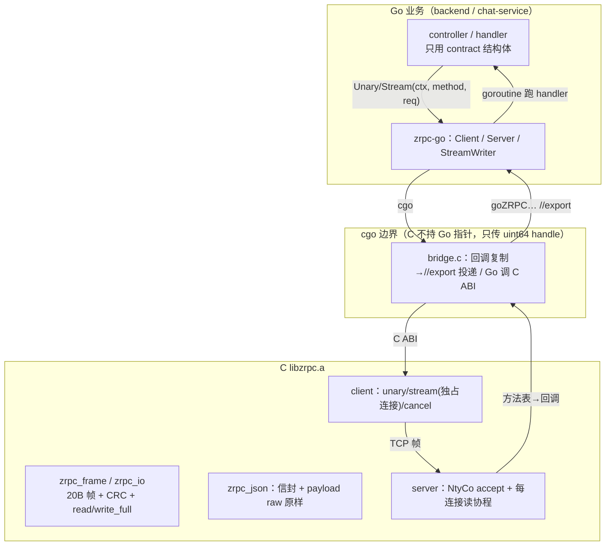
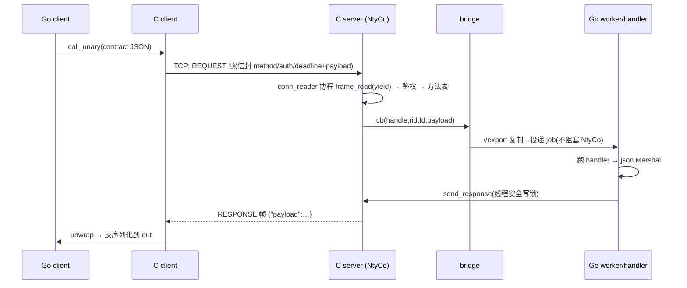
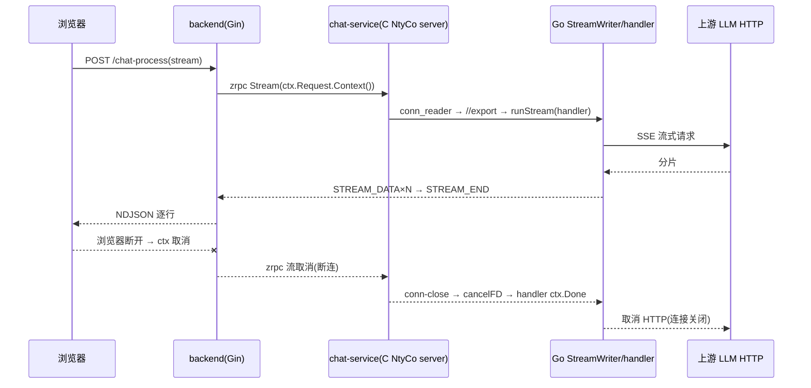

# zrpc v2：实现细节与在项目中的使用

状态：gRPC 已删，全链路仅自研 zrpc v2（单传输）。仓库目录：`third_party/zrpc/`（C 库）、
`zrpc-go/`（cgo bridge + contract）、三个服务使用点。

> 一句话定位：**C 写"内核"（协议/IO/并发），Go 写"外壳"（桥/业务）**。核心不是 Go 实现；
> Go 通过 cgo 调 C ABI，C 回调经 `//export` 回到 Go。

**增补（2026-09-08 · 以代码为准，格式对齐 `docs/项目文档/01-功能实现.md` 的「❓ 追问」块）**：全文件就地补充 **15 条「❓ 追问」块**（改用引用块展示，避免与正文混淆；每条给 `file:line` 与实盘行为）——§1.2：协程分支/两套 IO；§1.3：JSON 信封 vs 协议；§1.4：NtyCo 调度、回写与线程生命周期、回调进 Go 的约束、**zrpc 到底几个线程 / 回写为何不走协程**、**回写由哪个线程发、从哪发到哪**；§2：unary·unwrap·bridge·cgo 桥、契约与业务、unary vs stream、**为什么流 handler 临时起 goroutine 而 unary 不**、**三类 goroutine 的区别**、**全链路传输形态（前端流式 / proto 是否还在 / 各服务如何被 Go 调）**、**handler 结果回发到哪一跳（中间 handler 不直接回最终客户端）**。

## 0. 语言分工总览

| 层 | 语言 | 目录 | 职责 |
|---|---|---|---|
| 协议内核 | C | `third_party/zrpc/src/{zrpc_frame,zrpc_io,zrpc_json,zrpc_error,zrpc_client,zrpc_server}.c` | 帧/CRC、安全 IO、JSON 信封、方法表、鉴权、ping、客户端与服务器 |
| 协程并发 | C（NtyCo） | `third_party/zrpc/ntyco/` | **server** 的 accept/读协程调度（Go 侧/普通线程不经过它） |
| 静态库 | C | `third_party/zrpc/build/libzrpc.a` | 交付物；`make -C third_party/zrpc` |
| cgo 桥 | C shim + Go | `zrpc-go/bridge.c` + `client.go/server.go/stream.go` | Go↔C 双向：调用 C、`//export` 收 C 回调 |
| 契约 | Go | `zrpc-go/contract/` | 业务结构体（字段=proto json_name） |
| 业务 | Go | 三个服务 | 复用既有逻辑，仅换传输 |

## 1. C 内核实现细节

### 1.1 协议（zrpc_protocol.h / zrpc_frame.c）
- 帧：`magic 'ZR'(2B) | ver=2(1B) | type(1B) | request_id(8B BE) | len(4B BE) | crc32(payload)(4B)`，共 20B。
- 消息类型：REQUEST/RESPONSE/STREAM_DATA/STREAM_END/ERROR/CANCEL/PING/PONG。
- 分配前校验 `len ≤ MAX_FRAME_SIZE(4MiB)`，坏 magic/ver/type/CRC → `PROTOCOL_ERROR`，超长 → `FRAME_TOO_LARGE`。
- 所有整数大端、显式字节放置（无未对齐强转）；CRC 仅查损坏不做安全。
- 终态规则：unary 一个 RESPONSE/ERROR；stream 一个 `STREAM_END` 或 ERROR；收到终态删 pending。

### 1.2 安全 IO（zrpc_io.c）
`zrpc_read_full/write_full(_until)`：EINTR 重试、EAGAIN/EWOULDBLOCK 用 poll 等待、超时→`DEADLINE_EXCEEDED`、
对端关闭→`UNAVAILABLE`、写 0 字节视为异常、`MSG_NOSIGNAL`。
**协程分支**：当 `nty_coroutine_get_sched()!=NULL`（即运行在 NtyCo 协程内）时改用裸 `recv/send` 循环，
由 NtyCo 负责 yield——**绝不在调度线程上 poll 阻塞**。

> **❓ 追问：协程分支是什么意思？是不是同时用了 read/write 和 NtyCo 两套网络 IO？**
>
> **“是什么”**：`zrpc_io.c` 的读写函数在入口处先分叉一次（`in_coroutine()`＝`nty_coroutine_get_sched()!=NULL`，`zrpc_io.c:30-45`；sched 是按线程存 TLS 的，只有 NtyCo 调度线程上才有值，见「NtyCo 调度」追问）：
>
> - **非协程路径**（`sched==NULL`，即 C client 线程 / 任何 Go 线程）：`wait_ready(poll)` 等 fd 就绪 → 再 `recv/send`，带 wall-clock 超时（`zrpc_io.c:139-167 / 192-220`）。`_until` 变体共享一条 CLOCK_MONOTONIC 截止线。
> - **协程路径**（`sched!=NULL`，即调度线程上的 `conn_reader`/`server_main` 协程）：走 `co_read_full` / `co_write_full`（`zrpc_io.c:94-121`）——**不用 poll**，直接 `recv/send` 裸循环；`n==0` 判 UNAVAILABLE，`EINTR/EAGAIN/EWOULDBLOCK` 一律 `continue` 再试。
>
> **“为什么”**：链接进 libzrpc 后，`recv/send` 符号被 NtyCo 的同名 hook 覆盖（`ntyco/nty_socket.c recv:410-433 / send:500-532`）。hook 在 `sched!=NULL` 时会先 `nty_poll_inner`（把 fd 注册进调度器 epoll、把自己放进 waiting 红黑树、再 `nty_coroutine_yield` 把 CPU 交还调度器，`nty_socket.c:76-119`），等 epoll 报可读才被 resume 回来真正收一次。所以协程里的 `recv/send` **是“可让出”的**；若协程路径自己再调 `poll()` 阻塞等待，就会把**整条调度线程**卡死——其它所有连接的协程全部停摆。`co_*` 循环里的 `EAGAIN→continue` 正是“被唤醒但还没读到数据”的正常分支。
>
> **“是不是两套 IO 都用了”**：是的，同一份 `zrpc_read_full_until/write_full_until` 内部按“是否在协程里”选择实现：
> - 调度线程协程 → NtyCo hook 的 `recv/send`（非阻塞 fd + epoll + yield，无 poll）；
> - 普通/Go 线程 → libc `recv/send` + 自管 poll（`wait_ready`）实现阻塞+超时。
> 两套都落到同一组 socket 语义上，只是“谁来做等待”：协程路径由 **NtyCo 调度器（epoll）**负责，非协程路径由 **zrpc_io 自己的 poll**负责。C client（`zrpc_client.c`）跑在普通线程上，走的正是“poll + 阻塞 recv”那条；Go 侧回写（见「回写与线程生命周期」追问）也走非协程路径。
>
### 1.3 JSON 信封（zrpc_json.c + cJSON）
- REQUEST：`{"method","auth":"Bearer <token>","deadline_unix_ms","payload":<业务JSON>}`；
  业务 JSON 以 cJSON **raw 逐字嵌入/取出**，不重序列化（保字段序/数字）。
- RESPONSE/STREAM_DATA 块：`{"payload": <业务块>}`；客户端先 unwrap 再交给 Go。
- ERROR：`{"code","message","retryable"}`。

> **❓ 追问：JSON 信封和“协议”是什么关系？**
>
> 两者分属两层，别混：
>
> - **协议 = 传输层字节约定**（`zrpc_protocol.h`）：一条消息 = 20B 帧头（`magic 'ZR'(2B) | ver=2(1B) | type(1B) | request_id(8B BE) | len(4B BE) | crc32(payload)(4B)`）＋ payload。它负责“如何把一条消息切成可传输/可校验/可分帧的字节流”：类型（`zrpc_protocol.h:40-51`）、状态码（`zrpc_protocol.h:54-66`）、尺寸上限 `4MiB`（`:34`）、CRC 完整性、大端放置、终态规则（unary 一个 RESPONSE/ERROR；stream 一个 STREAM_END 或 ERROR，`:27`）。解析在 `zrpc_frame.c`。
> - **JSON 信封 = 帧 payload 里的 RPC 层 JSON 壳**（`zrpc_json.c`）：它回答“这一帧属于哪个方法、给谁鉴权、什么截止、业务体是什么”。
>   - REQUEST：`{"method","auth":"Bearer …","deadline_unix_ms","payload":<业务JSON>}`（`zrpc_json.c build_request:60-87`）；其中 `method/auth/deadline_unix_ms` 是**信封元数据**（路由键＋鉴权＋超时），`payload` 是**业务体**。
>   - RESPONSE / STREAM_DATA：`{"payload":<业务块>}`（`zrpc_json_wrap_payload:137-157`）；客户端先 unwrap（`zrpc_json_unwrap_payload:159-191`）再交给 Go。
>   - ERROR：`{"code","message","retryable"}`（`zrpc_json_build_error:195-214`）。
> - **“payload 业务体”以 cJSON raw 逐字嵌入/取出、不重新序列化**（`add_raw_member`，`zrpc_json.c:28-41`）——`cJSON_CreateRaw` 打印即原文，保证业务 JSON 的字段序、数字格式不被 cJSON 解析-重排破坏。
> - **两者叠加 = 一次 RPC**：C 侧先用协议层把帧读出来（校验 magic/ver/type/CRC/len），再按 type 分派；若是 REQUEST/RESPONSE 才进 JSON 层解信封。坏帧/坏信封分别回 `PROTOCOL_ERROR`。也就是说：**协议管“字节怎么走”，信封管“这一个请求是什么/带什么”**；业务 JSON 永远只是信封 `payload` 字段里原样搬运的一段文本（这也是 C 不做业务序列化、只做“剥壳/套壳”的由来）。
>
### 1.4 C server（zrpc_server.c）—— NtyCo 在这
- `zrpc_server_serve`：bind/listen 后起**一条 NtyCo 调度线程**，线程内建 `server_main`（accept 协程）。
- 每个连接再 `nty_coroutine_create` 一个 `conn_reader` 协程：`frame_read`（协程内 yield）→ PING 直接 PONG
  → REQUEST 解信封→鉴权（常量时间比较 Bearer）→查方法表→调注册回调（bridge cb）。
- **回调进 Go 的约束**：回调只把请求字节复制后 `//export` 投递给 Go worker 就返回，**不在 NtyCo 线程上做重活/阻塞**。
- **回写**：Go handler 完成后在任何线程调 `zrpc_server_send_response/send_stream_*`——走"每连接写锁 +
  非协程路径"，线程安全。
- 断连：conn_reader 退出前触发 conn-close 回调（`goZRPCOnConnClosed`）→ Go 取消该 fd 在途 stream 的 ctx。
- 优雅停机：`zrpc_server_shutdown`（假连接唤醒 accept、`shutdown(fd)` 唤醒各读协程）→ 协程退尽 →
  `nty_schedule_run` 返回 → `zrpc_server_join`。

> **❓ 追问：bind/listen 后起的“一条 NtyCo 调度线程”是怎么调度的？**
>
> 线程与协程怎么起来：`zrpc_server_serve` 在**调用方线程**上完成 getaddrinfo/socket/bind/listen（`zrpc_server.c:440-495`），再 `pthread_create` 一条调度线程跑 `scheduler_thread_main`（`:381-388`）。该线程刚进来还没有调度器，第一个 `nty_coroutine_create(&co, server_main, s)` 发现 `nty_coroutine_get_sched()==NULL` 就自动 `nty_schedule_create(0)` 建调度器并 `pthread_setspecific(global_sched_key, …)` 存进**线程 TLS**（`nty_coroutine.c:299-312`），然后 `nty_schedule_run()` 进入事件循环。之后每个 accept 到的连接再 `nty_coroutine_create` 一个 `conn_reader` 协程（`zrpc_server.c:371-372`）。
>
> 调度器内部（`nty_schedule.c`）用 4 个结构管状态：`ready` TAILQ（可运行）、`waiting` 红黑树（按 fd 键：在等某 fd 读/写就绪的协程）、`sleeping` 红黑树（定时/超时）、一个 epoll fd（`poller_fd`）。`nty_schedule_run()`（`nty_schedule.c:316-368`）是**单线程事件循环**，每轮：
>
> 1. **到点协程**：把 `sleeping` 树里到期的逐个 `nty_coroutine_resume`；
> 2. **跑 ready 队列**：逐条 resume（记录 `last_co_ready` 快照防止新协程插队导致无限循环）；resume＝`swapcontext` 切到协程栈执行，协程主动 yield/退出时切回调度器；
> 3. **等 epoll**：先算最近 `sleeping` 截止作为 epoll_wait 超时上限（`nty_schedule_epoll`/`min_timeout`），有 IO 事件就按 `fd` 在 `waiting` 树里找等待协程并 resume（`EPOLLHUP` 打 FDEOF 标志）；
> 4. 循环直到 `waiting/busy/sleeping/ready` 全空（`nty_schedule_isdone`），再 `nty_schedule_free` 返回。
>
> 协程怎么“让出等 IO”：被 hook 的 `recv/send/accept` 在调度线程上先走 `nty_poll_inner`（`nty_socket.c:76-119`）——把 `fd+事件` ADD 进 epoll、`nty_schedule_sched_wait` 把自己放进 waiting 树、`nty_coroutine_yield`（＝`swapcontext` 切回调度器）；等 epoll 报就绪，调度器 resume 它，它才真正 `recv/send`。协程栈：本 build 用 ucontext（`makecontext/swapcontext`），协程共享调度器一块栈、切进/切出时用 `_save_stack/_load_stack` 把协程自己的栈内容整体保存/恢复（`nty_coroutine.c:190-224,226-255`）——这就是文档 §6 说 ucontext 与 ASan 冲突、sanitizer 只能跑纯 C 的根因。
>
> **❓ 追问：回写会经过 C 的 server 吗？这些“线程/协程”是启动时就建还是临时建？**
>
> **回写经过 C、但不经过 NtyCo 协程/调度线程**。Go handler 算完（`server.go runUnary:198-227`）→ `json.Marshal` → `sendResp` 直接 `C.zrpc_server_send_response(...)`（`server.go:229-238`）。这条调用在 **libzrpc 内**：`zrpc_json_wrap_payload` 套壳 → `zrpc_frame_encode` 封 RESPONSE 帧 → `send_frame`（`zrpc_server.c:155-180`）→ `conn_lock_for_write`（先在连接表 `s->conn_lock` 里按 fd 找 `zrpc_conn_t`，再抢它的 **每连接写锁 `wlock`**）→ `zrpc_write_full` 直接在 raw fd 上写出去。因为是在普通线程（非协程）上调用，走的是 `zrpc_io` 的非协程 poll 路径（见「协程分支（两套 IO）」追问）。**它不需要经过 conn_reader 协程或调度线程来“代发”**——`conn_reader` 只负责读入与分发，写由任意线程经写锁直写。线程安全靠两点：连接表 `conn_lock`（防止连接被拆时用 fd）、每连接 `wlock`（串行化同连接的多写者，如并发 `Send`）。流式同样：`StreamWriter.Send/End/Error` → `C.zrpc_server_send_stream_data/end/error`（`stream.go:64-116`），同一路径。
>
> **线程/协程的生命周期**（哪些启动即建、哪些按需）：
>
> | 载体 | 创建时机 | 代码 |
> |---|---|---|
> | NtyCo 调度线程（1 条 OS 线程） | **启动即建**：`Serve()`→`zrpc_server_serve` pthread_create；`Close()`→shutdown/join 回收 | `zrpc_server.c:488 / 497-541` |
> | accept 协程 `server_main`（1 个） | **启动即建**（调度线程内首个协程） | `zrpc_server.c:385` |
> | Go 分发 worker（8 个 goroutine） | **启动即建**：`Serve()` 里 `go s.worker()`，常驻消费 `jobs` channel | `server.go:167-170` |
> | `conn_reader` 协程 | **每 accept 一个连接建一个**（临时，连接断则退） | `zrpc_server.c:371-372` |
> | 流 handler goroutine | **每个 stream 请求临时起一个**：`runJob` 里 `go s.runStream(...)`；unary 则在常驻 worker 上直接跑，不临时起 | `server.go:192` |
> | 客户端流 goroutine | **每条流临时起**（`Client.Stream` 内 runStream + 一个 ctx 观察 goroutine） | `stream.go:336-400` |
>
> 注意：Go 的 goroutine 不是 OS 线程；“8 个 worker”是 goroutine 常驻池。unary handler 都在这 8 个里轮流执行；只有流式 handler 每次 new 一个 goroutine。真正“启动即建的 OS 线程”只有那条 NtyCo 调度线程；Go 运行时自己的 M 是它内部按需增减的，不属于本设计。
>
> **❓ 追问：“回调只投递、不进 NtyCo 线程做重活”是什么意思？实际业务还是在 Go handler 里做吗？C 只是转发吗？**
>
> **约束的根因**：请求回调 `zrpc_bridge_server_cb` 是在 **NtyCo 调度线程上的 `conn_reader` 协程**里被调用的（`zrpc_server.c handle_request:281-282` → bridge）。整条调度线程靠协程轮流跑所有连接；若在回调里直接做重活/阻塞（比如就地发 HTTP 调 LLM），会**卡死整条调度线程**、其它连接全部停摆。所以回调体被严格压成“只搬数据”：
>
> ```c
> /* bridge.c:59-77 —— 复制请求字节 → //export 投递给 Go → 立即返回；请求字节不跨调用存活 */
> void *copy = malloc(request_len); memcpy(copy, request, request_len);
> goZRPCDispatchRequest(handle, rid, fd, copy, request_len, deadline); /* 同步但快 */
> free(copy); return 0;
> ```
>
> `//export goZRPCDispatchRequest`（`server.go:262-282`）本身也只做：`C.GoBytes` 复制一次 → `handleGet` 查表 → `select { jobs <- … : default: 丢弃并记日志 }`——**有界 channel（容量 1024）非阻塞投递，绝不阻塞 NtyCo 线程**；满则丢请求（客户端侧超时兜底）。
>
> **实际业务确实在 Go handler goroutine 里**：常驻 worker（`server.go:174-196`）从 `jobs` 取到 job → `runJob`：unary 直接在 worker 上 `fn(ctx, raw)`（`server.go:198-227`）；stream 则 `go s.runStream(ctx, raw, w)` 另起 goroutine 跑 handler（`stream.go:163-187`），真正的敏感词过滤、语义缓存、上下文拼装、调大模型流式转发全在这一层。handler 结果按「回写与线程生命周期」追问所述的回写路径送回。
>
> **C 只是转发吗**：对“业务字节”而言——是：C 不解释业务 JSON、不生成回答，只把 `payload` 业务体原样剥出给 Go、再把 Go 的返回原样套壳写回（raw 嵌入，见「JSON 信封与协议」追问）。但 C 绝不是“无脑转发”：帧/CRC 校验、信封解析、**常量时间 Bearer 鉴权**（`zrpc_server.c:83-90,233-243`）、deadline 过期检查、方法表路由、PING→PONG、每连接读协程与写锁并发、断连通知、优雅停机——这些都是 C 在连接进入 Go 之前/之后替 Go 做掉的“传输与并发内核”。一句话总结职责边界（即 §0 那行）：**C 写内核（协议/IO/并发），Go 写外壳（桥/业务）；C 负责把“对的人（鉴权后的请求字节）”高效送到 Go，Go 负责把它变成“对的答案”，再经 C 送回。**
>
> **❓ 追问：那整个 zrpc server 是不是只有两个线程？协程只负责读入和分发吗？Go handler 的结果不通过协程发送是为什么？**
>
> **先纠“两个线程”**：常驻的**专用 OS 线程只有 1 条 = NtyCo 调度线程**（每个 `zrpc.Server` 一个）；协程（`server_main` + 每连接 `conn_reader`）**不是线程**，只是这条调度线程上的用户态任务。除它之外，Go 运行时自己按需维持若干 **M（OS 线程）**——8 个 worker、各 handler goroutine、HTTP/metrics 全落在这些 M 上。所以服务端 = “**1 条专用调度线程 + Go 运行时的若干线程**”，不是“两条”。客户端进程根本没有 NtyCo 调度线程，只有 goroutine（跑在 Go 的 M 上）。
>
> **协程确实只干“读 + 分发 + 控制”**：accept 协程接新连接；每个连接一个 `conn_reader` 协程循环 `frame_read`（协程内 yield），读到 REQUEST → 解信封/鉴权/查方法表 → 回调把业务字节交到 Go 就返回（见「回调进 Go 的约束」追问）；PING→PONG、断连通知、停机唤醒也都发生在读侧。**写回完全不进协程**。
>
> **handler 结果为什么不“通过协程”发？** 两点：
> 1. **异步来源不匹配**：回答产自**任意 Go goroutine**（unary 在某个 worker 完成、stream handler 在任一时点 push 分片）。若让协程代发，就要做“Go 线程 → 跨线程唤醒调度线程 → 把写任务挂到某协程”的整套机制（eventfd/队列+握手），复杂度高，还会把 goroutine 生命周期和 NtyCo 调度绑死。
> 2. **没必要**：往 TCP socket 写不依赖读协程状态。写侧只要在连接表里按 fd 找到连接（`conn_lock` 保护、防连接被拆/fd 复用）→ 抢该连接的 `wlock`（串行化并发写者）→ `zrpc_write_full` 直接写（非协程 poll 路径）就够了（`zrpc_server.c send_frame:155-162`）。读协程只在自己 read 时让出，写线程按自己节奏写同一个 fd，TCP 全双工互不干扰。
>
> 所以准确说法是：**结果确实“经 C 发出去”**（走 libzrpc 的 `zrpc_server_send_*` 封帧 + 每连接写锁 + 直写 socket），只是**不经 NtyCo 协程/调度线程**——读归协程、写归各 Go 线程，各管一半互不阻塞，这正是“每连接写锁 + 非协程路径”线程安全设计的全部意义。
>
> **❓ 追问：回写到底是 Go 的哪个线程在发？从哪发到哪？**
>
> **没有专门的“发送线程”，回写发生在“完成 handler 的那个 goroutine 当前所跑的 Go 运行时线程（M）”上**：
>
> - unary：常驻 worker goroutine 跑 `runUnary` → handler 返回 → `json.Marshal` → `sendResp` → `C.zrpc_server_send_response(...)`（`server.go:198-238`）。整段就是**同一个 worker goroutine**；它在哪个 M 上执行，回写就在哪个 M 上发生（cgo 进 C 期间该 goroutine 会临时钉在当前 OS 线程上，写 socket 的这个 C 调用也就在这条 M 上完成）。
> - stream：流 handler goroutine（或它派生的 goroutine）在任意时刻调 `StreamWriter.Send/End/Error` → `C.zrpc_server_send_stream_*`（`stream.go:64-116`），同样在**当前 M** 上直接执行 C 写。
>
> 所以“哪个线程”没有固定答案——取决于 Go 调度器此刻把这条 goroutine 放到哪个 M 上；**不是 NtyCo 调度线程**（它只在读侧），也**没有写线程池**。并发安全不靠“固定线程发送”，而靠**每连接写锁 `wlock`** 串行化同 fd 的多写者。
>
> **从哪发到哪（一次回写的完整路径）**：
>
> ```text
> 服务端进程内: Go 堆里的结果字节(JSON) →(cgo 边界)→ libzrpc 封 {"payload":…} 信封
>   → 封 20B 帧(RESPONSE/STREAM_DATA) → 对该条连接对应的 socket fd send()
>   → 内核 TCP 发送缓冲 → 网线/loopback
> 对端进程: 该连接的 C client 收帧 → unwrap 业务 JSON → 反序列化交给调用它的 Go goroutine
> ```
>
> 关键：**回写物理上只到达“同一条 TCP 连接的另一端”**。zrpc 本身不知道“浏览器”在哪，它只是把这一跳的响应送回这一跳的调用方——至于调用方拿到后是继续下一步、还是结束给最终用户，见下一小节（§2 全链路追问）。若把“发送线程”具象成一个画面：就是那个刚跑完 handler 的 goroutine，在它正待着的 Go 线程上，直接把这个 fd 的帧写出去。
>
### 1.5 C client（zrpc_client.c）
普通线程阻塞 IO（不经 NtyCo）：`call_unary`（可复用连接）、`call_stream`（**每条流独占连接**，
逐块 unwrap 后回调，`STREAM_END/ERROR` 为终态）、`cancel`（`shutdown(SHUT_RDWR)` 唤醒阻塞读，无 fd 复用竞争）。

## 2. Go 桥与业务使用（zrpc-go）

> **❓ 追问：unary 是什么？unwrap 是什么？bridge 干什么？C server 是“中转”吗？**
>
> - **unary**＝一问一答的同步 RPC：客户端发 1 个 REQUEST，服务端回 1 个 RESPONSE（或 ERROR）即终态。C client `zrpc_client_call_unary`（`zrpc_client.c:212-282`）在一条**可复用连接**上：拼 REQUEST 帧 → write → 阻塞读一帧 → RESPONSE 就 unwrap、ERROR 解析 `code`。Go 侧 `Client.Unary`（`client.go:92-127`）包这一趟并把 C 返回码映射成 `*StatusError`。服务端 handler 形态 `func(ctx, raw json.RawMessage) (any, error)`（`RegisterUnary`，`server.go:142-144`）。
> - **unwrap（解包）**＝把帧 payload 里的信封壳剥掉、取出**业务 JSON**。收方向：客户端对 RESPONSE/STREAM_DATA 帧调 `zrpc_json_unwrap_payload`（`zrpc_json.c:159-191`）得到 `{"payload":<业务体>}` 里的业务体，再 `json.Unmarshal` 进 contract 结构体；发方向相反是 wrap（`zrpc_json_wrap_payload:137-157`）。服务端收请求则用 `zrpc_json_parse_envelope`（`zrpc_json.c:89-124`）解出 method/auth/deadline（元数据）并把 payload 业务体交给回调。业务 JSON 全程 **raw 逐字搬运、不重序列化**（见「JSON 信封与协议」追问）。
> - **bridge（`zrpc-go/bridge.c`）**＝把 C 库和 Go 缝在一起的 **C shim，连通 C 与 Go（双向）**：
>   - **Go→C**：Go 通过 cgo 直接调 `C.zrpc_server_*` / `C.zrpc_client_*`（见「cgo 桥」追问）；
>   - **C→Go**：C 回调经 bridge 反查 Go。每个 method 注册到 C 时都用**同一个回调 `zrpc_bridge_server_cb`**（`bridge.c:19-24,59-77`）——它复制请求字节后调 Go 的 `//export goZRPCDispatchRequest`（server 分发）；另外 `zrpc_bridge_conn_close`→`goZRPCOnConnClosed`（断连），`zrpc_bridge_stream_cb`→`goZRPCOnStreamEvent`（客户端流事件）。
> - **C server 是“接收客户端数据再调 Go handler”的中转吗？** 方向对，但 C 不是空转的转发器：它承接**网络内核**——accept（NtyCo 协程）、逐连接读协程、20B 帧 + CRC 校验、信封解析、鉴权（常量时间 Bearer 比较）、deadline 过期检查、方法表查 handler、PING→PONG、连接生命周期/优雅停机，确认了“这是哪个已注册方法”之后，才把业务字节经 bridge 交给 Go worker。也就是说 **C = 传输/协议/并发内核 + 分发，Go = 业务执行**；C 是中转者，但“中转”之上的协议与并发全是它做的（§0 那行“C 写内核、Go 写外壳”）。
>
> **❓ 追问：cgo 桥是怎么做的？用在哪里？**
>
> 机制分两半：
>
> 1. **Go 调 C（出）**：Go 包 `import "C"` + 头部 `#cgo CFLAGS/LDFLAGS` 声明包含路径并链接 `build/libzrpc.a`（`server.go:3-9`），于是 Go 里直接写 `C.zrpc_server_new`、`C.zrpc_server_serve`、`C.zrpc_server_send_response`、`C.zrpc_client_*` 等，参数用 `C.CString/C.uint64_t/C.int` 显式转换，`C.free` 释放（如 `NewServer` `server.go:106-134`）。
> 2. **C 调 Go（回）**：Go 侧用 `//export` 导出函数——`goZRPCDispatchRequest`（`server.go:262-282`）、`goZRPCOnStreamEvent` / `goZRPCOnConnClosed`（`stream.go:208-219,316-332`）。cgo 生成对应的 C 原型；bridge.c 顶部自己写一份**同签名声明**再调用（`bridge.c:12-17`）。
> 3. **C 永不持有 Go 指针，只传 `uint64` handle**：`Register*` 时 Go `handleAdd` 把 handler 放进 map、分配递增 id（`server.go:53-59`），把 id 作为 `handler_handle` 存进 C 方法表（`zrpc_server.c:267-273`，C 只当不透明数）；C 回调把 id 带回，Go `handleGet`（`server.go:61-65`）取回 handler 和所属 Server。客户端流句柄同理（`cstreamAdd/Get`，`stream.go:296-314`）。
> 4. **跨语言内存纪律**：C 回调里 `malloc+memcpy` 复制请求字节（`bridge.c:63-76`）；`//export` 内 Go `C.GoBytes` 在同步调用期间再复制一次（此刻安全），C 侧随后 `free`。Go 发数据时 `unsafe.Pointer(&data[0])` + `runtime.KeepAlive(data)`（`server.go:229-238` / `client.go:108-118`），保证 C 写 socket 期间 Go 字节不被回收/移动。
> 5. **C 线程回调进 Go 的形态**：NtyCo 调度线程是 C 创建的 pthread，它调 `//export` 时 Go runtime 会给这条陌生线程临时绑一个 M（needm）来执行导出函数——所以导出函数**必须快**（只复制+投递），这正是「回调进 Go 的约束」追问里“只投递不阻塞”的技术背景。
>
> **用在哪**：凡用 `echo-zrpc-go` 包的地方都是 cgo 桥——backend（chat-service 的客户端，`services/ai-chat-service/…`）、ai-chat-service（服务端 + 下游敏感词/关键词客户端，`services/keywords-filter/zrpc.go:69-97`）、keywords-filter（两个服务端实例）。整条链路 = Go 编/解码**业务 JSON（contract）**，C 管**传输与并发**，二者经这座桥互相调用。
>
### 2.1 服务端
```go
srv, _ := zrpc.NewServer(zrpc.ServerOptions{Address: "0.0.0.0:50055", AccessToken: cfg.Server.AccessToken})
srv.RegisterUnary(contract.MethodFilterValidate, func(ctx context.Context, raw json.RawMessage) (any, error) {
    var req contract.FilterRequest
    _ = json.Unmarshal(raw, &req)
    return contract.ValidateResponse{OK: ok, Keyword: w}, nil
})
srv.RegisterStream(contract.MethodChatCompletionStream, chat.ServeChatStreamZRPC) // handler 收 *StreamWriter
_ = srv.Serve()
// 退出: srv.Close()  // 优雅停 + 清 handle/worker
```
- handle 注册表：`Register*` 分配 `uint64 handle`（C 永不持 Go 指针），`Close` 清空（`RegisteredCount()==0`）。
- 请求分发：C 回调 → `//export goZRPCDispatchRequest`（仅复制、投递有界 channel，**不阻塞 NtyCo**）→
  Go worker（goroutine）跑 handler → 结果经 C 回写。
- 流：`StreamWriter.Send(v)/End()/Error(err)`；断连时 writer ctx 取消 → handler 可选 `ctx.Done()` 取消上游 LLM。
- panic 恢复 → `INTERNAL`；错误码稳定（`*StatusError{Code}`）。

### 2.2 客户端
```go
cli, _ := zrpc.NewClient(zrpc.ClientOptions{Host: "127.0.0.1", Port: 50055, Token: tok})
var resp contract.ChatCompletionResponse
err := cli.Unary(ctx, contract.MethodChatCompletion, &req, &resp)          // StatusError on fail
st, _ := cli.Stream(ctx, contract.MethodChatCompletionStream, &req)         // 专用 C client per stream
for { var c contract.ChatCompletionStreamResponse; err := st.Recv(&c); if err == io.EOF { break } }
st.Close() // 或 ctx 取消
```
- ctx 带 deadline → 信封 `deadline_unix_ms`；浏览器断开用 `ctx.Request.Context()` 作父 ctx。
- backend 入口：`ai_chat_service.OpenChatStream(ctx, addr, token, protoReq)`（zrpc only）。
- chat-service 下游敏感词/关键词：`keywords_filter.ZRPCValidate / ZRPCFindAll(ctx, addr, token, text)`。

> **❓ 追问：“契约”（contract）和“业务”又是什么？**
>
> - **契约（`zrpc-go/contract/`）＝“长什么样、叫什么名”**，两块：
>   1. **方法名常量**（`contract/methods.go`）：`chat.completion` / `chat.completion_stream` / `filter.validate` / `filter.find_all`——这是 C 方法表路由的 key（取代 gRPC full-method 字符串），服务端 `Register*` 与客户端调用共用同一处真源；
>   2. **请求/响应结构体**（`contract/chat.go`、`contract/filter.go`）：字段的 json tag **复刻原 proto 的 `json_name`**（例：`ChatCompletionRequest.Message` 的 tag 是 `json:"message"`、`PID` 的是 `json:"p_id"`），保证 wire 上的 JSON 与 gRPC 基线语义一致；它们也是收发两端唯一编解码 DTO。注意别用 protojson——int64 会变字符串（§2.3 也强调）。
> - **业务（business）＝“做了什么”**：各服务里真正注册进 `Register*` 的 Go handler。例：ai-chat-service 的 `ServeChatStreamZRPC`（`chat-server/server/zrpc.go:40-50`）→ `s.chatCompletionStream(...)`（敏感词→语义缓存→上下文→调模型→流式转发，与 gRPC 时代同一套逻辑）；keywords-filter 两个服务实例的 Validate / FindAll handler；backend 侧客户端封装 `ai_chat_service.OpenChatStream`、`keywords_filter.ZRPCValidate/ZRPCFindAll` 只依赖 contract。
> - 分层一句话：**契约定义“方法与报文形状”，业务实现“收到后干什么”**。新增一个 RPC 就按 §2.3 三件套改（contract 常量+结构体 → 服务端 handler → 客户端调用）。
>
> **❓ 追问：unary 和 stream 有什么区别？**
>
> | 维度 | unary（一问一答） | server-stream（一问多答） |
> |---|---|---|
> | 语义 | 1 个 REQUEST → 至多 1 个 RESPONSE（或 ERROR） | 1 个 REQUEST → N 个 `STREAM_DATA` → 1 个 `STREAM_END`（或 ERROR）终态 |
> | 终态规则 | RESPONSE 或 ERROR 即终 | 一个 `STREAM_END` 或 ERROR 即终（`zrpc_protocol.h:27`） |
> | C client | `zrpc_client_call_unary`：**复用一条连接**（读一帧就回，`zrpc_client.c:212-282`） | `zrpc_client_call_stream`：**每条流独占一条连接**（`zrpc_client.c:305-307`），循环读事件到终态；`cancel` 用 `shutdown(SHUT_RDWR)` 唤醒阻塞读（`:286-296`） |
> | C server | `conn_reader` 读 REQUEST→回调；Go 返回后 `send_response` 一帧 | 同一 REQUEST 进流 handler；Go 多次 `send_stream_data`，`End()/Error()` 收尾（`zrpc_server.c:201-229`） |
> | Go 服务端 API | `RegisterUnary`：`fn(ctx, raw) (any, error)` | `RegisterStream`：`fn(ctx, raw, *StreamWriter)`；每请求 `go s.runStream`（`server.go:192`） |
> | Go 客户端 API | `Client.Unary(ctx, method, req, resp)` 阻塞到一答 | `Client.Stream(ctx, …) → st.Recv(&c)` 循环；`io.EOF`=STREAM_END；ctx 取消/Close 终止（`stream.go:336-400`） |
> | 并发/复用 | unary 复用 fd，需外部串行（Go 连接加锁） | 流独占连接（无多路复用，见 §6 边界） |
>
> 业务形态对应：backend→chat-service 用 **stream**（打字机式 NDJSON 逐块），chat-service→敏感词/关键词用 **unary**（一问一答）。其余（帧/信封/鉴权/协程）两型共用同一套 C 内核，差异只在“服务端 handler 怎么发、客户端怎么收”。
>
> **❓ 追问：为什么 stream 请求要临时起一个 goroutine，而 unary 不临时起？**
>
> 两类 handler 都从**同一条有界 jobs channel**（容量 1024，`server.go:129`）出来，由 **8 个常驻 worker goroutine**（`server.go:167-170`）消费；分叉点在 `runJob`（`server.go:186-196`），**按注册时的 handler 类型**决定：
>
> - `case UnaryHandler:` → `s.runUnary(j, fn)`：在**当前 worker goroutine 上直接跑**，不再 new goroutine（`server.go:190 / 198-227`）；
> - `case StreamHandler:` → `go s.runStream(j, fn)`：**临时起一个专用 goroutine**，worker 立刻回到循环取下一个 job（`server.go:192`）。
>
> 原因是两类调用的**寿命与并发语义**不同：
>
> 1. **unary 短**（一次敏感词/关键词判断是毫秒级）：直接占用一个 worker 就把并发上限天然压到 ≈8，避免“每个请求都 new goroutine”的开销；worker 被占满时新请求在 channel 排队（有界 + 客户端超时兜底，不会无限积压）。
> 2. **stream 长**（一条对话要流式转发几秒到几分钟到 LLM）：若也占 worker，则**每活跃 8 条对话就把 8 个 worker 全占住**，后续任何请求（新 unary / 新 stream）都没 worker 可取——变成“8 条对话就把服务饿死”。所以 stream 由 worker **代为 spawn 一个长命 goroutine 后立刻释放 worker**；goroutine 数量随并发对话增长（Go 调度器承载成千上万没问题），业务结束或断连取消时它自行退出。NtyCo 调度线程完全不受影响（它只干读 + 分发）。
>
> 一句话：**worker 池管“分发 + 短任务”，长流业务“谁的孩子谁抱走”（每流一个 goroutine），互不占池。**
>
> **❓ 追问：客户端流 goroutine、Go 分发 worker（8 个）、流 handler goroutine，三者有什么区别？**
>
> 三者是**不同进程端、不同职责**的三类 goroutine，别混：
>
> | 维度 | Go 分发 worker | 流 handler goroutine | 客户端流 goroutine |
> |---|---|---|---|
> | 所在进程端 | 服务端（每个 `zrpc.Server` 一组） | 服务端 | 客户端 |
> | 职责 | 消费 jobs channel，按类型分派：unary **就地跑**、stream **代为 spawn 下一个** | 真正跑**一条流的业务**（chat 编排：敏感词→语义缓存→上下文→调 LLM→流式写回） | 驱动**一条客户端流**：持专用 C client 阻塞 `zrpc_client_call_stream`，把 DATA/END/ERROR 投到 `evCh` |
> | 数量 | 固定 **8 个**（`Serve()` `go s.worker()`×8，`server.go:167-170`） | **每个在途流 1 个**（`runJob` `go s.runStream`，`server.go:192`；`stream.go:163-187`） | **每条流 1 个**（`Client.Stream` `go c.runStream(...)`，`stream.go:336-400`），另带 1 个 ctx 观察 goroutine |
> | 生命周期 | 与 Server 同生共死（`Close()` 关 done、`wg.Wait()` 回收） | 随流结束：`End()/Error()` 或断连 ctx 取消后退出 | 随流结束：收到 STREAM_END/ERROR 或本地 ctx/`Close()` 后退出 |
> | 与业务关系 | 分发员（unary 例外：直接在它身上跑） | 执行服务端业务 | 不执行业务，只把远端事件变成 Go 的 `Stream.Recv()` |
>
> 一条对话把它们串起来看：客户端「业务 goroutine 调 `Recv()`」⇐ `evCh` ⇐「客户端流 goroutine（阻塞在 C 读，把事件投进来）」⇐ TCP ⇐ 服务端「`conn_reader` 协程读帧→分发」⇐「流 handler goroutine 跑业务并 `Send`」⇐「worker 代为 spawn」。四段各管一环，靠 `//export` / channel 交接。
>
### 2.3 新增一个 RPC 的套路
1. `zrpc-go/contract` 加方法常量与结构体（字段 json 名 = proto `json_name`）。
2. 服务端 `RegisterUnary/RegisterStream` 写 handler（内部 DTO 是 proto 结构体时做显式映射，
   **勿用 protojson**——int64 会变字符串）。
3. 客户端 `cli.Unary/Stream` 调用；需要 gRPC 兼容层的话在服务侧补 contract↔proto 适配。

> **❓ 追问：和前端、大模型交互的都是 Go 的流式请求吗？线上除了 JSON 还有 proto 数据包吗？backend 做了什么？敏感词/关键词、tokenizer、semantic 等都是 Go 去调的吗？前端怎么实现流式显示？**
>
> **对，能跟“外部世界”打交道的一律是 Go**：浏览器↔backend 是 Go(Gin) HTTP；backend↔chat-service 是 Go 的 zrpc client（`ai-chat-service.OpenChatStream`，§2.2）；chat-service↔DeepSeek 也是 Go（HTTP SSE，且经 openai-api-proxy 这个 Go 反代换真 key）。C 只嵌在 zrpc 端点的传输层，业务/编解码/上游调用全是 Go。Vue 前端只 HTTP 访问 backend 一个入口。
>
> **线上没有 proto 数据包**——zrpc 的线上帧是 **JSON 信封**（见「JSON 信封与协议」追问）。原 proto 生成的 pb.go 如今只是**两端内部 DTO**：ai-chat-service 在 zrpc adapter 里 `json.Unmarshal` contract → `protoReqFromContract` 转 proto 结构体进业务、返回再 `contractRespFromProto` 转回（`ai-chat-service/chat-server/server/zrpc.go:40-132`）；backend 侧 `contractReqFromProto / protoFromContractStream` 同样只做内存映射（`ai-chat-backend/services/ai-chat-service/chat_stream.go`）。即“**线上只跑 JSON，proto 结构体活在进程内**”，且映射是显式逐字段（数字不会像 protojson 那样被转字符串）。
>
> **backend 做了什么**（`pkg/controllers/chat.go ChatProcess`）：限流(10/s) + `AuthMiddleware` 鉴权（`session:` → device_id）+ 额度预检 → 组装请求参数 → `OpenChatStream`(zrpc) 打开流 → `for { stream.Recv() }`：每 chunk 把 `Delta` 累进 `result.Text`、每 15 个 chunk（且 `source=llm`）用 tokenizer 刷一次 tokens 随包下发（缓存命中不做周期统计）→ 逐 chunk 写 NDJSON（`"\n"+json.Marshal(result)` + `ctx.Writer.Flush()`，`chat.go:215-248`）→ EOF 按 `source` 计费/记节省并发末包（source/tokens 给前端）。
>
> **下游服务都是 Go 主动去调的**：
> - 敏感词/关键词：chat-service 里 Go 封装 `keywords_filter.ZRPCValidate / ZRPCFindAll`（zrpc unary，`ai-chat-service/services/keywords-filter/zrpc.go:69-97`）→ keywords-filter 的 Go handler（AC 自动机）；两端都经 zrpc（本 C 库）。
> - tokenizer：Go 用 HTTP 调 `:3002`（`services/tokenizer`，backend 计费、chat-service 预算裁剪都用）。
> - semantic：chat-service 的 semcache 用 Go HTTP 调 `:3003` 的 `/embed`、`/v1/decision[/batch]`。
> - MySQL/kvstore：Go 客户端。
> 没有任何一条内部调用是 C/Python 主动发起的——**C 只当 zrpc 传输内核，谁都不直接对外**。
>
> **前端流式显示**：Vue 用 axios `POST /api/chat-process` 并传 `onDownloadProgress`（`ai-chat-web/src/views/chat/index.vue`）；每次进度回调从 `xhr.responseText` 取**最后一个 `\n` 之后的整行** → `JSON.parse` 出 NDJSON 对象 → 追加 `data.text`（打字机效果）、更新 `source/tokensUsed/tokensSaved`，配合 `▍` 光标。backend 端对应“逐 chunk `Flush` NDJSON”；浏览器断开 → axios 取消 → Gin 请求 ctx 取消 → zrpc 流取消 → chat-service handler 的 `ctx.Done()` → 取消上游 LLM HTTP——整条取消链见附录 A3。
>
> **❓ 追问：handler 的结果都回发到哪里？敏感词/关键词这种“流程中间件”的 handler，结果不会每次都发给最终客户端吧？**
>
> 先纠正一个词：对 **zrpc 而言“客户端”永远指“当前这条 TCP 连接的另一端调用方”**，不一定是浏览器。handler 的结果**只回发给调用它的那个进程**，zrpc 不知道也不关心“浏览器”，它只把这一跳的响应送回这一跳的调用方。
>
> 落到本系统逐跳看（敏感词/关键词 handler 的“客户端”其实是 **ai-chat-service**，不是浏览器）：
>
> - chat-service 在编排里调 `ZRPCValidate / ZRPCFindAll`（`ai-chat-service/services/keywords-filter/zrpc.go:69-97`，每条一条独立 zrpc unary 连接）→ keywords-filter 的 handler 算完，把 `{ok,keyword}` / `{keywords[]}` 沿**这条 zrpc 连接回发到 chat-service**（Go 里就是阻塞在 `c.cli.Unary` 的那个 goroutine 拿到返回值）。
> - **收到后怎么走由调用方（chat-service 的 Go 编排）决定，不是由 keywords-filter 决定**：
>   - sensitive 命中（fail-closed）→ `chatCompletionStream` 直接短路，往**它自己那条流**（backend 正在收的 `chat.completion_stream`）发“触发到知识盲区”的结束消息，**不调大模型**（`chat-server/server/server.go:149-173`）——这条“盲区”文案最终才经 backend 的 NDJSON 到达浏览器；
>   - keywords 未命中敏感词 → 提取的关键词**只用于写 `chat_records` 记录**（`server.go:189-190 / 283-296`），根本不发给任何人；
>   - 真正会一路到浏览器的，只有 chat-service 走完整个编排（语义缓存/上下文/调 DeepSeek）后产出的**该 stream 的 STREAM_DATA 分片**——经 backend 逐个转成 NDJSON。
>
> 所以“流程中的中间结果”确实**不会直接发给最终用户**，而是回到当前这一跳的调用方，作为它继续下一步的输入。整条链路是层层嵌套的“调用方—被调方”：浏览器 → backend(HTTP) → chat-service(zrpc stream) → keyword/sensitive(zrpc unary)、tokenizer/semantic(HTTP)、DeepSeek(HTTP SSE)；**每一跳的结果都只回给上一跳**，由上一跳（Go 编排）决定是继续、记录、短路还是最终呈现。

## 3. NtyCo 到底用在哪、不用在哪
- **用**：C server 一条调度线程内的 accept 协程 + 每连接读协程；协程里阻塞 recv/send 由 NtyCo yield。
  只存在于**服务进程**，且仅跑在 C 层；NtyCo 的链接期 hook 对**非协程线程（Go/普通线程）透明**（回退 libc）。
- **不用**：客户端、Go 侧业务、Go 调度。Go 的并发是 goroutine；两套并发栈以 `//export`/C ABI 交接，
  关键纪律 = **回调只投递、不阻塞 NtyCo 线程**；C 只保存 `uint64 handle`。

## 4. 构建 / 测试 / 压测
```bash
make -C third_party/zrpc            # libzrpc.a
make test-go                         # 四模块关键用例(race)
make zrpc-test / make zrpc-sanitize # C 层普通 / sanitizer(纯C；NtyCo/ucontext 与 ASan 冲突故 sanitizer 只跑纯C)
make build                           # 三个服务二进制
cd ai-chat-service && GOFLAGS=-mod=mod CGO_ENABLED=1 go run ./cmd/benchf zrpc 8 5000   # filter 压测
make -C third_party/zrpc ccli        # C unary 客户端 → tests/bin/ccli <host> <port> <token> <method> <json>
```
注意：凡编译含 cgo 的模块都需 `CGO_ENABLED=1` 且先有 `libzrpc.a`（`start.sh`/根 Makefile 已处理）。

## 5. 端口速查（单 zrpc）

| 服务 | zrpc 端口 | HTTP 健康 |
|---|---|---|
| keywords-filter sensitive / keywords | 50053 / 50054 | 18081 / 18082（`/healthz` `/readyz`） |
| ai-chat-service | 50055 | 8080（`/healthz` `/readyz`，与 metrics 共用） |

## 6. 已知边界 / 待办
- NtyCo 用 ucontext，与 ASan 不兼容（sanitizer 只覆盖纯 C，NtyCo 内存健康靠压测 fd/RSS canary）。
- 流用独占连接（无多路复用）；单 Client 一条连接串行（unary 池是后续项）。
- 流事件有界 channel 满时丢事件并记日志（背压细化是后续项）。
- 无 TLS/服务发现/LB（与 gRPC 时代相同的内网边界）；跨不可信网络需自行加 TLS/mesh。
- 协议无 schema 演进工具（JSON + 契约 golden 测试兜底）。

---

## 附录 A：流程图

### A1 架构分层与一次调用（unary / stream 通用）



### A2 unary 时序（request→response）



### A3 流式 + 浏览器断开取消链



## 附录 B：必读代码摘录（与源码一致的"骨架"，完整实现见对应文件）

**B1 帧解析：先校验长度再分配（zrpc_frame.c `parse_header`）**
```c
uint32_t len = get_u32_be(h + 12);
if (len > ZRPC_MAX_FRAME_SIZE) return ZRPC_STATUS_FRAME_TOO_LARGE; /* 任何 malloc 之前 */
```

**B2 JSON 信封：业务 JSON raw 原样注入，不重序列化（zrpc_json.c）**
```c
static int add_raw_member(cJSON *root, const char *key,
                          const void *business, uint32_t business_len)
{
    if (business == NULL || business_len == 0)
        return cJSON_AddRawToObject(root, key, "{}") != NULL ? 0 : -1;
    char *raw = dup_bytes(business, business_len);      /* 原样文本 */
    cJSON *item = cJSON_CreateRaw(raw);                 /* raw 节点，打印即原文 */
    free(raw);
    cJSON_AddItemToObject(root, key, item);
    return 0;
}
```

**B3 协程内读：交给 NtyCo yield，不在调度线程上 poll（zrpc_io.c `co_read_full`）**
```c
static int co_read_full(int fd, void *buf, size_t len)
{
    uint8_t *p = (uint8_t *)buf; size_t off = 0;
    while (off < len) {
        ssize_t n = recv(fd, p + off, len - off, 0); /* 在 NtyCo 协程内 recv 会 yield */
        if (n > 0) { off += (size_t)n; continue; }
        if (n == 0) return ZRPC_STATUS_UNAVAILABLE;
        if (errno == EINTR || errno == EAGAIN || errno == EWOULDBLOCK) continue;
        return map_recv_error(errno);
    }
    return ZRPC_STATUS_OK;
}
```

**B4 C→Go 回调：只复制并投递，立即返回（bridge.c `zrpc_bridge_server_cb`）**
```c
int zrpc_bridge_server_cb(uint64_t handle, uint64_t rid, int fd,
                          const void *req, uint32_t len, uint64_t deadline)
{
    void *copy = len ? malloc(len) : NULL;
    if (copy) memcpy(copy, req, len);
    goZRPCDispatchRequest(handle, rid, fd, copy, len, deadline); /* 同步返回 */
    free(copy);
    return 0;
}
```

**B5 Go 侧分发：不阻塞 NtyCo，有界投递（server.go `goZRPCDispatchRequest`）**
```go
//export goZRPCDispatchRequest
func goZRPCDispatchRequest(handle C.uint64_t, rid C.uint64_t, fd C.int,
	data unsafe.Pointer, dataLen C.uint32_t, deadline C.uint64_t) {
	payload := C.GoBytes(data, C.int(dataLen)) // 此刻拷贝，安全
	entry := handleGet(uint64(handle))          // uint64 → Go handler
	if entry == nil || entry.srv.closed {
		return
	}
	select { // 满则丢弃并记日志，绝不阻塞 NtyCo 调度线程
	case entry.srv.jobs <- requestJob{rid: uint64(rid), fd: int(fd), payload: payload,
		deadline: uint64(deadline), entry: entry}:
	default:
		log.Printf("zrpc: dispatch queue full, dropping rid=%d", uint64(rid))
	}
}
```

**B6 客户端流主循环（stream.go `Stream.Recv`）**
```go
func (s *Stream) Recv(out any) error {
	select {
	case ev, ok := <-s.evCh:
		if !ok {
			return io.EOF
		}
		switch ev.kind {
		case eventStreamData:
			return json.Unmarshal(ev.data, out) // DATA → 反序列化
		case eventStreamEnd:
			return io.EOF
		case eventError:
			return &StatusError{Code: ev.code, Message: errorMsgFromBytes(ev.data)}
		}
	case <-s.ctx.Done(): // 本地取消优先
		return s.ctx.Err()
	}
}
```
