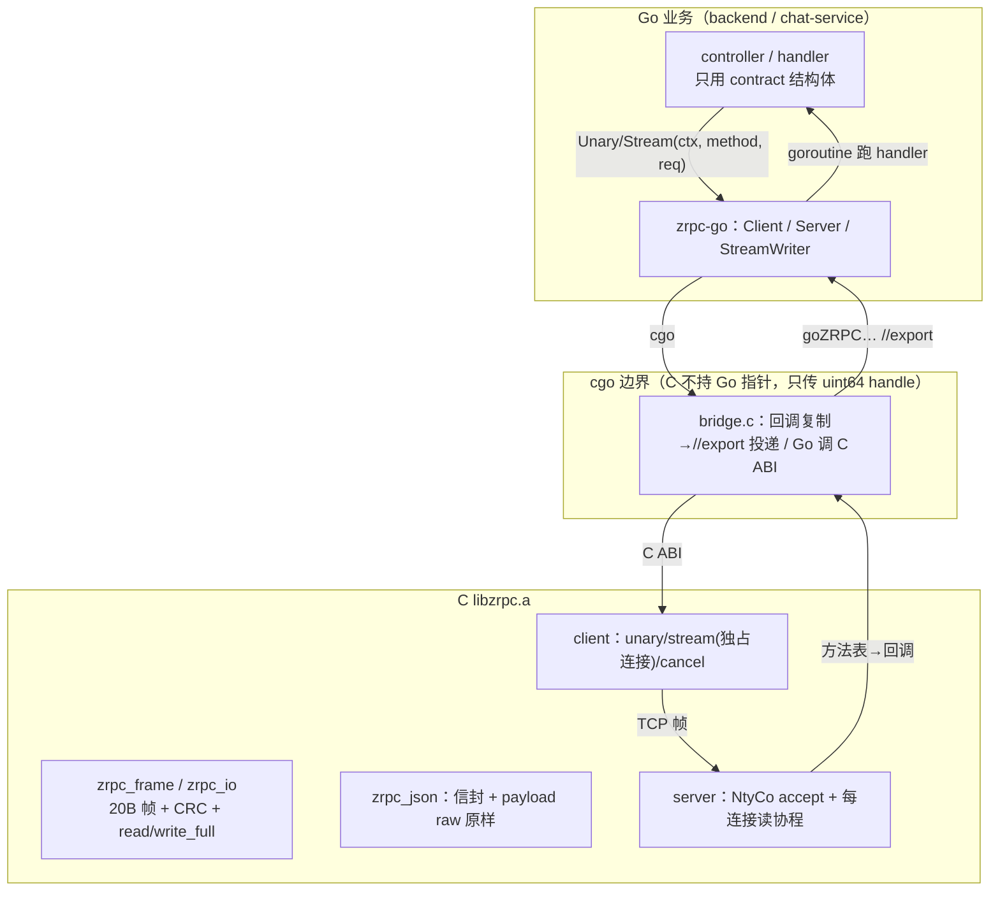
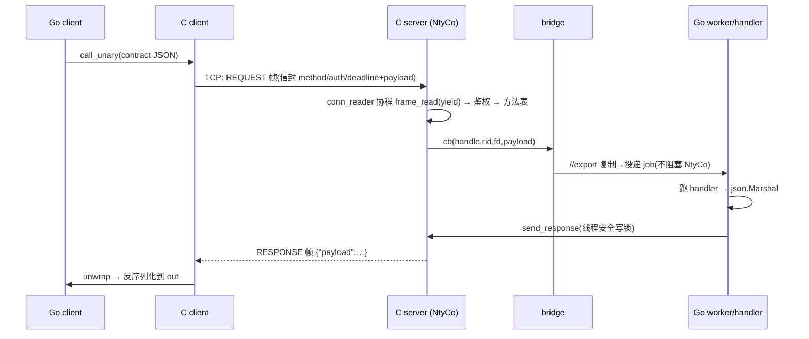
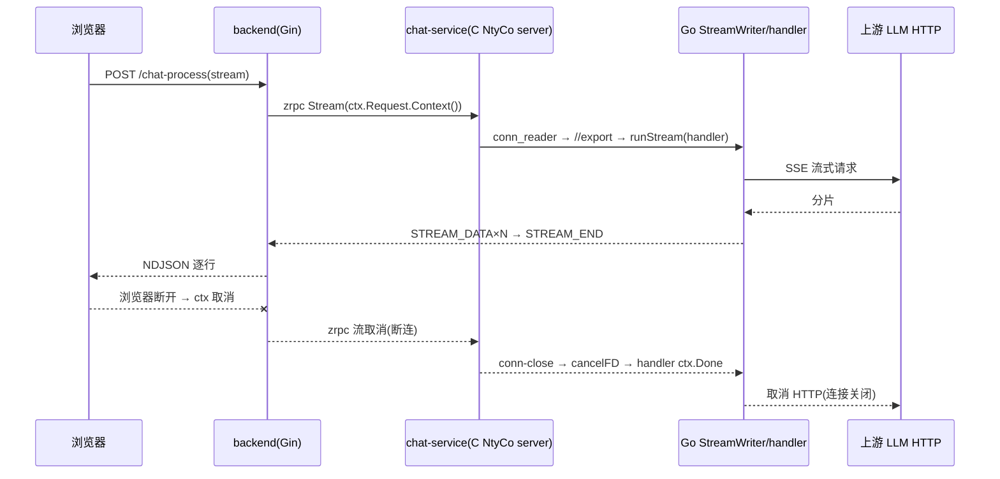

# zrpc v2：实现细节与在项目中的使用

状态：gRPC 已删，全链路仅自研 zrpc v2（单传输）。仓库目录：`third_party/zrpc/`（C 库）、
`zrpc-go/`（cgo bridge + contract）、三个服务使用点。

> 一句话定位：**C 写"内核"（协议/IO/并发），Go 写"外壳"（桥/业务）**。核心不是 Go 实现；
> Go 通过 cgo 调 C ABI，C 回调经 `//export` 回到 Go。

## 0. 语言分工总览

| 层 | 语言 | 目录 | 职责 |
|---|---|---|---|
| 协议内核 | C | `third_party/zrpc/src/{zrpc_frame,zrpc_io,zrpc_json,zrpc_error,zrpc_client,zrpc_server}.c` | 帧/CRC、安全 IO、JSON 信封、方法表、鉴权、ping、客户端与服务器 |
| 协程并发 | C（NtyCo） | `third_party/zrpc/ntyco/` | **server** 的 accept/读协程调度（Go 侧/普通线程不经过它） |
| 静态库 | C | `third_party/zrpc/build/libzrpc.a` | 交付物；`make -C third_party/zrpc` |
| cgo 桥 | C shim + Go | `zrpc-go/bridge.c` + `client.go/server.go/stream.go` | Go↔C 双向：调用 C、`//export` 收 C 回调 |
| 契约 | Go | `zrpc-go/contract/` | 业务结构体（字段=proto json_name） |
| 业务 | Go | 三个服务 | 复用既有逻辑，仅换传输 |

## 1. C 内核实现细节

### 1.1 协议（zrpc_protocol.h / zrpc_frame.c）
- 帧：`magic 'ZR'(2B) | ver=2(1B) | type(1B) | request_id(8B BE) | len(4B BE) | crc32(payload)(4B)`，共 20B。
- 消息类型：REQUEST/RESPONSE/STREAM_DATA/STREAM_END/ERROR/CANCEL/PING/PONG。
- 分配前校验 `len ≤ MAX_FRAME_SIZE(4MiB)`，坏 magic/ver/type/CRC → `PROTOCOL_ERROR`，超长 → `FRAME_TOO_LARGE`。
- 所有整数大端、显式字节放置（无未对齐强转）；CRC 仅查损坏不做安全。
- 终态规则：unary 一个 RESPONSE/ERROR；stream 一个 `STREAM_END` 或 ERROR；收到终态删 pending。

### 1.2 安全 IO（zrpc_io.c）
`zrpc_read_full/write_full(_until)`：EINTR 重试、EAGAIN/EWOULDBLOCK 用 poll 等待、超时→`DEADLINE_EXCEEDED`、
对端关闭→`UNAVAILABLE`、写 0 字节视为异常、`MSG_NOSIGNAL`。
**协程分支**：当 `nty_coroutine_get_sched()!=NULL`（即运行在 NtyCo 协程内）时改用裸 `recv/send` 循环，
由 NtyCo 负责 yield——**绝不在调度线程上 poll 阻塞**。

### 1.3 JSON 信封（zrpc_json.c + cJSON）
- REQUEST：`{"method","auth":"Bearer <token>","deadline_unix_ms","payload":<业务JSON>}`；
  业务 JSON 以 cJSON **raw 逐字嵌入/取出**，不重序列化（保字段序/数字）。
- RESPONSE/STREAM_DATA 块：`{"payload": <业务块>}`；客户端先 unwrap 再交给 Go。
- ERROR：`{"code","message","retryable"}`。

### 1.4 C server（zrpc_server.c）—— NtyCo 在这
- `zrpc_server_serve`：bind/listen 后起**一条 NtyCo 调度线程**，线程内建 `server_main`（accept 协程）。
- 每个连接再 `nty_coroutine_create` 一个 `conn_reader` 协程：`frame_read`（协程内 yield）→ PING 直接 PONG
  → REQUEST 解信封→鉴权（常量时间比较 Bearer）→查方法表→调注册回调（bridge cb）。
- **回调进 Go 的约束**：回调只把请求字节复制后 `//export` 投递给 Go worker 就返回，**不在 NtyCo 线程上做重活/阻塞**。
- **回写**：Go handler 完成后在任何线程调 `zrpc_server_send_response/send_stream_*`——走"每连接写锁 +
  非协程路径"，线程安全。
- 断连：conn_reader 退出前触发 conn-close 回调（`goZRPCOnConnClosed`）→ Go 取消该 fd 在途 stream 的 ctx。
- 优雅停机：`zrpc_server_shutdown`（假连接唤醒 accept、`shutdown(fd)` 唤醒各读协程）→ 协程退尽 →
  `nty_schedule_run` 返回 → `zrpc_server_join`。

### 1.5 C client（zrpc_client.c）
普通线程阻塞 IO（不经 NtyCo）：`call_unary`（可复用连接）、`call_stream`（**每条流独占连接**，
逐块 unwrap 后回调，`STREAM_END/ERROR` 为终态）、`cancel`（`shutdown(SHUT_RDWR)` 唤醒阻塞读，无 fd 复用竞争）。

## 2. Go 桥与业务使用（zrpc-go）

### 2.1 服务端
```go
srv, _ := zrpc.NewServer(zrpc.ServerOptions{Address: "0.0.0.0:50055", AccessToken: cfg.Server.AccessToken})
srv.RegisterUnary(contract.MethodFilterValidate, func(ctx context.Context, raw json.RawMessage) (any, error) {
    var req contract.FilterRequest
    _ = json.Unmarshal(raw, &req)
    return contract.ValidateResponse{OK: ok, Keyword: w}, nil
})
srv.RegisterStream(contract.MethodChatCompletionStream, chat.ServeChatStreamZRPC) // handler 收 *StreamWriter
_ = srv.Serve()
// 退出: srv.Close()  // 优雅停 + 清 handle/worker
```
- handle 注册表：`Register*` 分配 `uint64 handle`（C 永不持 Go 指针），`Close` 清空（`RegisteredCount()==0`）。
- 请求分发：C 回调 → `//export goZRPCDispatchRequest`（仅复制、投递有界 channel，**不阻塞 NtyCo**）→
  Go worker（goroutine）跑 handler → 结果经 C 回写。
- 流：`StreamWriter.Send(v)/End()/Error(err)`；断连时 writer ctx 取消 → handler 可选 `ctx.Done()` 取消上游 LLM。
- panic 恢复 → `INTERNAL`；错误码稳定（`*StatusError{Code}`）。

### 2.2 客户端
```go
cli, _ := zrpc.NewClient(zrpc.ClientOptions{Host: "127.0.0.1", Port: 50055, Token: tok})
var resp contract.ChatCompletionResponse
err := cli.Unary(ctx, contract.MethodChatCompletion, &req, &resp)          // StatusError on fail
st, _ := cli.Stream(ctx, contract.MethodChatCompletionStream, &req)         // 专用 C client per stream
for { var c contract.ChatCompletionStreamResponse; err := st.Recv(&c); if err == io.EOF { break } }
st.Close() // 或 ctx 取消
```
- ctx 带 deadline → 信封 `deadline_unix_ms`；浏览器断开用 `ctx.Request.Context()` 作父 ctx。
- backend 入口：`ai_chat_service.OpenChatStream(ctx, addr, token, protoReq)`（zrpc only）。
- chat-service 下游敏感词/关键词：`keywords_filter.ZRPCValidate / ZRPCFindAll(ctx, addr, token, text)`。

### 2.3 新增一个 RPC 的套路
1. `zrpc-go/contract` 加方法常量与结构体（字段 json 名 = proto `json_name`）。
2. 服务端 `RegisterUnary/RegisterStream` 写 handler（内部 DTO 是 proto 结构体时做显式映射，
   **勿用 protojson**——int64 会变字符串）。
3. 客户端 `cli.Unary/Stream` 调用；需要 gRPC 兼容层的话在服务侧补 contract↔proto 适配。

## 3. NtyCo 到底用在哪、不用在哪
- **用**：C server 一条调度线程内的 accept 协程 + 每连接读协程；协程里阻塞 recv/send 由 NtyCo yield。
  只存在于**服务进程**，且仅跑在 C 层；NtyCo 的链接期 hook 对**非协程线程（Go/普通线程）透明**（回退 libc）。
- **不用**：客户端、Go 侧业务、Go 调度。Go 的并发是 goroutine；两套并发栈以 `//export`/C ABI 交接，
  关键纪律 = **回调只投递、不阻塞 NtyCo 线程**；C 只保存 `uint64 handle`。

## 4. 构建 / 测试 / 压测
```bash
make -C third_party/zrpc            # libzrpc.a
make test-go                         # 四模块关键用例(race)
make zrpc-test / make zrpc-sanitize # C 层普通 / sanitizer(纯C；NtyCo/ucontext 与 ASan 冲突故 sanitizer 只跑纯C)
make build                           # 三个服务二进制
cd ai-chat-service && GOFLAGS=-mod=mod CGO_ENABLED=1 go run ./cmd/benchf zrpc 8 5000   # filter 压测
make -C third_party/zrpc ccli        # C unary 客户端 → tests/bin/ccli <host> <port> <token> <method> <json>
```
注意：凡编译含 cgo 的模块都需 `CGO_ENABLED=1` 且先有 `libzrpc.a`（`start.sh`/根 Makefile 已处理）。

## 5. 端口速查（单 zrpc）

| 服务 | zrpc 端口 | HTTP 健康 |
|---|---|---|
| keywords-filter sensitive / keywords | 50053 / 50054 | 18081 / 18082（`/healthz` `/readyz`） |
| ai-chat-service | 50055 | 8080（`/healthz` `/readyz`，与 metrics 共用） |

## 6. 已知边界 / 待办
- NtyCo 用 ucontext，与 ASan 不兼容（sanitizer 只覆盖纯 C，NtyCo 内存健康靠压测 fd/RSS canary）。
- 流用独占连接（无多路复用）；单 Client 一条连接串行（unary 池是后续项）。
- 流事件有界 channel 满时丢事件并记日志（背压细化是后续项）。
- 无 TLS/服务发现/LB（与 gRPC 时代相同的内网边界）；跨不可信网络需自行加 TLS/mesh。
- 协议无 schema 演进工具（JSON + 契约 golden 测试兜底）。

---

## 附录 A：流程图

### A1 架构分层与一次调用（unary / stream 通用）



### A2 unary 时序（request→response）



### A3 流式 + 浏览器断开取消链



## 附录 B：必读代码摘录（与源码一致的"骨架"，完整实现见对应文件）

**B1 帧解析：先校验长度再分配（zrpc_frame.c `parse_header`）**
```c
uint32_t len = get_u32_be(h + 12);
if (len > ZRPC_MAX_FRAME_SIZE) return ZRPC_STATUS_FRAME_TOO_LARGE; /* 任何 malloc 之前 */
```

**B2 JSON 信封：业务 JSON raw 原样注入，不重序列化（zrpc_json.c）**
```c
static int add_raw_member(cJSON *root, const char *key,
                          const void *business, uint32_t business_len)
{
    if (business == NULL || business_len == 0)
        return cJSON_AddRawToObject(root, key, "{}") != NULL ? 0 : -1;
    char *raw = dup_bytes(business, business_len);      /* 原样文本 */
    cJSON *item = cJSON_CreateRaw(raw);                 /* raw 节点，打印即原文 */
    free(raw);
    cJSON_AddItemToObject(root, key, item);
    return 0;
}
```

**B3 协程内读：交给 NtyCo yield，不在调度线程上 poll（zrpc_io.c `co_read_full`）**
```c
static int co_read_full(int fd, void *buf, size_t len)
{
    uint8_t *p = (uint8_t *)buf; size_t off = 0;
    while (off < len) {
        ssize_t n = recv(fd, p + off, len - off, 0); /* 在 NtyCo 协程内 recv 会 yield */
        if (n > 0) { off += (size_t)n; continue; }
        if (n == 0) return ZRPC_STATUS_UNAVAILABLE;
        if (errno == EINTR || errno == EAGAIN || errno == EWOULDBLOCK) continue;
        return map_recv_error(errno);
    }
    return ZRPC_STATUS_OK;
}
```

**B4 C→Go 回调：只复制并投递，立即返回（bridge.c `zrpc_bridge_server_cb`）**
```c
int zrpc_bridge_server_cb(uint64_t handle, uint64_t rid, int fd,
                          const void *req, uint32_t len, uint64_t deadline)
{
    void *copy = len ? malloc(len) : NULL;
    if (copy) memcpy(copy, req, len);
    goZRPCDispatchRequest(handle, rid, fd, copy, len, deadline); /* 同步返回 */
    free(copy);
    return 0;
}
```

**B5 Go 侧分发：不阻塞 NtyCo，有界投递（server.go `goZRPCDispatchRequest`）**
```go
//export goZRPCDispatchRequest
func goZRPCDispatchRequest(handle C.uint64_t, rid C.uint64_t, fd C.int,
	data unsafe.Pointer, dataLen C.uint32_t, deadline C.uint64_t) {
	payload := C.GoBytes(data, C.int(dataLen)) // 此刻拷贝，安全
	entry := handleGet(uint64(handle))          // uint64 → Go handler
	if entry == nil || entry.srv.closed {
		return
	}
	select { // 满则丢弃并记日志，绝不阻塞 NtyCo 调度线程
	case entry.srv.jobs <- requestJob{rid: uint64(rid), fd: int(fd), payload: payload,
		deadline: uint64(deadline), entry: entry}:
	default:
		log.Printf("zrpc: dispatch queue full, dropping rid=%d", uint64(rid))
	}
}
```

**B6 客户端流主循环（stream.go `Stream.Recv`）**
```go
func (s *Stream) Recv(out any) error {
	select {
	case ev, ok := <-s.evCh:
		if !ok {
			return io.EOF
		}
		switch ev.kind {
		case eventStreamData:
			return json.Unmarshal(ev.data, out) // DATA → 反序列化
		case eventStreamEnd:
			return io.EOF
		case eventError:
			return &StatusError{Code: ev.code, Message: errorMsgFromBytes(ev.data)}
		}
	case <-s.ctx.Done(): // 本地取消优先
		return s.ctx.Err()
	}
}
```
