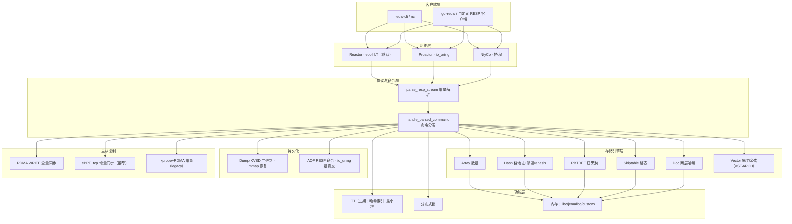
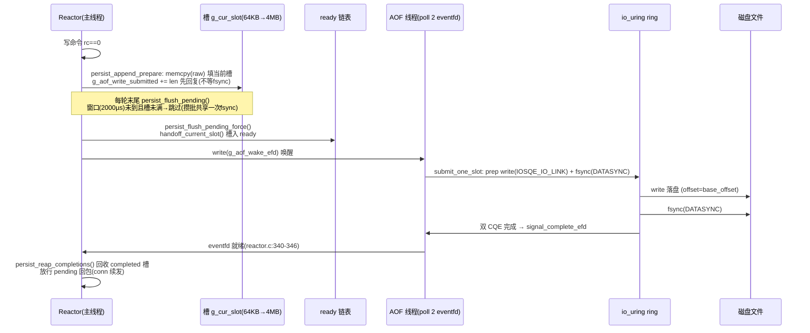
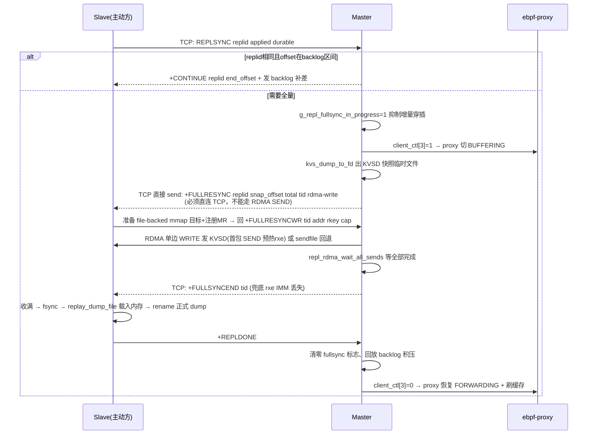

# 文档 1：kvstore 功能实现详解（以代码为准）

> 本文以当前代码为准，覆盖自研类 Redis KV 存储 kvstore 的完整功能实现：网络模型、RESP 协议、命令分发、存储引擎、内存管理、TTL 过期、持久化、主从复制、分布式锁、鉴权、VSEARCH 语义检索与哨兵。代码引用格式为 `文件:行号`，源码根目录为 `kvstore/`。

---

## 目录

1. [项目概述](#1-项目概述)
2. [总体架构](#2-总体架构)
3. [网络层：三种 I/O 模型](#3-网络层三种-io-模型)
4. [RESP 协议解析](#4-resp-协议解析)
5. [命令分发：前缀路由 + 统一写路径](#5-命令分发前缀路由--统一写路径)
6. [存储引擎：六种数据结构](#6-存储引擎六种数据结构)
7. [内存管理：libc / jemalloc / custom](#7-内存管理libc--jemalloc--custom)
8. [TTL / 过期机制](#8-ttl--过期机制)
9. [持久化：Dump + AOF + io_uring](#9-持久化dump--aof--io_uring)
10. [主从复制：全量 RDMA + 增量 eBPF+tcp](#10-主从复制全量-rdma--增量-ebpftcp)
11. [分布式锁](#11-分布式锁)
12. [鉴权 AUTH](#12-鉴权-auth)
13. [VSEARCH 语义检索](#13-vsearch-语义检索)
14. [哨兵 Sentinel](#14-哨兵-sentinel)
15. [配置项全表](#15-配置项全表)
16. [文档与代码的已知差异](#16-文档与代码的已知差异)

---

## 1. 项目概述

kvstore 是一个用 C 语言从零实现的高性能键值存储系统，目标是**兼容 Redis 的 RESP 协议**，但内部结构与 Redis 有显著差异（五种/六种存储引擎 + 三网络模型 + 三内存后端并存，属课程项目"对比学习"定位）。

- **语言**：C99 + Glibc，构建为 `kvstore/kvstore` 单二进制。
- **协议**：RESP（`*N\r\n$len\r\n...` 数组 / 批量字符串 / 简单字符串 / 整数 / 错误）。
- **配置**：`kvstore.conf`（`key=value`），命令行参数可覆盖。
- **默认端口**：5160。
- **默认网络模型**：epoll Reactor（`kvstore.conf:18,40`，`main/kvstore.c:46`）。
- **默认内存后端**：libc。

---

## 2. 总体架构



---

## 3. 网络层：三种 I/O 模型

网络后端由 `g_cfg.net_backend` 决定，`main()` 末尾按字符串分发（`main/kvstore.c:3038-3052`）：

```c
if (!strcmp(g_cfg.net_backend, "reactor"))     return reactor_start();
else if (!strcmp(g_cfg.net_backend, "proactor")) return proactor_start((unsigned short)g_cfg.port);
else if (!strcmp(g_cfg.net_backend, "ntyco"))  return ntyco_start((unsigned short)g_cfg.port);
```

**当前默认 = `reactor`**（`main/kvstore.c:46` `.net_backend="reactor"`，`kvstore.conf:18,40`）。


| 模型         | 底层           | 定位                    | 核心文件                             |
| ------------ | -------------- | ----------------------- | ------------------------------------ |
| **Reactor**  | epoll 水平触发 | 通用 I/O 密集，**默认** | `src/core/reactor.c`                 |
| **Proactor** | io_uring       | 高并发 + 磁盘 I/O       | `src/core/proactor.c`                |
| **NtyCo**    | 协程 hook      | 海量连接、同步写法      | `src/core/ntyco.c` + `NtyCo/` 子模块 |

三者共享同一 `parse_resp_stream` 业务路径与命令分发，仅 I/O 泵不同——这是课程"对比学习"设计的核心（详见技术选型文档）。

### 3.1 epoll Reactor（默认）

事件循环 `reactor_start()`（`reactor.c:245-391`），单线程 epoll：

```
epoll_wait(timeout 受 AOF 攒批窗口约束)        reactor.c:313-316
  ├─ 每 100ms：kvs_active_expire_cycle + persist_autosnap_cron   reactor.c:318-328
  ├─ 遍历就绪事件：
  │    persist_uring_fd() → reap AOF 批完成       reactor.c:340-346
  │    is_listener → on_accept()                  reactor.c:351
  │    EPOLLOUT → on_write()                      reactor.c:366,376
  │    EPOLLIN  → on_read()                       reactor.c:371
  └─ 末尾统一 flush_conn_output()（对齐 Redis beforeSleep）      reactor.c:387
```

关键设计（性能路径）：

- **I/O 缓冲**：每连接一次 malloc 合并块（1MB inbuf + 256KB out_ring），不清零以省冷启动缺页（`reactor.c:124-133`）。
- **`on_read()` 背压**：客户端连接先查 `repl_ebpf_backpressure()`（避免复制增量把客户端挤出）（`reactor.c:156-159`）。
- **单事件最多 16 次 recv**，读空即停（`reactor.c:173,176`，省多余 EAGAIN 探测）。
- **读路径不立即写**：仅置 `defer_epollout` 抑制 EPOLLOUT 注册，末尾统一 flush（`reactor.c:194-201`，省 epoll_ctl 系统调用）。
- **写缓冲**：`queue_bytes()` 写 out_ring 环形缓冲，从空→非空才注册 EPOLLOUT（`reactor.c:43-68`）。响应上限受 `OUT_RING_SIZE=256KB` 约束；大 value 在 `kvstore.c:2093` 走流式直写 ring。

### 🔍 3.1 深入解析：I/O 缓冲、读路径优化与写路径/背压

**（1）「一次 malloc 合并块 + 不清零」指什么（`reactor.c:131-137`）**

```c
c->inbuf    = (unsigned char *)kvs_malloc(INBUF_CAP + OUT_RING_SIZE);  // 1MB + 256KB = 1.3MB
c->out_ring = c->inbuf + INBUF_CAP;                                    // 指向合并块的后半段
```

- 每个连接只做**一次** `kvs_malloc`，`inbuf`（1MB 接收缓冲）和 `out_ring`（256KB 环形发送缓冲）**首尾相接**放在同一块内存里（`out_ring` 就是 `inbuf + 1MB`），省了一次堆分配（`kvs_malloc` 底层可能触发一次 `mmap`）。
- **"不清零"** = 不用 `calloc`/`memset` 清零这块 1.3MB。原因（代码注释 `reactor.c:128-130`）：`calloc` 清零 1.3MB/连接是冷启动 1k 连接基准测试的主要开销——**50 连接 = 65MB 清零 + 1.6 万次缺页**。`memset` 会触碰全部页强制分配物理内存（写缺页）；不清零则页按需分配，连接建立时只写 `inbuf/out_ring` 头部几个字节，其余 1.3MB 页懒分配。而这两个缓冲都只在"写入后读取"（长度从 0 开始计数），不存在读到未初始化数据的风险，所以不必清零。

**（2）「读路径不立即写」的优化针对什么（`reactor.c:176,200-206`）**

针对的是**省 `epoll_ctl` 系统调用**，正是 ECHO 压测暴露出的热点（与 redis-benchmark→Memtier 后 kv<redis 的排查一致）：

- perf 实测 `epoll_ctl` 占 ECHO 路径 **~13%**、HSET **~7%**（代码注释 `reactor.c:204`）。
- 原实现：`on_read` 读一次 → 回包 `queue_bytes` → 立即 `epoll_ctl(MOD, EPOLLIN|EPOLLOUT)` 注册写事件 → 事件循环下次扫描再 `on_write`。一条命令要 **2 次 `epoll_ctl` MOD**。
- 优化后（对齐 Redis `beforeSleep`）：读路径只置 `c->defer_epollout = 1`（`reactor.c:176`），让 `queue_bytes` 里"空→非空才注册 EPOLLOUT"的逻辑被抑制（`reactor.c:68` 的 `&& !c->defer_epollout`）；命令解析完**不立即 send**，而是等**每轮事件循环末尾的 `flush_conn_output(NULL)` 统一 flush**（`reactor.c:387`，遍历 `fdmap` 把所有有 pending 输出的连接 `send` 一次）。一次写不完（`EAGAIN`/慢读）时 `on_write` 末尾按剩余量注册 `EPOLLOUT` 兜底（`reactor.c:231`），由事件驱动续写。
- 收益：把每条命令的 2 次 `epoll_ctl` 摊掉，且"读完所有就绪连接后统一写"的多连接并发调度更优。

**（3）`queue_bytes()` 写缓冲 / `on_read()` 背压各自针对什么（`reactor.c:47-72,154-163`）**

- **`queue_bytes` 写缓冲**：把响应写进 `out_ring` 环形缓冲（环形让 `memcpy` 最多拆两段，`head/tail` 位与运算回卷，`reactor.c:56-63`）。只在**从空→非空**的跃迁才 `epoll_ctl` 注册 `EPOLLOUT`（`reactor.c:68`），避免每命令都注册。响应上限受 `OUT_RING_SIZE=256KB` 约束：`queue_bytes` 在 `len > OUT_RING_SIZE - out_ring_len` 时返回 -1（`reactor.c:52`），即"已排队字节 + 本条响应"总量不能超过 256KB。
- **大 value 流式直写（`kvstore.c:2097-2110`）**：64KB~256KB 的 value 读回时，`GET` 分支不塞进 64KB 栈 `resp` 缓冲，而是把 `$<len>\r\n`、value、`\r\n` 分成三次 `queue_bytes` 直接写 `out_ring`（绕过 `BUFFER_CAP` 栈缓冲，慢客户端 `EAGAIN` 由 flush 兜底续写）；超 256KB 才回错误。
- **`on_read()` 背压（`reactor.c:154-163`）**：针对 **eBPF+tcp 增量复制的无损性**。ebpf-proxy 转发队列近满时会把 `client_ctl[4]/[6]` 置位；master 客户端连接每次 `recv` 前查 `repl_ebpf_backpressure()`（`kvs_repl_ebpf.c:381-440`，2ms 缓存），置位则 `usleep(100)` 停手等 proxy 排空，把 ringbuf 溢出导致的 fexit 静默丢数据转成 TCP 背压（无损）。只拦客户端连接（`!c->is_replica`）：replica 连接读的是 REPLACK 等控制命令（proxy 已过滤不转发），阻塞会让复制控制面超时。

> **❓ 追问：优化前是"两次事件循环分别处理 read 和 write"，优化后只用一次事件循环处理所有 write 吗？defer_epollout 不也是在 read 里设置的吗？**
>
> 你的理解基本正确，补两个关键点：
>
> 1. **事件循环次数**：对。优化前一条会回包的命令要经过**两轮** epoll——第 N 轮扫描触发 `EPOLLIN` → `on_read` 读+把响应写进 `out_ring` → `queue_bytes` 注册 `EPOLLOUT` → 第 N+1 轮扫描触发 `EPOLLOUT` → `on_write` 真正 `send` → 发完再 MOD 回 `EPOLLIN`。共 **2 次 `epoll_ctl` MOD + 2 轮事件循环**。
> 2. **优化后**：读和写都发生在**同一轮**里——扫描阶段 `on_read` 把响应写进 `out_ring`，扫描结束 `flush_conn_output(NULL)`（`reactor.c:393`）直接遍历 `fdmap` 把所有 pending 输出 `send` 掉，**不再等下一轮 EPOLLOUT**。正常情况下一条命令 **0 次 `epoll_ctl`**（`mod_events` 有"mask 相同就跳过"的守卫，`reactor.c:38`）。
>
> **defer_epollout 为什么在 read 里设？** 因为它抑制的正是"命令处理过程中由 `queue_bytes` 触发的 EPOLLOUT 注册"。`queue_bytes` 是 `handle_parsed_command` → 各命令处理函数在**读路径内部**调用的（回包都在这里写）；`queue_bytes` 有条逻辑"`out_ring` 从空变非空就注册 EPOLLOUT"（`reactor.c:68`）。若不抑制，每处理一条产生回包的命令，`queue_bytes` 都会白花一次 `epoll_ctl`。所以 `on_read` 在调 `parse_resp_stream` 前把 `defer_epollout=1`、解析完复位（`reactor.c:176,178`），等于告诉 `queue_bytes`："现在别注册 EPOLLOUT，本轮末尾的 `flush_conn_output(NULL)` 会统一发"。
>
> **EPOLLOUT 并没有消失，只是从"每命令必发生"降级为"写不完才发生"的兜底**：`flush_conn_output` 是尽力发送，遇到慢客户端/EAGAIN 一次发不完时，`on_write` 末尾按剩余量注册 `EPOLLOUT`（`reactor.c:231`），下一轮事件循环续写。这也解释了为什么 `flush_conn_output(NULL)` 要遍历整个 `fdmap` 而不是只遍历就绪 fd——那些"本轮没有 EPOLLOUT 事件但攒了输出"的连接（正是被 defer 抑制了注册的那些）都要靠它发。
>
> **❓ 追问：`fdmap` 存的什么？pending 指什么？单个/多个客户端分别是什么？"按剩余量注册 EPOLLOUT"又指什么？**
>
> **`fdmap`**（`reactor.c:16`）：`static conn_t *fdmap[65536]`——一个**按 fd 索引的指针数组**，`fdmap[fd]` = 该 fd 对应的连接对象 `conn_t*`（监听 socket 也占一个槽，`is_listener=1`）。`on_accept` 时 `fdmap[cfd]=c`，`close_conn` 时置 NULL。
>
> **pending 输出**：指某个连接的 `out_ring_len > 0`——即 out_ring 环形发送缓冲里**还没 `send` 出去的积压字节**。回包是先写进 out_ring 的，只要没发完就是 pending。
>
> - **单个客户端**：它的 conn 在 `fdmap[它的fd]`，若 `out_ring_len>0` 就说明有 pending 回包。`flush_conn_output(NULL)` 遍历 fdmap 找到它 → `on_write` 把 out_ring 尽量发完。
> - **多个客户端**：`flush_conn_output(NULL)` 遍历整个 fdmap，把**所有** `out_ring_len>0` 的连接依次 `on_write`（跳过 listener）。好处：不是 50 个连接各触发一次 EPOLLOUT+on_write（那是 50×2 次 epoll_ctl），而是统一扫一遍直接 send。
>
> **"按剩余量注册 EPOLLOUT"**（`on_write`，`reactor.c:211-233`）：`on_write` 是 `while(out_ring_len>0)` 尽力发送，发完一轮后看剩多少：
>
> - `out_ring_len == 0`（全发完）→ `mod_events(EPOLLIN)`，下轮只等读；
> - `out_ring_len > 0`（还有剩，说明遇到 EAGAIN/慢客户端）→ `mod_events(EPOLLIN | EPOLLOUT)`，注册写事件，下轮 epoll 再进 `on_write` 续发。
>
> **50 客户端各发一条 PING 的例子**（对照优化前后）：
>
> | 阶段 | 优化前 | 优化后 |
> |---|---|---|
> | 扫描 | epoll_wait 返回 50 个 EPOLLIN | 同左 |
> | 读+回包 | 逐个 on_read，`queue_bytes` 每条各注册一次 EPOLLOUT（50 次 epoll_ctl MOD） | 逐个 on_read，defer_epollout=1 抑制注册（**0 次 epoll_ctl**），回包进各 out_ring |
> | 写 | 下一轮 epoll 触发 50 个 EPOLLOUT → on_write 发完 → 再 50 次 MOD 回 EPOLLIN | 本轮扫描结束 `flush_conn_output(NULL)` 遍历 fdmap，50 条 +PONG 一次发完（**0 次 epoll_ctl**） |
> | 总计 | **2 轮事件循环 + 100 次 epoll_ctl** | **1 轮事件循环 + 0 次 epoll_ctl** |
>
> 若其中 1 个是慢客户端发不完：它 out_ring_len>0 → 给它单独注册 EPOLLOUT 等下一轮续发；其余 49 个发完只挂 EPOLLIN。这正是"ECHO 路径 epoll_ctl 占 ~13%"被优化的来源。

### 3.2 io_uring Proactor

真正的异步读写（独立 ring，`proactor.c`）：

```
proactor_start(): io_uring_queue_init(1024) + submit_accept + 单线程
  io_uring_wait_cqe_timeout → 按 req->event 分派：
    ACCEPT → 建 conn + submit_read        proactor.c:186-209
    READ   → parse_resp_stream; 有输出则 submit_write       proactor.c:210-229
    WRITE  → 更新 head/len; 残留则续写     proactor.c:230-246
```

`uring_req_t` 携带 event+conn+缓冲（`proactor.c:9-15`）。100ms crontab 跑 expire/autosnap/rewrite poll（`proactor.c:41-50`）。属实验路径，无 bgrewriteaof 竞态处理、无转发线程配合。

### 3.3 NtyCo 协程

基于 NtyCo 库：每个连接一个 `server_reader` 协程（`ntyco.c:41-82`），`recv`/`send` 用阻塞语义（底层转 epoll 挂起/唤醒）。事件循环退化为单 `server_main` 协程 accept + `nty_schedule_run()` 调度（`ntyco.c:172-190`）。cron 独立线程（`ntyco.c:84-102`）。三模型中最"演示级"的实现。

---

## 4. RESP 协议解析

核心函数 `parse_resp_stream()`（`kvstore.c:2277-2579`），在 inbuf 上**增量解析**（不完整数据留在尾部，下次续读）。

```
'*' 数组分支（kvstore.c:2455-2570）：
  读 argc（最多 32，超过静默丢弃）       kvstore.c:2465-2472
  逐个 bulk：
    '$' → blen（校验溢出/非数字）          kvstore.c:2497-2509
    argv 存 PARSE_SCRATCH(4KB) 栈缓冲，满则退 heap    kvstore.c:2526-2538
    完整 → handle_parsed_command(...)      kvstore.c:2564
'+' 控制行（kvstore.c:2343-2416）：专门处理 +FULLRESYNC/+CONTINUE 等复制控制面
inline 裸命令（kvstore.c:2418-2453）：兼容 "MGET k1 k2" 空格分隔
```

**边界处理**：

- 命令跨 recv 分片时安全（CRLF 未完整即 incomplete，已 malloc 的 argv 释放，下次重解析，`kvstore.c:2547`）。
- 全量同步截获（`kvstore.c:2296-2341`）：`g_slave_loading_fullsync` 时把 raw KVSD 字节直接写 temp 文件而非解析，是 TCP/RDMA/kprobe 所有接收路径的汇聚点。
- **协议限制**：argc>32 的命令被静默丢弃（MGET/HMSET 等 >32 key 的命令不兼容 Redis，`kvstore.c:2469`）。

### 🔍 4 深入解析：不完整数据如何"续读"

`parse_resp_stream()` 是**无状态增量解析**：它只消费 `inbuf` 里"已经完整"的命令，遇到不完整的数据就停，把剩余字节**搬回 inbuf 头部**等下次续读。关键在函数末尾（`kvstore.c:2577-2582`）：

```c
if (pos > 0 && pos < *len) {
    memmove(buf, buf + pos, *len - pos);   // 未解析完的尾部搬回 buf 开头
    *len -= pos;
} else if (pos >= *len) {
    *len = 0;                              // 全部消费完
}
```

- `pos` 是本次已成功解析的字节偏移。解析到不完整处（例如 `$5\r\nhell` 只收到 9 字节，缺 `o\r\n`）时，内层分支置 `incomplete=1` 后 `break`（`kvstore.c:2552`），此时 `pos` 停在完整命令的终点，尾部（不完整命令）被 `memmove` 搬到 `inbuf[0]`。
- reactor 侧 `on_read` 用 `c->in_len` 记录剩余长度，下一次 `recv` 把新字节**追加到 `inbuf + in_len`**（`reactor.c:173`），下一轮 `parse_resp_stream` 从 `inbuf[0]` 继续——"旧半条 + 新字节"拼成完整命令，续读闭环成立。
- `incomplete` 时已 `malloc` 的 argv 会被释放（`kvstore.c:2553-2557`，指向 `PARSE_SCRATCH` 栈的则跳过），下次重新解析，避免残留脏数据。
- 命令跨多次 `recv` 分片是安全的：一次 `recv` 最多读 `MAX_RECV_BYTES=32764` 字节（对齐 BPF 捕获上限），一条大命令可能拆多次 `recv`，但每次都会先拼尾巴再解析。

---

## 5. 命令分发：前缀路由 + 统一写路径

### 5.1 前缀路由

命令按**首字母前缀**决定引擎（`kvstore.c:835-846`）：

```c
static int cmd_engine(const char *cmd) {
    if (cmd[0] == 'R') return KVS_ENGINE_RBTREE;      // R* → 红黑树
    if (cmd[0] == 'H') return KVS_ENGINE_HASH;        // H* → 哈希
    if (cmd[0] == 'X') return KVS_ENGINE_SKIPTABLE;   // X* → 跳表
    return KVS_ENGINE_ARRAY;                          // 其余 → 数组
}
static const char *strip_prefix(const char *cmd) {
    if (cmd[0] == 'R' || cmd[0] == 'H' || cmd[0] == 'X') return cmd + 1;
    return cmd;
}
```

`SET`/`GET`(→array)、`RSET`/`RGET`(→rbtree)、`HSET`/`HGET`(→hash)、`XSET`/`XGET`(→skiptable) 是同一个 `SET` 操作挂在四个引擎上。引擎抽象为统一函数指针表（`kvstore.c:848-892` `engine_exist/get/set/mod/del`）。

### 5.2 命令分层

`handle_parsed_command()`（`kvstore.c:1176-2258`）没有标准命令结构体表，而是一串 `if(!strcmp(...))`，分层次：

1. **AUTH 门禁**（`kvstore.c:1183-1195`）：`requirepass` 非空且未 authed 时只放行 AUTH/QUIT，其余回 `-NOAUTH`（复制回放豁免）。
2. **ECHO/PING 快路径**（`kvstore.c:1202-1247`）：`|32` 小写化比较 + 单栈缓冲拼 RESP（ECHO 分派占热点 ~40%）。
3. **HSET/HGET/HDEL/HMOD 4 字命令快路径**（`kvstore.c:1274-1282`）：直接 `goto engine_dispatch`，省 ~35 次 strcmp。
4. **控制命令链**：PING/ECHO/QUIT/AUTH/COMMAND/CLIENT/HELLO/REPLSYNC/REPLACK/REPLDONE/KPROBEMR/INFO/MEMSTAT/MEMORY_PURGE/SAVE/BGSAVE/BGREWRITEAOF/APPENDFSYNC/CONFIG/SNAPRULE*/LOCK/UNLOCK/RENEW/OWNER/SLAVEOF/ROLE/DOC*（`kvstore.c:1284-2041`）。
5. **`engine_dispatch` 引擎区**（`kvstore.c:2043-2190`）：`if(!strcmp(op,"SET") && argc==3)` 二次分派。

### 🔍 5.2 深入解析：AUTH 门禁的用途与使用方式

- **用途**：给 server 加访问密码，防止未授权客户端读写数据。`requirepass` 非空即启用（默认空 = 关闭，见 `kvstore.conf` 与 §12）。
- **使用方式**：
  1. 客户端连上后先发 `AUTH <password>`；匹配成功置 `c->authed = 1`（`kvstore.c:1303-1318`：`len == strlen(requirepass)` && `strncmp` 精确匹配 → `+OK`，否则 `-invalid password`；空 `requirepass` 回 `-ERR Client sent AUTH, but no password is set`）。
  2. 在 `handle_parsed_command` **最前**（`kvstore.c:1183-1195`）做门禁：未 `authed` 的连接只放行 `AUTH`/`QUIT`，其余任何命令（包括 `PING`/`ECHO`）一律回 `-NOAUTH Authentication required.`。
  3. **复制回放豁免**：`from_replication=1` 的内部复制连接不受门禁（slave 重放 master 命令无需客户端鉴权），保证主从同步不被密码阻断。
  4. 业务接入：`go-redis` 等客户端配 `Password` 即可，ai-chat 服务经 openai-api-proxy 连 kvstore 时使用（见文档 4）。

### 5.3 写命令统一持久化 + 复制广播

写命令走统一代码路径（`kvstore.c:2192-2243`），`is_write_cmd()`（`kvstore.c:821-833`）列出全部写命令：

```c
if (rc == 0) {                       // 引擎写入成功
    resp[0..4] = "+OK\r\n";          // 静态写出，省 snprintf
    if (!from_replication && is_write_cmd(cmd)) {
        persist_note_write();                              // dirty 计数
        int pr = persist_append_prepare(c, raw, rawlen, resp, n);  // AOF
        if (pr == KVS_PERSIST_ERR) → 回 -ERR
        if (g_cfg.role == ROLE_MASTER) {
            repl_backlog_feed(raw, rawlen);   // 入 backlog
            repl_note_broadcast(rawlen);      // master offset += rawlen
            repl_broadcast(raw, rawlen);      // 广播给 slave
        }
    }
}
```

**关键点**：广播和 AOF 都用**原始 RESP 字节 `raw`**（非重新序列化）——保证 slave 逐字节一致、offset 与 backlog 字节系对齐。`from_replication` 表示 slave 端点播命令，只更新 offset 并写 AOF（`kvstore.c:2199-2218`）。

> 注意：LOCK/UNLOCK/RENEW 三命令内联各自的 `persist_append_prepare` + `repl_broadcast`（`kvstore.c:1781-1858`），不走上面的统一 is_write_cmd 路径——这是实现差异，非 bug。

### 🔍 5.3 深入解析：`persist_append_prepare()` 持久化是怎么做的

写命令落 AOF 走 `persist_append_prepare()`（`kvs_persist.c:914-994`），核心是 **"先回复、后台 fsync"** 的异步 group-commit 流水线：

**入口判定（`kvs_persist.c:917-919`）**

- `g_aof_fd < 0` → AOF 禁用则返回 `OK`，否则 `ERR`；
- `aof_fsync != ALWAYS`（即 `appendfsync off`）→ 直接 `OK`（不落盘）；
- 命中 `KVS_PERSIST_ERR` → 调用方回 `-ERR` 并把响应发出。

**两条落盘路径**：

1. **同步模式（`--aof-fsync-sync*`）**：`pwrite + fdatasync` 立即落盘（`persist_sync_append_write`，`kvs_persist.c:903-912`），回包天然在 fsync 之后。
2. **异步 group-commit（默认）**：
   - **write-in-place 填槽**：把 `raw` 字节 `memcpy` 追加到当前槽 `g_cur_slot->aof_buf`（槽从 64KB 起、动态翻倍到 4MB，`kvs_persist.c:970-983`），`g_aof_write_submitted += len`。
   - **先回复**：函数直接返回 `KVS_PERSIST_OK`，回包**不等 fsync**。`persist_append_prepare` 返回后调用方（`kvstore.c:2238`）若拿到 `KVS_PERSIST_PENDING` 则把 `resp=NULL`（回包延后到批完成再发）。
   - **攒批**：`persist_flush_pending()`（reactor 每轮末尾，`reactor.c:388`）按 group-commit 窗口（默认 2000µs）判断是否 handoff；窗口未到且槽未满则跳过（`kvs_persist.c:1080-1085`），攒多批共享一次 fsync。
   - **handoff**：`persist_flush_pending_force()` → `handoff_current_slot()` 把当前槽推入 ready 链表，写 `g_aof_wake_efd` 唤醒 AOF 线程（`kvs_persist.c:1059-1073`）。`MAX_OUTSTANDING=16` 槽在途背压界住崩溃窗口。
   - **AOF 线程提交**：`aof_thread_main`（`kvs_persist.c:364-393`）poll 两个 eventfd，`submit_one_slot` 提交 **`write(IOSQE_IO_LINK)` + `fsync(DATASYNC)` 两个 SQE**（`kvs_persist.c:1028-1056`），由 io_uring 保证 write 完成后才 fsync。
   - **CQE 回收**：双 CQE 完成后 `signal_complete_efd` → 主线程 eventfd 唤醒 → `persist_reap_completions()` 把 completed 槽回收、放行连接（`reactor.c:340-346`）。

**与复制的关系**：广播和 AOF 都使用**原始 RESP 字节 `raw`**（非重新序列化）——保证 slave 逐字节一致、offset 与 backlog 字节系对齐；`from_replication`（slave 回放）也走同一函数只写 AOF、不广播（`kvstore.c:2204-2222`）。

---

## 6. 存储引擎：六种数据结构

五种实例全局定义：`global_array / global_rbtree / global_hash / global_skiptable / global_doc`，在 `main()` 创建（`kvstore.c:3002-3007`）。

### 6.1 Array 引擎（无前缀，`SET`/`GET`/`DEL`）

**数据结构**：定长槽数组 + key→slot 哈希索引（O(1) 查找，是对早期 O(N) 线性扫描的改造）。

```c
kvs_array_t {
    table[KVS_ARRAY_SIZE=1M 槽];     // 惰性分配，首次 set 才 16MB（kvstore.h:80）
    int next_slot;  int *free_list;  // 空槽栈复用
    kvs_hash_t *index;               // key→slot，O(1) 定位
}
```

- **插入**：hash 索引找 slot，不存在则分配 O(1) 槽（free_list 优先），写 table，回写 index（`kvs_array.c:88-98`）。
- **查找**：`find_slot()` → hash_get 得 slot → table[slot].value（`kvs_array.c:43-49`）。
- **容量**：1M 槽硬上限，满了返回 -1。均摊 O(1)。默认引擎，适合小规模 KV。

### 🔍 6.1 深入解析：Array 引擎的存储与增删改查

**数据怎么存**：一张**定长槽数组** `table[KVS_ARRAY_SIZE=1M]`（`kvs_array_item_t{key,value}`，16B/槽）+ 一个 **key→slot 哈希索引** `index`（就是一个 `kvs_hash_t`，key→"slot 数字的字符串"）。`table` 惰性分配——首次 `SET` 才 `kvs_malloc(1M×16B=16MB)`（`kvs_array.c:54-58`），纯 hash 负载不占这 16MB。`next_slot` 指向下一个可用的连续槽，`free_list` 是已删除槽的下标栈。

**每次分配节点**：key、value **各自 `kvs_malloc`** 拷贝一份（`kvs_array.c:71-72`，strlen+1，NUL 结尾），槽本身不动态分配。

**查找（O(1)）**：`find_slot` → `kvs_hash_get(index, key)` 拿到 slot 字符串 → `atoi` → `table[slot].value`（`kvs_array.c:43-49`）。这就是对早期 `find_slot` O(N) 线性扫描的改造。

**插入（`kvs_array_set`，`kvs_array.c:51-100`）**：

1. 惰性分配 `table`；
2. `find_slot` 命中 → 走 `kvs_array_mod`（只换 value）；
3. 未命中 → 分配槽：`free_list` 有则弹栈复用（O(1)），否则 `next_slot++`；`next_slot >= 1M` 返回 -1（数组满）；
4. `memcpy` key/value 入槽，`total++`；
5. `snprintf` 出 slot 字符串 → `kvs_hash_set(index, key, slotbuf)` 建索引；
6. 索引写失败（OOM）→ **回滚**：free key/value、`total--`、槽位退回 `free_list`。

**删除（`kvs_array_del`，`kvs_array.c:107-130`）**：free key/value 置 NULL → `total--` → 槽位下标入 `free_list`（不够就 2 倍扩容）→ `kvs_hash_del(index, key)`。槽位不搬移，靠索引定位。

**修改（`kvs_array_mod`，`kvs_array.c:132-142`）**：只重分配 value（`malloc+memcpy` 后 free 旧 value）。

均摊 O(1)；1M 槽硬上限，满了返回 -1。

> **❓ 追问：`find_slot` 里那个 `index` 是哪来的？是不是要先 key→index 再通过 index 找 slot？**
>
> 是，分两步。`index` 是 Array 引擎在创建时就内嵌的一个**完整哈希表**（就是 `kvs_hash_t`）：
>
> ```c
> // kvs_array_create（kvs_array.c:17-19）
> inst->index = kvs_malloc(sizeof(kvs_hash_t));
> kvs_hash_create(inst->index);        // 它自己有 buckets、能哈希、能链地址
> ```
>
> 它与 1M 槽数组是**两套东西**：`table` 存真实 key/value 数据，`index` 只存"key → 槽号"的映射。查询流程（`find_slot`，`kvs_array.c:43-49`）：
>
> 1. 拿 `key` 去 `index`（一个普通哈希表）里查——先 FNV-1a 哈希 key 定位桶，链上 `strcmp` 找到对应节点；
> 2. 节点里存的 value 是**槽号字符串**（如 `"42"`，`kvs_array_set` 里 `snprintf` 成字符串写入，`kvs_array.c:86-88`，因为 `kvs_hash_t` 的 value 是 `char*`）；
> 3. `atoi` 转成整数槽号 → 访问 `table[42]` 拿 value。
>
> 所以每次 `SET` 要更新两处（`table[slot]` 写数据 + `index` 建 key→slot 映射），每次 `DEL` 也要删 `index`（`kvs_array.c:128`）。这就是"O(1) 查找"的代价——用一块哈希索引换掉 O(N) 线性扫描。
>
> **❓ 追问：Array 引擎为什么要做这个优化？是空间换时间吗？**
>
> 是，典型的**空间换时间**。优化前 `find_slot` 是 **O(N) 线性扫描**——遍历 1M 槽 table、逐个 `strcmp` 找 key（`kvs_array.c:16` 注释明说"替代 find_slot 的 O(N) 线性扫描"）。数据一多，每次 SET/GET 都要扫很久，代价 O(N)。
>
> 优化后加了一个 **key→slot 哈希索引**（内嵌 `kvs_hash_t`），把查找降到 O(1)。空间代价：索引是一张哈希表——初始 4096 桶（`HASH_INIT_SIZE`），每个 key 还要在 index 里多存一份 key 拷贝 + 一个槽号字符串，100 万 key 大概多占几十 MB 级（取决于 key 长度）。用这块额外内存换每次操作 O(1)，正是"空间换时间"的经典取舍。

### 6.2 Hash 引擎（`H*` 前缀，`HSET`/`HGET`/`HDEL`）

**链地址法 + 渐进式 rehash**（Redis dict 风格）。**FNV-1a 非加密哈希**：

```c
static uint32_t _hash_raw(const char *key) {   // kvs_hash.c:10-17
    uint32_t sum = 2166136261u;
    for (int i = 0; key[i] != 0; ++i) { sum ^= key[i]; sum *= 16777619u; }
    return sum;
}
```

**结构**：`ht[2]` 双表（active + rehash 目标），`rehash_idx` 标识进度（`kvs_hash.c:175-178`）。

```
_maybe_expand：count > max_slots * 2 → 开新表 2x，rehash_idx=0   kvs_hash.c:135-151
_maybe_shrink：count < max_slots/8 → 缩表                        kvs_hash.c:154-173
_rehash_step：每次操作前迁移 10 个桶                              kvs_hash.c:94-132
查: 同时查 ht[0]+ht[1]（rehash 中）                              kvs_hash.c:176-194
```

**节点单块分配**：`hashnode + key + value` 一个 `kvs_malloc` 块（`kvs_hash.c:25-39`），free 一次；缓存 FNV 哈希值加速 rehash。支持**二进制 value**（`kvs_hash_set_len/get_len`，`kvs_hash.c:236-265`，4 引擎中唯一）。均摊 O(1)。通用 KV，无容量上限。

### 🔍 6.2 深入解析：链地址法、渐进式 rehash 与 `ht[2]` 双表

**链地址法**：哈希表是**桶数组**（`ht[n].nodes` 是 `hashnode_t*` 指针数组），冲突的 key 不找下一个空位，而是**串成链表挂在同一个桶上**（头插法）。所以桶上是一个链表，`count` 记录总节点数。负载因子 `LOAD_FACTOR=2`：`count > max_slots*2` 时认为冲突过多，触发扩容。

**渐进式 rehash 与 `ht[2]` 双表**：扩容/缩容**不一次性搬完**，而是**每次操作前只迁移 10 个桶**（`REHASH_STEP_BUCKETS=10`，`_rehash_step`，`kvs_hash.c:94-132`），把搬桶开销均摊到每一次操作上，避免单次操作卡顿。

- `ht[0]` = active 表（当前服务），`ht[1]` = rehash 目标表（扩容时是 2x 新表，缩容时是半表），`rehash_idx` 记录 `ht[0]` 里已迁移到的桶下标（`kvs_hash.c:175-178`）。
- 触发：`_maybe_expand`（`count > max_slots*2` → 开 2x 新表，`rehash_idx=0`）；`_maybe_shrink`（`count < max_slots/8` → 缩一半，最低 4096，`kvs_hash.c:154-173`）。rehash 进行中不再次触发。
- 每步：从 `ht[0][rehash_idx]` 开始搬整个桶的**整条链表**（节点逐个按 `node->hv % ht[1].max_slots` 重新挂到 `ht[1]`，`ht[0].count--`/`ht[1].count++`），`rehash_idx++`。搬到 `>= ht[0].max_slots` 时：`free(ht[0].nodes)`，把 `ht[1]` 整表**提升**为 `ht[0]`，`rehash_idx=-1` 结束。
- rehash 期间的读写规则：**查/删同时查 `ht[0]`+`ht[1]`**（`_find_node`，`kvs_hash.c:176-194`）；**插入只进 `ht[1]`**（`kvs_hash.c:221`）。因为已迁移的 key 在 `ht[1]`，未迁移的在 `ht[0]`。

**节点怎么分配**：`_create_node_len` **单块分配** `sizeof(hashnode_t)+klen+1+vlen+1`（`kvs_hash.c:25-39`），`node->key = node+1`、`node->value = key+klen+1` 就地在同一块内布局，**free 一次**。`node->hv` 缓存 FNV-1a 哈希值，rehash 时直接取用不用重算。覆盖 value 时若新 value ≤ 旧 `vlen` 就地写，否则单独 `kvs_malloc` 一块（`_overwrite_value`，`kvs_hash.c:47-61`）。

**增删改查**（都先 `_rehash_step(10)` 摊还迁移）：

- `set`：`_find_node` 查重 → 命中覆盖（`_overwrite_value`）→ 未命中头插到目标表（rehash 中 `ht[1]` 否则 `ht[0]`）→ `count++` → `_maybe_expand`。
- `get`：`_find_node` 先 `ht[0]` 后 `ht[1]`（rehash 中）。`get_len` 版还能取二进制 value 真实长度。
- `del`：先在 `ht[0]` 桶链上摘除+free，再查 `ht[1]`；删除后 `_maybe_shrink`。
- 均摊 O(1)；支持含 `\0` 的二进制 value（`kvs_hash_set_len/get_len`），4 引擎中唯一。

> **❓ 追问：`ht[0]` 和 `ht[1]` 是不是一个存真实数据、一个不存？**
>
> **两个表都存真实数据，但互补不重复**——任意一个 key 在某一时刻只存在于其中一张表，绝不同时在两表：
>
> - **平时（未 rehash）**：`ht[1].nodes` 是 `NULL`（空表），所有数据都在 `ht[0]`（`kvs_hash_create` 只初始化 ht[0]，`kvs_hash.c:67-72`）。
> - **rehash 期间**：数据从 `ht[0]` **逐桶搬到** `ht[1]`。已搬走的在 `ht[1]`，还没搬的仍在 `ht[0]`，两表**合计**才是完整数据（`ht[0].count + ht[1].count = 总节点数`）。这正是为什么要"查双表"——key 可能在任一张表里。
> - **搬完**：`free` 掉旧的 `ht[0].nodes` 缓冲，把 `ht[1]` 整表**提升**为新的 `ht[0]`，`ht[1]` 清空重置为 NULL（`kvs_hash.c:122-129`），又回到"只用一个表"状态。
>
> 为什么不一次性搬完再切换？因为一次搬全部桶会卡住当前这条命令几十毫秒。渐进式把搬桶摊到**每次操作前迁 10 桶**，代价就是：rehash 期间**查要查两遍**（先 ht[0] 后 ht[1]）、**插入要插到 ht[1]**、**删除要两表都找**——这些都在 `_find_node`/`kvs_hash_del` 里处理了（`kvs_hash.c:176-194,275-316`）。

### 6.3 红黑树引擎（`R*` 前缀，`RSET`/`RGET`/`RDEL`）

经典 CLRS 实现：`rbtree_node{color,left,right,parent,key,value}` + `nil` 哨兵（`kvstore.h:130-143`）。左旋/右旋/fixup 完整实现（`kvs_rbtree.c:40-130,181-249`）。

- `kvs_rbtree_set`：存在则覆盖，否则建节点 + `rbtree_insert`（`kvs_rbtree.c:476-499`）。
- key 用 `strcmp` 比较。**O(log n) 严格**。当前无范围查询命令暴露，有序性主要用于 dump 时中序遍历序列化。

### 6.4 跳表引擎（`X*` 前缀，`XSET`/`XGET`/`XDEL`）

`MAX_LEVEL=12`、`P=0.5`（`kvs_skiptable.c:3-4`），`random_level()` 抛硬币（`kvs_skiptable.c:67-73`）。`search_node` 记录 `update[]` 路径（`kvs_skiptable.c:75-89`），set/del 依据 update 指针重连。提供 `kvs_skiptable_foreach` 有序遍历（`kvs_skiptable.c:182-189`）。期望 O(log n)。

### 6.5 Doc 引擎（`DOC*`，`DOCSET`/`DOCGET`/`DOCDEL`/...）

**两层哈希**：外层按 key 哈希到文档桶（`KVS_DOC_BUCKETS=1024`，可扩至 4M），内层按字段名哈希（`KVS_DOC_FIELD_BUCKETS=16`）到字段链（`kvs_doc.c:7-55`）。

```
doc(key) → 外层桶 ──→ fields[16] ──→ {name, value, next}
```

7 个命令：`DOCSET/DOCGET/DOCDEL/DOCDROP/DOCEXIST/DOCCOUNT/DOCGETALL`（`kvstore.c:1919-2041`）。均摊 O(1)。类似 Redis Hash 的多字段结构。

> ⚠️ dump 限制：Doc 序列化时字段拼成 `field=value` 空格串，字段值含空格时恢复 `strtok` 会拆分错乱（`kvs_persist.c:645-661`）——存在往返失真风险（中置信度）。

### 6.6 Vector 引擎（`VSEARCH`，语义向量检索）

不是独立存储引擎，而是**遍历 hash 引擎做暴力余弦 top-k** 的检索命令（`src/storage/kvs_vector.c`）：

```
值布局（自定义二进制）: [u32 qlen][q][u32 alen][a][u32 dim][float vec[dim]]   小端
遍历 ht[0]+ht[1] 所有 hashnode                              kvs_vector.c:56-79
  ├─ 只处理 key 前缀 "semcache:" 的条目                     kvs_vector.c:11
  ├─ parse_vec 校验维度 → cosine(query, vec)                 kvs_vector.c:14-46
  └─ top-k 数组插入冒泡排序                                  kvs_vector.c:65-76
RESP: *[2k] (key,score) 交替 bulk                            kvs_vector.c:82-94
```

- **复杂度**：O(n·dim + n·topk) 暴力，n=库中 semcache: 条目数。
- **用途**：语义缓存命中（LLM 应用查相似问题命中原缓存答案），见文档 4。不是 ANN/向量库。

### 🔍 6.6 深入解析：Vector 引擎如何复用 Hash 引擎做语义检索

- **是不是独立的存储引擎**：不是。`kvs_vector.c` 没有自己的存储结构，它直接**遍历 `global_hash`**（`ht[0]` 全部桶 + rehash 中再扫 `ht[1]`，`kvs_vector.c:56-79`）做检索。向量数据本身是用普通 `HSET` 写进 hash 引擎的。
- **值布局**：`[u32 qlen][q][u32 alen][a][u32 dim][float vec[dim]]`（小端）。即存了查询原文、答案原文、维度、float 数组四段。
- **暴力余弦 top-k 是什么**：对库里**所有** key 前缀为 `semcache:` 的条目，逐条 `parse_vec` 校验维度（`kvs_vector.c:15-31`）→ 与 query 向量算**余弦相似度**（`dot/(|a|·|b|)`，`kvs_vector.c:33-42`）→ 维护一个**大小为 topk 的候选数组**，新候选冒泡插入到正确位置（`kvs_vector.c:65-76`），O(n·dim + n·topk)，是**全库暴力扫描**而非 ANN 索引。
- **命令如何用**：`VSEARCH <dim> <query_bytes> <topk>`（`kvstore.c:2134-2145`），`argv[2]` 直接解释为 `float[]`（校验 `argl[2] == dim*4`），调 `kvs_vector_search`；返回 RESP `*[2k]`，`(key,score)` 交替 bulk。
- **业务形态（语义缓存命中）**：ai-chat 侧把"问题 → embedding → 答案"预存成 `semcache:<key>`（hash 引擎），LLM 请求来时先用 `VSEARCH` 查库里语义最接近的旧问题，命中（得分够高）就直接返回缓存的答案，省一次 LLM 调用。见文档 4。

---

> **❓ 追问：topk 就是得分排名吗？分数怎么算？`semcache:<key>` 的 key 是什么、value 是什么？**
>
> 以实际调用方 ai-chat 的 `semcache.go` 为准：
>
> - **key** = `semcache:<FNV-32a(query) 的 8 位十六进制>`（`semcache.go:135-139`）。同一问题 → 同样 FNV 哈希 → 同一 key，天然去重（同一个问题只缓存一份）。
> - **value** = 二进制记录 `[u32 qlen][q][u32 alen][a][u32 dim][float32 vec[dim]]`（`encodeRecord`，`semcache.go:91-104`），存了**问题原文、答案原文、嵌入维度、float32 向量**四段。写入用 `HSET semcache:<hash> <record>`（`semcache.go:210`）——**必须 HSET（hash 引擎）**，因为 `VSEARCH` 只扫 `global_hash`，用 `SET`（数组引擎）写进去扫不到。
> - **topk**：`VSEARCH` 返回得分最高的前 k 个（`CacheQuery` 硬编码 `VSEARCH 256 <query_vec> 5`，`semcache.go:155`）。**得分 = 余弦相似度** `dot(a,b)/(|a|·|b|)`（`kvs_vector.c:33-42`），∈[0,1]，越接近 1 越相似。`kvs_vector_search` 把所有 `semcache:*` 条目的向量与 query 向量逐个算 cosine，维护一个**大小为 topk 的有序候选数组**（新候选冒泡插入，`kvs_vector.c:65-76`），最后按分数降序返回 `(key,score)` 交替的 RESP 数组。
> - **命中判定不止 topk**（`semcache.go:163-195`）：拿到最高分后还要 `score >= Threshold`（语义缓存阈值）→ `HGET` 读回记录 → `decodeAnswer` 解析答案 → 再用 **rerank 交叉验证**（把 query 和缓存问题交给 rerank 接口，要求 `RerankThreshold` 且 `Shared` 标记）——三重校验才真正命中返回答案，避免"仅靠向量相似度就误命中"。
>
> **❓ 追问：record 里的"向量"是什么？为什么余弦能判问题相似？rerank 又是什么、为什么需要？**
>
> **向量 = 文本 embedding**：ai-chat 调 tokenizer 服务的 `/embed` 接口把问题文本编码成 **256 维 float 向量**（`semcache.go:51-71` `embedText`）。它是文本的语义数字表示——训练目标就是让**语义相近的文本在向量空间里方向接近**。
>
> **为什么余弦能判相似**：两个向量夹角 θ 越小 → `cosθ` 越接近 1 → 语义越相似。这是神经网络文本 embedding 的核心性质（语义 ≈ 空间方向）。`cosine = dot/(|a|·|b|)` ∈[0,1]，直接当相似度打分用。
>
> **rerank 交叉验证**（`semcache.go:73-89,187-194`）：向量余弦是"粗筛"——对整句做**单向量**编码，可能因关键词重合误判（如"苹果手机怎么修"与"苹果怎么种"都含"苹果"）。rerank 用**交叉编码器**把 `(query, 候选问题)` 两个文本**一起**喂给模型，逐词交互计算更精确的相关度，要求 `RerankThreshold` 且 `Shared=true` 才真正命中。
>
> **为什么需要**：VSEARCH 便宜（全库粗筛出 top-1），rerank 贵但准（双输入强交互）。流程 = **先用 VSEARCH 粗筛，再用 rerank 精确认**，避免"语义缓存命中但答案是错的"。

## 7. 内存管理：libc / jemalloc / custom

三种后端经 `kvs_malloc/free/calloc/realloc` 统一封装（`kvs_mem.c:636-666`），由 `g_cfg.mem_backend` 决定（当前默认 **libc**）。`MEMSTAT` 展示统计（`kvstore.c:1692-1699`），`MEMORY_PURGE` 触发归还（`kvstore.c:1701-1708`）。

### 7.1 libc / jemalloc

- **libc**：直接 malloc/free，每 10 万次 free 触发一次 `malloc_trim(0)` 还内存（`kvs_mem.c:484-493`）。
- **jemalloc**：启动时找到 libjemalloc.so → `execvp` 自重启用 `LD_PRELOAD`（`kvs_mem.c:152-176`）。`MEMORY_PURGE` 走 `mallctl("arena.<all>.purge")`（`kvs_mem.c:550-563`）。

### 🔍 7.1 深入解析：jemalloc 是怎么"用"的

**不是链接进来，而是"自重启用 `LD_PRELOAD`"**：

- 所有分配走 `kvs_malloc/free/...` 统一封装（`kvs_mem.c:636-666`），按 `g_mem.backend` 分发到 `backend_malloc`；libc 和 jemalloc 两个后端**共用 `malloc/free` 分支**（`kvs_mem.c:470-483`），区别只在进程启动时如何让 jemalloc 接管 `malloc`。
- 启动流程（`main` 里 `kvs_mem_prepare_process`，`kvstore.c:2997-3002` → `kvs_mem.c:152-176`）：
  1. `find_jemalloc_path()` 在一串候选路径找 `libjemalloc.so.2`；
  2. 把 jemalloc 路径**追加进 `LD_PRELOAD`**（保留原有 preload），`setenv("KVS_MEM_JEMALLOC_ACTIVE","1")`；
  3. `execvp(argv[0], argv)` **重启自己**——重载后整个进程（包括 glibc 的 malloc 调用者）的 `malloc/free` 全被 jemalloc 接管；
  4. 靠 `KVS_MEM_JEMALLOC_ACTIVE=1` 环境变量防止重启后再次 exec（死循环）。
- 所以 jemalloc 是**进程级全局接管**，不是只接管 kvstore 自己的分配。
- `MEMORY_PURGE`：`kvs_mem_purge`（`kvs_mem.c:550-563`）jemalloc 分支用 `dlopen(NULL)+dlsym("mallctl")` 拿 `mallctl` → `mallctl("arena.<all>.purge")` 强制 purge 所有 arena 的 dirty/muzzy 页。
- **libc 后端对照**：直接 `malloc/free`，每 10 万次 free 触发一次 `malloc_trim(0)` 把空闲堆内存还内核（`kvs_mem.c:484-493`）。

### 7.2 custom 分配器（slab 分页 + 大小类）

**核心结构**（`kvs_mem.c:22-88`）：

```c
small_class_t classes[SMALL_CLASS_COUNT=19];  // 8..1024 字节 19 个大小类
slab_page_t { mem(65536B mmap)/chunks_total/chunks_in_use/free_stack/free_top; next }
small_chunk_t { request_size(2B)/magic(1B)/class_idx(1B) }   // 4 字节块头，magic=0xCC
large_hdr_t   { magic=0xC0DEC0DF/request_size/mapping_size } // >1024B 走 mmap
fallback_hdr_t{ magic=0xC0DEC0E0 }                            // 异常回退 glibc
```

**分配**（`custom_malloc`，`kvs_mem.c:276-337`）：

1. `size <= 1024` → 找最小适配 size class（`class_index_for` 线性扫 19 类，`kvs_mem.c:117-122`）。
2. 从 active_page 的 free_stack 取 chunk → 设 request_size/magic → 返回 `chunk+1`；free_stack 空则 mmap 新 64KB 页。
3. `>1024B` → mmap 页对齐的大块 `large_hdr + payload`。

**释放**（`custom_free`，`kvs_mem.c:399-461`）：magic+class_idx 识别类型，地址差算 chunk 下标回压 free_stack；整页全空 → munmap 整页（保留 ≥2 页缓冲）。页元数据借 glibc 堆。

**8/136 大小类**：`class_sizes` 含 8 与 136（`kvs_mem.c:95,104`）——为修 XSET（跳表）节点 3 次分配造成的碎片（value=128 落 class 160 浪费 24%、forward 8B 落 class 16 浪费 50%），效果见文档 3（碎片率 14.1%→5.0%）。

> 全局一把 `g_mem.lock`（`kvs_mem.c:63,279`），custom 是**单锁全局**粒度，高并发锁竞争是它的瓶颈（基准显示吞吐与 libc 持平、内存密度胜出）。

### 🔍 7.2 深入解析：`small_chunk_t` 4 字节块头都有什么用

```c
typedef struct small_chunk_s {
    uint16_t request_size;   // 2B
    uint8_t  magic;          // 1B  = 0xCC
    uint8_t  class_idx;      // 1B
} small_chunk_t;             // 共 4 字节，位于每个 slab chunk 的最前面
```

块头是 **free/realloc 时定位"这块从哪来、多大、怎么还"的元数据**：

- **`magic = 0xCC`**：类型标签。`custom_free(ptr)` 先读 `ptr-1` 的 magic，`==CHUNK_MAGIC && class_idx<19` 才认定这是 custom 的小块、走 slab 归还路径（`kvs_mem.c:401-402`）；否则继续探测 `LARGE_MAGIC(0xC0DEC0DF)`、`FALLBACK_MAGIC(0xC0DEC0E0)`，最后都不是才 `free(ptr)` 兜底。**防止把 glibc 指针误当 custom 指针处理**（免双重释放/越界）。
- **`class_idx`**：这块属于哪个 size class（0..18）。free 时据此找到对应的 `small_class_t`（取 `pages` 链表、算 `chunk_total`），再按"地址差 / chunk_total"反算 chunk 下标压回该页的 `free_stack`（`kvs_mem.c:407-413`）。`slab_grow_locked` 建新页时会给整页所有 chunk 预设 magic+class_idx（`kvs_mem.c:264-270`）。
- **`request_size`**：用户请求的原始大小（≤1024）。用于 `realloc` 判断"新尺寸 ≤ 旧尺寸且 kind=small 可就地返回"（`kvs_mem.c:516`），以及精确记账 `current_requested_bytes`（内存密度/碎片率统计）。
- **`large_hdr_t`/`fallback_hdr_t` 同理**：>1024B 的 mmap 大块用 `large_hdr_t{magic,request_size,mapping_size}`——`mapping_size` 记录页对齐后的真实映射大小，`munmap` 必须用它；异常回退 glibc 的块用 `fallback_hdr_t{magic,request_size,alloc_size}`，free 时按原始 `malloc` 指针归还。

**碎片视角**：chunk 实际占用 = 4B 头 + class 大小，所以"8/136 大小类"能降低 XSET 节点碎片（详见文档 3）。

---

> **❓ 追问：slab 是用来管理 class 的吗？每次申请一个小内存要开辟多少个 class 页？比如 64B。**
>
> 是。**slab 页是"每个 size class 一条 page 链表"**——19 个 class（8B~1024B）各自维护自己的 `small_class_t{ pages, active_page, total_chunks, ... }`，互不混用。
>
> **不是每次申请都开页**。只有当前 class 的 `active_page` 没有空闲 chunk 了，才 `slab_grow_locked` 开一张新页（`kvs_mem.c:227-272`）。所以"每次申请小内存"实际是 O(1) 从 `free_stack` 弹一个下标，页是**懒分配**的。
>
> 每张页的 chunk 数 = **页大小 / (4B 块头 + class 大小)**：
>
> - 默认页大小 64KB（`chunk_total > 页一半` 时用 256KB 页）；
> - class 64B → `chunk_total = 4 + 64 = 68B` → 每页 `65536/68 ≈ 963` 个 chunk（**不是 1024**，因为多 4B 块头）；
> - 页里空闲 chunk 用 `free_stack`（`uint16` 下标栈，LIFO）管理：分配弹栈、释放压栈（`kvs_mem.c:302,412-413`）；
> - 新页建立时会给整页所有 chunk 预设 `magic + class_idx`（`kvs_mem.c:264-270`）。
>
> 释放：整页全空且系统里其他页还有 ≥2 页的 free 缓冲，才 `munmap` 整页还给内核（`try_reclaim_page_locked`，`kvs_mem.c:374-397`，保底缓冲防抖动）；页元数据（`slab_page_t`/`free_stack`）借 glibc 堆。
>
> **❓ 追问：`chunk_total > 页一半` 时用 256KB 页，是什么意思？**
>
> 在 `slab_grow_locked`（`kvs_mem.c:229-230`）：
>
> ```c
> size_t page_size = 65536;                              // 默认 64KB 页
> if (chunk_total > page_size / 2) page_size = 262144;   // 单 chunk 超 64KB 一半 → 换 256KB 页
> ```
>
> 含义：如果**单个 chunk 的大小超过 64KB 页的一半**，那 64KB 页装不下几个 chunk（可能只装 1~2 个），页内空闲空间浪费极大，每页还要配一个 `free_stack`（uint16 数组）等管理开销，摊薄不下去。这时改用 256KB 大页，让每页 chunk 数回到合理量级。
>
> 但注意：当前 19 个 size class 最大 1024B，`chunk_total` 最大 = 4 + 1024 = **1028B**，远小于 32768B（64KB 一半），**这个分支实际永远不触发**——它是防御性边界（给未来更大 size class 预留的）。

## 8. TTL / 过期机制

**数据结构 = 哈希索引（O(1) 查任意 key 的 TTL）+ 最小堆（取最早过期）**：

```
kvs_expire_table_t {
    kvs_expire_item_t **buckets[8192];   // key 索引，FNV-1a+engine 混入
    kvs_expire_item_t **heap;            // 最小堆，按 expire_at_ms
}
kvs_expire_item_t { key/engine/expire_at_ms/heap_index/next }
```

`heap_index` 双向定位（sift_up/down 同步更新，`kvs_expire.c:28-60`），使任意 key 的 TTL 更新/删除都是 O(log n)。

- **惰性过期**：每个命令前 `try_expire()`（`kvstore.c:893-900`）。
- **主动过期**：`kvs_active_expire_cycle(budget)`（`kvs_expire.c:252-265`）从堆顶连续弹已过期项并 `engine_del`；reactor 每 100ms 调用，预算按过期条目数分级（`reactor.c:15-24`）。
- `TTL` 返回秒数（向上取整，`kvs_expire.c:238-248`），-1 无 TTL，-2 已过期/不存在。`PERSIST` = 移除过期（`kvs_expire.c:228-230`）。
- dump 恢复时重建 TTL（`kvs_persist.c:668-681`）。

### 🔍 8 深入解析：主动过期会不会拖累主循环、dump 恢复怎么重建 TTL

**（1）100ms 一次主动过期，过期数据多会不会影响主循环？**

不会长时间卡住主循环——因为**预算是限量的**。reactor 每 100ms 调一次 `kvs_active_expire_cycle(expire_cycle_budget())`（`reactor.c:325-328`），预算按全局过期条目数分级（`reactor.c:19-28`）：

```
count ≥ 1_000_000 → 4096 条/周期     ≥ 300_000 → 2048     ≥ 100_000 → 1024
≥ 30_000 → 512     ≥ 10_000 → 256     ≥ 1_000  → 128       其它      → 32
```

每次 `kvs_active_expire_cycle(budget)`（`kvs_expire.c:252-265`）**从最小堆顶连续弹已过期项**（每轮检查堆顶 `expire_at_ms <= now`，不是全堆扫描），每个删除 = `engine_del`（引擎 O(1)）+ `expire_free_node`（`heap_remove_at` O(log n) 均摊 + 哈希桶摘除 O(1)），`removed` 达到 budget 就停。所以最坏情况一次周期做 4096 次删除，量级可控；**剩下没删完的留到下一周期**，过期删除被均匀摊到每 100ms。这正是 Redis `activeExpireCycle` 的限量思想——保证事件循环延迟有上界。

**（2）dump 恢复时重建 TTL，是因为 dump 里存了 TTL 数据吗？**

是的。KVSD 每条记录都有 `flags` 位，其中 `KVSD_FLAG_HAS_EXPIRE` 置位时**额外写 8B 绝对过期时间戳 `expire_at_ms`**（`kvs_dump_to_fd`：`kvs_expire_ttl` 取剩余秒 → 换算成 `kvs_now_ms() + ttl_sec*1000` 写入，`kvstore.c:2812-2823`）。恢复时 `replay_dump_file` 读到该位则把 `expire_at_ms` 换算成**相对剩余时间** `ttl_ms = expire_at_ms - now`，`> 0` 才 `kvs_expire_set` 重新入表（`kvs_persist.c:668-681`）：

```c
if (flags & KVSD_FLAG_HAS_EXPIRE) {
    memcpy(&expire_at_ms, mapped + pos, 8);
    long long ttl_ms = (long long)expire_at_ms - kvs_now_ms();
    if (ttl_ms > 0) kvs_expire_set(&global_expire, engine_id, key, ttl_ms);
    // ttl_ms <= 0 的条目：过期，直接跳过不恢复（等价已过期删除）
}
```

所以恢复后的 TTL 是"**从恢复时刻重新计时**"；dump 创建后、恢复前已过期的条目，恢复时直接丢弃。这也是 `persist_recover` 末尾再跑一次大 budget `kvs_active_expire_cycle(1000000)` 的原因——兜底清掉恢复过程中刚过期/边角过期项（`kvs_persist.c:1157`）。

---

> **❓ 追问：如果同时 100 万条数据过期，主动过期需要处理多久？**
>
> 预算按 `global_expire.count`（**全部带 TTL 的条目数**，含未过期的）分级，随删除逐级下降，近似估算（每轮 = 100ms）：
>
>
> | 阶段(count) | 每轮预算 | 需删条数          | 轮数 ≈ | 耗时 ≈ |
> | ----------- | -------- | ----------------- | ------- | ------- |
> | ≥1M        | 4096     | 1M→300k = 70万   | 171     | 17.1s   |
> | ≥300k      | 2048     | 30万→10万 = 20万 | 98      | 9.8s    |
> | ≥100k      | 1024     | 10万→3万 = 7万   | 68      | 6.8s    |
> | ≥30k       | 512      | 3万→1万 = 2万    | 39      | 3.9s    |
> | ≥10k       | 256      | 1万→1千 = 9千    | 35      | 3.5s    |
> | ≥1k        | 128      | 1千→0            | ~8      | 0.8s    |
>
> **合计约 40~45 秒**才能把 100 万条过期条目从内存清完。但有两个关键点：
>
> 1. **每轮开销有界**：单轮最多 `budget` 次堆顶弹出 + `engine_del`，轮内耗时毫秒级，不会把某一次事件循环卡死几秒——代价是**用延迟换流畅**（把一次性大清理摊到每 100ms 一点）。
> 2. **清理前数据物理还在**：过期只是"逻辑上不可见"。任何命令访问到过期 key 会立刻被**惰性过期** `try_expire` 删掉（`kvstore.c:893-900`），所以业务上读不到脏数据；但**内存要等主动过期慢慢回收**。想立刻释放可触发 `MEMORY_PURGE` 或重启。
>
> 现实里"100 万同时过期"是极端场景（例如所有 key 用相同 TTL 且同时写入）；正常会错峰设 TTL，主动过期每轮只删到期的部分。

## 9. 持久化：Dump + AOF + io_uring

### 9.1 KVSD dump 二进制格式

```
[8B aof_offset]   <- dump 创建时的 AOF 文件大小（恢复时据此跳过 AOF 前 aof_offset 字节）
重复记录:
  [1B engine_id] [1B flags] [4B klen] [key] [4B vlen] [value] [8B expire_at_ms? (flags&0x01)]
```

- **写入**：`kvs_dump_to_fd`（`kvstore.c:2790-2887`），`dump_ctx` 4MB 用户态缓冲，极大降系统调用数。
- **恢复**：整个文件 `mmap`（`MAP_PRIVATE|PROT_WRITE`）后顺序遍历分派到五引擎（`kvs_persist.c:571-695`），mmap 失败回退 fread。顺序：hash → array → rbtree → skiptable → doc（重复 key 后者覆盖）。
- **KVSD 统一**：全量同步与全量持久化共用同一 KVSD 格式（早期全量同步用 RESP 快照，两套生成/加载器，后统一）。

### 9.2 AOF + io_uring + group commit（核心）

**AOF 前写** `persist_append_prepare`（`kvs_persist.c:914-994`）：

- `PENDING`：回包不立即发，等 io_uring 批完成 eventfd 唤醒（reactor.c:340-346）后 drain 再发。
- **同步模式**：主线程 `pwrite + fdatasync` 立即落盘（`kvs_persist.c:903-954`）。
- **异步组提交（默认）**：write-in-place 到当前槽（64KB→4MB 动态），攒批窗口到 → handoff 到 ready 链表 → AOF 线程提交 **`write(IOSQE_IO_LINK)` + `fsync(DATASYNC)` 两个 SQE**（`kvs_persist.c:1028-1056`）→ 双 CQE 完成后槽转 completed。

**AOF 线程接管 io_uring（SINGLE_ISSUER）**：`aof_thread_main`（`kvs_persist.c:364-393`）poll 两个 eventfd（主线程唤醒 + ring eventfd），主线程不再 get_sqe/submit/reap。`MAX_OUTSTANDING=16` 批背压，界住崩溃窗口。

**appendfsync always / off**（`kvstore.conf:20`）：`always` 每批写+fsync；`off` 直接返回 OK（`kvs_persist.c:918`）。

**group commit window**（`kvstore.conf:24 aof_group_commit_window_us=2000`）：`persist_flush_pending`（`kvs_persist.c:1078-1088`）窗口未到且槽未满则跳过 handoff，攒多批共享一次 fsync。`persist_aof_pending_flush_ms`（`kvs_persist.c:1098-1104`）把剩余时间反馈给 `epoll_wait timeout`（reactor.c:314-315），稀疏流量下崩溃窗口压在攒批窗口量级而非 100ms。

> 吞吐模型：`吞吐 ≈ 批大小 × fsync 率`。攒批窗口 2000µs 把 AOF always 100w 从 78.8k 提到 118.7k（+51%），代价是崩溃窗口 ~0.7ms→~2.5ms（详见文档 3）。

### 🔍 9.2 深入解析：AOF 线程、批量提交、数据刷盘的完整流程

整体是 **"主线程填槽 → 攒批 handoff → AOF 线程提交 write+fsync → CQE 回收放行"** 的生产者-消费者流水线：



**逐环节说明**：

1. **填槽（主线程）**：`persist_append_prepare`（`kvs_persist.c:914-994`）把原始 RESP 字节 `raw` `memcpy` 进 `g_cur_slot->aof_buf`，槽从 `AOF_SLOT_INIT=64KB` 起、需要时翻倍、上限 `AOF_SLOT_MAX=4MB`（`kvs_persist.c:970-983`）。`base_offset` 记录本槽在 AOF 文件中的起始写入位置（= handoff 时的 `g_aof_write_submitted`）。
2. **先回复 + 背压**：返回 `KVS_PERSIST_OK` 回包照发（或 `PENDING` 延后）；在途槽数 `g_outstanding` 上限 `MAX_OUTSTANDING=16`，满则 `handoff` 阻塞等 CQE 回收——用这条背压把"崩溃窗口"界住（最多丢 ≤16 批 ≈ 一个窗口量级的数据）。
3. **攒批**：reactor 每轮末尾 `persist_flush_pending`（`reactor.c:388`）看窗口 `aof_group_commit_window_us=2000µs`：窗口没到且槽没满就跳过 handoff，多攒几条共享一次 fsync（`kvs_persist.c:1078-1088`）。`persist_aof_pending_flush_ms` 把"距窗口结束的剩余时间"反馈给 `epoll_wait` timeout（`reactor.c:314-321`），稀疏流量下孤立命令也在 ~2ms 内 flush，而不是等 100ms epoll 超时。
4. **handoff + 唤醒**：`persist_flush_pending_force` → `handoff_current_slot`（持 `g_slot_lock` 入 ready 链表）→ 写 `g_aof_wake_efd` 唤醒 AOF 线程（`kvs_persist.c:1059-1073`）。
5. **AOF 线程提交**：`aof_thread_main`（`kvs_persist.c:364-393`）poll `g_aof_wake_efd` + `g_persist_eventfd`。收到 wake 就 `aof_thread_submit_all_ready`：逐槽 `submit_one_slot`（`kvs_persist.c:1028-1056`）一次 prep **两个 SQE**——`write(sqe, fd, buf, len, base_offset)` 带 `IOSQE_IO_LINK`（链接：write 完成才执行下一 SQE）+ `fsync(IORING_FSYNC_DATASYNC)`；`io_uring_submit`。io_uring 由 AOF 线程独占（`SINGLE_ISSUER`，主线程不再 submit）。
6. **CQE 回收**：AOF 线程在 `g_persist_eventfd`（ring 完成 eventfd）就绪时 `reap_completions_inline` 收割，`cqe_seen==2` 的槽入 completed 链表并 `signal_complete_efd`；主线程 `reactor.c:340-346` 读到该 eventfd → `persist_reap_completions()` → `drain_completed` 把 completed 槽释放回 free 链表、放行 pending 连接的回包。
7. **同步模式对照**：`--aof-fsync-sync` 时主线程 `pwrite+fdatasync` 立即落盘（`persist_sync_append_write`），无攒批；`appendfsync off` 直接返回 OK 不落盘。

**崩溃语义**：fsync 完成才把槽转 completed，所以 **`aof_write_submitted - aof_write_offset` 就是未落盘窗口**（≤MAX_OUTSTANDING 批）；崩溃后 AOF 尾部可能有半个命令，恢复靠 `parse_resp_stream` 增量解析天然丢弃不完整尾部。

### 9.3 BGSAVE / BGREWRITEAOF / 自动快照

- **BGREWRITEAOF**：fork 子进程写 RESP 格式快照（`kvs_persist.c:715-723`），父进程 fork 后把新命令追加到 rewrite buffer（`kvs_persist.c:744-768`）；子进程 exit → 追加 buffered + rename（`kvs_persist.c:770-807`）。fork 前 `persist_force_aof_flush` 防数据 gap（`kvs_persist.c:1235`）。
- **SAVE**：`persist_drain_pending()` 先 fence 把 submitted==durable（避免 dump 头偏移与快照错位，`kvs_persist.c:1110-1119`）+ dump + fsync。
- **BGSAVE**：fork 子进程写 `dump_path.tmp.<pid>` + rename（`kvs_persist.c:1164-1217`）。
- **自动快照**：`autosnap` 规则（`seconds:changes`）由 `persist_autosnap_cron` 每 100ms 检查（`kvs_persist.c:1405-1425`）。

### 🔍 9.3 深入解析：BGSAVE / BGREWRITEAOF / 自动快照的完整流程

三者都是 **fork 子进程写文件 + 父进程续攒增量 + 子进程退出后 rename 原子替换** 的经典模型：

```mermaid
flowchart LR
    subgraph BGSAVE[BGSAVE · dump 二进制 KVSD]
        A1[persist_bgsave_start] --> A2[persist_drain_pending<br/>fence 到 submitted==durable]
        A2 --> A3[fork]
        A3 -->|父| A4[记 bgsave_pid / 状态 running<br/>主循环继续服务写请求]
        A3 -->|子| A5[persist_save_dump_to tmp_path<br/>kvs_dump_to_fd + fsync]
        A5 --> A6[rename tmp→dump_path 原子替换]
        A4 --> A7[persist_autosnap_cron<br/>每100ms poll waitpid WNOHANG]
        A6 --> A8[子 _exit(0)]
        A7 --> A9[子退出→状态 ok<br/>persist_mark_snapshot_success 扣 dirty]
    end

    subgraph BGREWRITE[AOF BGREWRITE · RESP 格式快照]
        B1[persist_bgrewriteaof_start] --> B2[persist_force_aof_flush<br/>先落地防数据 gap]
        B2 --> B3[fork]
        B3 -->|父| B4[清空 rewrite_buffer<br/>此后写命令 persist_append_prepare<br/>里 append_to_rewrite_buffer 追加]
        B3 -->|子| B5[persist_write_aof_snapshot_to tmp<br/>kvs_snapshot_to_fd RESP 格式]
        B4 --> B7[子退出→finalize_rewrite_parent]
        B5 --> B6[子 _exit(0)]
        B7 --> B8[父把 rewrite_buffer 追加到 tmp 末尾]
        B8 --> B9[fsync + rename tmp→aof_path 原子替换<br/>AOF 线程 REREGISTER 新 fd]
    end
```

**BGSAVE（`kvs_persist.c:1164-1217`）**：

1. `persist_bgsave_start`：先 `persist_drain_pending()` **fence**——请求 AOF 线程把 submitted 全部落盘（`g_aof_write_offset` 追平），保证 dump 头里写的 `aof_offset` 与快照内容吻合（否则恢复会重叠重放 `[fsynced, submitted]` 的非幂等命令，`kvs_persist.c:1167-1169`）。
2. `fork()`：父进程记 `g_bgsave_pid`、状态置 running，继续服务；子进程 `persist_save_dump_to(tmp_path, aof_off)` 写 KVSD（`kvs_dump_to_fd` 遍历五引擎 + fsync）→ `rename(tmp, dump_path)` 原子替换 → `_exit`。
3. 完成：`persist_bgsave_poll`（`persist_autosnap_cron` 每 100ms 调，`kvs_persist.c:1405-1425`）`waitpid(WNOHANG)` 收尸，成功后 `persist_mark_snapshot_success` 从 `g_dirty_counter` 扣掉本次快照的脏计数。

**BGREWRITEAOF（`kvs_persist.c:1232-...`）**：

1. `persist_bgrewriteaof_start`：先 `persist_force_aof_flush()` 把当前槽强制落盘，防 fork 后数据 gap（`kvs_persist.c:1235`）；清空 rewrite buffer。
2. `fork()`：子进程 `persist_write_aof_snapshot_to(rewrite_tmp)` 写**当前内存全量**的 **RESP 格式**快照（`kvs_snapshot_to_fd` → `snapshot_all_sink`，与 dump 的 KVSD 格式不同）；父进程**从 fork 起**把每条新写命令 `append_to_rewrite_buffer` 追加进 rewrite buffer（`kvs_persist.c:744-768`，受 `g_rewrite_buf_lock` 保护）。
3. 子退出 → `finalize_rewrite_parent`（`kvs_persist.c:770-807`）：父进程把 rewrite buffer 里的增量命令**追加到 rewrite_tmp 末尾**（保证不丢 fork 后到 rename 之间的命令）→ fsync → `rename(tmp, aof_path)` 原子替换旧 AOF → 通知 AOF 线程 `REREGISTER` 把新 fd 换成 io_uring `register_files`（`kvs_persist.c:353-362`）。
4. 结果：新 AOF = 全量 RESP 快照 + fork 后的增量，体积压缩（旧 AOF 里已过期/被覆盖的命令被丢掉）。

**自动快照（`persist_autosnap_cron`，`kvs_persist.c:1405-1425`）**：`autosnap` 配置形如 `seconds:changes`（如 `60:1000,300:10`）。每 100ms 检查：`g_dirty_counter >= changes` 且距上次快照 ≥ `seconds*1000` → `persist_bgsave_start()`。只有 master 触发；已在 BGSAVE 中则跳过。

### 9.4 恢复顺序

`persist_recover`（`kvs_persist.c:1126-1162`）：先 replay dump 得到 aof_offset → 再 mmap replay AOF **跳过前 aof_offset 字节**（防重复重放非幂等命令）→ 最后跑一次大 budget 主动过期清理。

### 🔍 9.4 深入解析：恢复顺序与"跳过前 aof_offset 字节"

`persist_recover`（`kvs_persist.c:1126-1162`）三步：

1. `aof_offset = replay_dump_file(dump_path)`：mmap 整个 dump，读头 8B 拿到 dump 创建时的 AOF 大小，顺序重放各引擎数据 + 重建 TTL（见 §8 详解），**返回该 aof_offset**；
2. `replay_file(aof_path, aof_offset)`：重放 AOF，但**跳过前 aof_offset 字节**；
3. `kvs_active_expire_cycle(1000000)`：大 budget 主动过期清理兜底。

**怎么跳过**：AOF 重放走 `replay_file_mmap`（`kvs_persist.c:528-565`）——先 `mmap` 整个 AOF 文件，然后**用指针算术而不是读进来再丢**：

```c
len = (size_t)st.st_size - (size_t)skip_bytes;         // 剩余要解析的字节数
parse_resp_stream(NULL, mapped + skip_bytes, &len, 1); // 解析起点直接指到 mapped+skip_bytes
```

即解析器的 `buf` 首地址 = `mapped + aof_offset`，前 `aof_offset` 字节（dump 已包含的数据）根本不会被解析器看到；`len` 也相应减掉。mmap 失败回退 `fread` 时则 `fseeko(fp, skip_bytes, SEEK_SET)` 跳到偏移处再读（`kvs_persist.c:508-526`）。

**为什么必须跳过**：dump 头里的 `aof_offset` 是"dump 创建时刻 AOF 已写入的字节数"。AOF 里 `[0, aof_offset)` 的命令都已经包含在 dump 快照里了，若从 0 重放一遍，`SET`/`INCR` 等**非幂等命令会被重复应用**（例如 `SET k v1` 后再 `SET k v2`，dump 已到 v2，AOF 重放又把 v1 盖上）。跳过前 `aof_offset` 字节 = 只重放 dump 之后产生的新命令，保证幂等。

---

## 10. 主从复制：全量 RDMA + 增量 eBPF+tcp

复制分两个层次：**全量同步**（快照）与**增量同步**（实时广播）。当前默认：`repl_fullsync_transport=rdma` + `repl_realtime_transport=ebpf+tcp`（双通道）。

### 10.1 全量同步（queue_snapshot，`kvstore.c:649-808`）

传输无关协议在 `kvs_fullsync.c`（严格校验 token、transfer_id 绑定、地址溢出）。模式三选一：`RDMA_WRITE`（首选）/ `RDMA_SEND`（仅基准）/ `TCP`（sendfile 回退）。

```
Master:
  1. 置 g_repl_fullsync_in_progress=1 抑制增量穿插 + 通知 ebpf-proxy BUFFERING   kvstore.c:663-666
  2. 起 RDMA，kvs_dump_to_fd 出 snapshot 临时文件
  3. 发送 +FULLRESYNC <replid> <offset> <total> <tid> rdma-write  （必须直接 TCP，不能走 RDMA SEND）  kvstore.c:697-707
  4. 等 slave 回 +FULLRESYNCWR 握手（8s 超时） → 单边 WRITE 发送   kvstore.c:733-736
  5. WRITE 失败/不支持 → repl_fullsync_sendfile(tcp_fd,...) 零拷贝回退   kvstore.c:772
  6. 经 TCP 兜底 finalize（rxe IMM 可能丢）                          kvstore.c:753-758
Slave:
  +FULLRESYNC → repl_slave_prepare_target 建 file-backed mmap 目标 + 回 FULLRESYNCWR  kvstore.c:2380-2391
  之后所有 KVSD 字节截获写目标文件（parse_resp_stream 全量截获）    kvstore.c:2296-2341
  收满 → replay_dump_file 载入内存 + rename → 回 +REPLDONE          kvs_repl.c:3097-3171
REPLDONE（Master）：清零 fullsync 标志、通知 proxy 恢复 FORWARDING、回放 backlog 积压、关 RDMA   kvstore.c:1446-1501
```

### 🔍 10.1 深入解析：全量同步谁发起、完整握手与数据流

**确实是 slave 发起**：slave 启动后 `slave_thread` 循环（`kvs_repl.c:3465+`）连接 master 的 TCP 控制面，先发 `REPLSYNC <replid> <applied> <durable>`（`kvs_repl.c:4009`）。master 收到后决定**部分重同步还是全量**（见 §10.2）。



**Master 侧（`queue_snapshot`，`kvstore.c:649-808`）**：

1. `g_repl_fullsync_in_progress = 1` 抑制增量穿插（`kvstore.c:663`）；`repl_notify_ebpf_proxy_fullsync(1)` 置 `client_ctl[3]=1` 让 proxy 切 BUFFERING（`kvstore.c:666`）。
2. 尝试启动 RDMA（`repl_rdma_start_fullsync`）；`kvs_dump_to_fd` 把当前全量内存写成 KVSD 快照临时文件（header 8B 写 `snap_base_offset` = 全量启动时的 master offset）。
3. **直接 `send(c->fd, +FULLRESYNC <replid> <snap_base_offset> <total> <tid> rdma-write\r\n)`**（`kvstore.c:697-707`）。代码注释明确：**必须直接走 TCP，不能走 RDMA SEND**——slave 的 RDMA 可能尚未 ESTABLISHED（rxe 事件延迟），SEND 会丢 header；也不能 `queue_bytes`（reactor 被 queue_snapshot 阻塞，ring 不会 flush）。
4. 等 slave 回 `+FULLRESYNCWR`（`repl_fullsync_wait_remote_mr`，8s 超时）→ 拿到 slave 的 file-backed MR 地址/rkey，进入单边 WRITE 发送：`read(fd)` 读 dump 文件 → `repl_send_chunked` → RDMA WRITE（首包 SEND 预热 rxe，其余 WRITE，`kvstore.c:737-762`）。
5. WRITE 失败/握手超时 → `repl_fullsync_sendfile(tcp_fd, dump_fd, total)` 零拷贝回退（`kvstore.c:772`）。
6. `repl_rdma_wait_all_sends(15000)` 等全部 WRITE 完成 → 经 TCP 发 `+FULLSYNCEND` 兜底 finalize（`kvstore.c:755-758`，rxe 下 RDMA IMM 事件可能丢失）。
7. 等 slave 回 `+REPLDONE`（`kvstore.c:1447-1497`）：清零 fullsync 标志、通知 proxy 恢复 FORWARDING（`client_ctl[3]=0`）、回放 backlog 积压（经转发线程 `repl_fwd_enqueue`，`kvstore.c:1466-1492`）、关 RDMA。

**Slave 侧**：

- `parse_resp_stream` 收到 `+FULLRESYNC`（`kvstore.c:2385-2396`）→ `repl_slave_set_sync_state(replid, offset, offset, 1, target)` 进入 loading 态 → `repl_rdma_slave_prepare_target` 建 **file-backed mmap 目标**（`ftruncate(total)` + `mmap(MAP_SHARED)` + `ibv_reg_mr(REMOTE_WRITE)`，`kvs_repl.c:2654-2734`）→ 回 `+FULLRESYNCWR <tid> <addr> <rkey> <cap>`。
- 之后所有 KVSD 字节被 `parse_resp_stream` 的**全量截获分支**（`g_slave_loading_fullsync`，`kvstore.c:2301-2346`）写入 mmap 目标（`repl_rdma_slave_target_write`，SEND 预热 chunk 与 master WRITE 数据落同一文件）或 legacy tmp。
- 收满（`loaded >= target`）→ `repl_slave_finish_fullsync`（`kvs_repl.c:3097-3171`）：fsync + close + `replay_dump_file` 载入内存（重建 TTL）+ `rename` 成正式 dump → 回 **`+REPLDONE`**。

**同步结束信号**：是 slave 发的 `+REPLDONE`（确认已载入完成）；master 收到后才放行增量。全量期间 master 的增量命令全部进 backlog，REPLDONE 后统一回放。

> **❓ 追问：`+FULLRESYNC <replid> <snap_base_offset> <total> <tid> rdma-write` 里各字段干嘛的？`ftruncate + mmap(MAP_SHARED) + ibv_reg_mr` 又是什么？FULLRESYNC/FULLRESYNCWR 是什么命令？**
>
> **（1）FULLRESYNC 头字段（`kvstore.c:697-699`）**：
>
> - `replid`：master 复制 ID，slave 记住，断线重连时判断"是不是同一个主"；
> - `snap_base_offset`：全量开始时刻的 master offset（字节），slave 存下来，全量之后**从它开始接增量**（对 AOF/backlog）；
> - `total`：KVSD 快照总字节数，slave 用它**预分配目标文件** + 判断"收满"；
> - `tid`：transfer_id，本次传输唯一标识，FULLRESYNCWR/FULLSYNCEND/FULLSYNCABORT 都靠它关联同一传输；
> - `rdma-write`：声明传输模式（单边 WRITE 而非 SEND），slave 据此走 file-backed MR 路径。
>
> **（2）file-backed mmap 目标（`repl_rdma_slave_prepare_target`，`kvs_repl.c:2654-2734`）**：
>
> - `ftruncate(fd, total)`：把临时文件大小预置为 total（RDMA WRITE 按固定偏移写，文件必须先有长度）；
> - `mmap(MAP_SHARED, fd)`：把文件映射成共享内存——RDMA 写进这段映射 = 写进文件（脏页由内核回写）。选 **file-backed 而不是匿名内存**的原因：收满后要 `fsync + rename` 变成正式 dump，file-backed 让"收的数据"和"落盘的数据"是同一份，**省一次内存→文件的拷贝**（全量可能几十上百 MB）；
> - `ibv_reg_mr(pd, mapping, total, LOCAL_WRITE|REMOTE_WRITE)`：把这段映射注册成 RDMA 内存区（MR），得到 `rkey`。master 凭 rkey+虚拟地址就能**单边 WRITE 把数据直接写进 slave 这块内存**，全程不经过 slave CPU。****注意注册大 MR 需要 root + `ulimit -l**`**（85MB+ MR 必须 root + `ulimit -l unlimited`，见实验记录）。
> - slave 随后经 TCP 回 `+FULLRESYNCWR <tid> <addr> <rkey> <cap>` 把 MR 地址/rkey/容量告诉 master（`kvs_repl.c:2719-2730`）。
>
> **（3）FULLRESYNC / FULLRESYNCWR 是什么**：都不是 Redis 标准命令，是 kvstore **自定义的复制控制面命令**。它们以 `+` 简单字符串形式走 TCP 控制面，由 `parse_resp_stream` 的 `+` 分支处理（`kvstore.c:2348-2420`），不进引擎。完整控制面命令族：`REPLSYNC`（slave→master 请求同步）、`FULLRESYNC`（master→slave 开始全量）、`FULLRESYNCWR`（slave→master 回传 MR 信息）、`FULLSYNCEND`（master→slave 数据发完兜底信号）、`FULLSYNCABORT`（master→slave 放弃传输）、`CONTINUE`（master→slave 部分重同步）、`REPLACK`（slave→master 回报 offset）、`REPLDONE`（slave→master 全量完成）。

### 10.2 增量同步与 backlog（`kvs_repl.c`）

- **master offset**：写命令广播时 `repl_note_broadcast(rawlen)`，offset 单位是字节，等于已广播写命令的字节前缀（`kvs_repl.c:2390-2393`）。
- **backlog 环形缓冲**（10MB）：`repl_backlog_feed` 把每条写命令压入（无 slave 时不分配省 10MB），记录 start/end offset（`kvs_repl.c:410-417,2340-2388`）。
- **部分重同步**：slave 发 `REPLSYNC <replid> <applied> <durable>`；master 若 replid 相同且 offset 在 backlog 区间 → 回 `+CONTINUE` + 发 backlog 补差，否则全量（`kvs_repl.c:3338-3367`）。
- **REPLACK**：slave 回报 applied+durable offset，master 更新 ack（watermark 去重防非幂等双应用）（`kvstore.c:1415-1445`）。
- **转发线程**：`repl_broadcast`（`kvstore.c:539-588`）不直接写 fd，而是 `repl_fwd_enqueue` 深拷贝入 FIFO（`kvs_repl.c:41-60`），单 `repl_fwd_thread_main` 线程 + 自有 epoll 非阻塞发送（`kvs_repl.c:272-323`）。慢 slave 缓冲满（4MB）标 stalled 背压，靠 REPLACK/refill 自愈。

### 🔍 10.2 深入解析：backlog 用途、REPLSYNC 三参数、转发线程与 ebpf-proxy 的关系

**（1）backlog 环形缓冲（10MB）是干嘛的**：

`repl_backlog_feed`（`kvs_repl.c:2352-2385`）把每条广播的写命令**原始 RESP 字节**压入 10MB 环形缓冲，记录窗口 `[start_offset, end_offset)`。三个用途：

- **部分重同步**：slave 断线重连时，若它报的 `applied` offset 落在窗口内 → `+CONTINUE` + 从 backlog 补差，免全量（`repl_backlog_can_continue`/`repl_backlog_write_range`，`kvs_repl.c:3338-3367`）。
- **REPLACK/REPLDONE 追赶**：slave 落后时从 `max(applied, watermark)` 起 `repl_backlog_copy_range` 深拷贝补发（`kvstore.c:1435-1443,1478-1486`）。
- **慢 slave 背压兜底**：转发线程 `stalled`（发送缓冲满 4MB）时字节仍在 backlog，不丢，靠 REPLACK/refill 自愈。

惰性分配：**无 slave 时不分配**（省 10MB，`kvs_repl.c:2355-2356`），`ensure_repl_backlog` 在有 slave 后才 `kvs_malloc`。

**（2）REPLSYNC 里的 `replid` / `applied` / `durable` 各是什么**

- **replid**：master 的复制 ID。master 启动时 `ensure_master_replid()` 生成/持久化一个随机字符串；slave 通过 `repl_slave_state_load` 从 `kvstore.aof.replstate` 恢复并记住它。`REPLSYNC` 里上报——master 比对**是不是同一个 master**（`repl_backlog_can_continue` 第一条件：`strcmp(replid, g_master_replid)==0`），replid 不同则必须全量。
- **applied**：slave **已应用到内存**的字节前缀偏移。slave 每应用一条写命令 `repl_slave_note_applied(rawlen)` 就 `+rawlen`（`kvs_repl.c:3173-3195`）。它是"数据在内存里到哪了"。
- **durable**：slave **已持久化到 AOF** 的字节前缀偏移。`repl_slave_note_durable`（AOF 写成功后把 durable 追平到 applied，`kvs_repl.c:3197-3213`）。因惰性 AOF fsync，durable 可能落后 applied。部分重同步**只看 applied**（master 可以从 applied 重放，`kvstore.c:1350-1354` 注释）。
- 这两个 offset 由 slave 每 ≤1s 经 `REPLACK <applied> <durable>` 回报 master，master 更新 `repl_replica_update_ack`（`kvstore.c:1415-1445`）。

**（3）转发线程 vs ebpf-proxy：增量到底谁在转发**：

**两条链路，取决于实时传输类型**：

- **ebpf+tcp（默认，推荐）**：增量由 **ebpf-proxy 独立进程全权转发**（fexit 捕获 → ringbuf → proxy 转发线程 writev 到 slave，见 §10.3）。此时 master 进程内 `repl_broadcast` 对 EBPF_TCP 传输的 slave **直接跳过不发送**（`kvstore.c:563-566`）。
- **非 ebpf+tcp（tcp 直连 / kprobe-rdma 回退等）**：由 master **进程内的转发线程** `repl_fwd_thread_main`（`kvs_repl.c:272-323`）负责——`repl_broadcast`（`kvstore.c:539-588`）不直接写 fd，而是 `repl_fwd_enqueue` 深拷贝入 FIFO（`kvs_repl.c:41-60`），单线程出队 + 自有 epoll 非阻塞发送（`repl_fwd_drain_send`）。慢 slave 缓冲满 4MB 标 `stalled`（`repl_fwd_is_stalled`）→ `repl_broadcast` 跳过入队（字节已在 backlog），靠 REPLACK/refill 自愈（`kvs_repl.c:196-210`）。`watermark` 去重防非幂等命令双应用。

所以"增量同步用的是 ebpf-proxy 进程转发"只在 **ebpf+tcp** 传输下成立；转发线程是 master 进程内的通用机制（非 ebpf+tcp 的 TCP 路径用）。

### 10.3 传输层 ops 与 eBPF 路径

```c
g_repl_transport_tcp_ops         {name:"tcp",        ...}
g_repl_transport_ebpf_ops        {name:"ebpf",       ...}
g_repl_transport_rdma_ops        {name:"rdma",       .supported=KVS_ENABLE_RDMA}
g_repl_transport_kprobe_rdma_ops {name:"kprobe-rdma",.supported=KVS_ENABLE_KPROBE_RDMA}
```

（`kvs_repl.c:1981-2081`）RDMA 失败 → `repl_transport_trigger_fallback` 禁 rdma 一段时间回退 TCP。

- **kprobe+RDMA（legacy）**：`repl_transport_kprobe_rdma_send` 永远返回 -1，让 reactor 走 TCP；BPF kprobe 透明拦截 TCP send 做 RDMA WRITE（`kvs_repl.c:2027-2057`）。
- **eBPF sockmap（fallback，默认关闭）**：`repl_ebpf_init/register_fd`（`kvs_repl_ebpf.c`，`ebpf_enabled=0`）。
- **eBPF+tcp（推荐，默认）**：master 启动自动 `spawn_ebpf_proxy` 拉独立 `build/ebpf_proxy` 进程（`kvstore.c:2892-2916`），用 fentry/fexit 捕获 `tcp_recvmsg` 客户端写流量写 ringbuf → proxy 转发到 slave。`repl_transport_kind=EBPF_TCP` 时 `repl_broadcast` 不发送（`kvstore.c:563-566`，proxy 全权转发）。`client_ctl` map 协调 BUFFERING/FORWARDING 状态（`kvstore.c:629-647`）。

### 🔍 10.3 深入解析：eBPF+tcp 增量路径完整流程

**核心思想**：master 进程自己被 eBPF"旁路"了——客户端写流量被 BPF 的 `fexit/tcp_recvmsg` 拦截并搬进 ringbuf，由独立 **ebpf-proxy** 进程读出后直接转发给 slave；master 的 `repl_broadcast` 对 EBPF_TCP slave 直接跳过（`kvstore.c:563-566`），避免双份发送。

```mermaid
flowchart LR
    C[客户端] -->|写命令 recv| M
    subgraph M[master 进程]
        M0[reactor on_read 每次 recv 前<br/>repl_ebpf_backpressure 查背压]
        M1[repl_broadcast<br/>EBPF_TCP slave 跳过不发]
        M2[REPLSYNC handler<br/>写 slave_addr/port 到 proxy_cfg]
    end
    C -.->|BPF fexit/tcp_recvmsg 捕获<br/>pid 过滤 + 读 msghdr| B
    subgraph B[内核 BPF]
        B1[client_tmpbuf 中转]
        B2[client_cache_ringbuf 64MB<br/>自适应唤醒 NO_WAKEUP/FORCE_WAKEUP]
        B3[水位背压: client_ctl[4]<br/>可用≥32MB 置位]
    end
    B2 -->|ringbuf| P
    subgraph P[ebpf-proxy 独立进程]
        P0[主循环 ring_buffer__poll + consume]
        P1[回调: 过滤 REPL 控制命令<br/>FORWARDING→快队列 / BUFFERING→cache]
        P2[转发线程 writev 到 slave<br/>攒批 ≤256节点/512KB, EAGAIN poll]
        P3[双背压: client_ctl[6] 转发队列<br/>client_ctl[4] ringbuf + 心跳 client_ctl[5]]
    end
    P2 --> S[slave]
    M0 <-.->|client_ctl map pin bpffs| P3
    M2 -->|proxy_cfg map| P
```

**完整环节**：

1. **启动**：master 以 `repl_realtime_transport=ebpf+tcp` 启动时 `spawn_ebpf_proxy` 自动 `posix_spawn` 拉 `build/ebpf_proxy`（`kvstore.c:2897-2921`；若 `proxy_cfg` 已 pin 说明 proxy 已手动启动，不重复 spawn）；`ebpf_proxy_init_bg` 后台线程把 `master_pid`/`master_port` 写进 `proxy_cfg` map（`kvstore.c:2923-2950`）。
2. **slave 接入**：master 的 `REPLSYNC` handler 把 slave 的 `slave_addr`/`slave_port`（=master 端口+1，proxy 监听）写进 `proxy_cfg` map（`kvstore.c:1375-1397`）。proxy 主循环发现 slave 未连接就主动 `proxy_slave_connect` 连过去（带指数退避，退避期间继续 poll ringbuf 防溢出）。
3. **BPF 捕获**：proxy 加载 `repl_client_capture.bpf.o`，attach `fexit/tcp_recvmsg`（`repl_client_capture.bpf.c`）。每次 master 进程（按 `client_ctl[1]` 里记录的 pid 过滤）调用 `tcp_recvmsg` 从客户端收数据时：取 `ctx[5]` 返回值（实际读字节数）→ 从 `msghdr`（`ctx[1]`）读已收数据 → `client_tmpbuf`（PERCPU_ARRAY）中转 → `[4B payload_len][payload]` 写入 `client_cache_ringbuf`（64MB ringbuf）。**自适应唤醒**：低水位 `BPF_RB_NO_WAKEUP`（省每 recv 的 self-IPI），跨 8MB 阈值才 `BPF_RB_FORCE_WAKEUP`（`repl_client_capture.bpf.c:190-193`）。`MAX_RECV_BYTES=32764` 保证单次 recv ≤ 捕获上限，不截断。
4. **proxy 主循环**：`ring_buffer__poll` + `ring_buffer__consume`（NO_WAKEUP 下必须 consume 主动处理）。回调 `ringbuf_callback`（`ebpf_proxy/main.c:565-601`）：过滤 repl 控制命令（REPLSYNC/REPLACK/REPLDONE，防止回传 slave）；FORWARDING 且 slave 已连 → 大 payload（>32768）走 heap cache、否则入快队列；BUFFERING（全量中）→ 全部入 cache 等全量结束 flush。
5. **转发线程**：`proxy_fwd_thread_main`（`ebpf_proxy/main.c:293-365`）持 `g_state_lock` 校验 FORWARDING 后**攒批 writev**（≤256 节点 / ≤512KB，`PFWD_BATCH_MAX`/`PFWD_BATCH_BYTES_MAX`，避免撑爆 slave 1MB 发送缓冲）；EAGAIN 用 `poll(POLLOUT)` 等可写再续，硬错误回退 cache 并请求 flush。fwd 线程是 slave fd 的**唯一 writer**（主线程不再直接写，消除并发写竞态）。
6. **全量同步协调**：master `queue_snapshot` 置 `client_ctl[3]=1` → proxy 切 BUFFERING 并清空转发队列（`proxy_fwd_drain_to_cache_or_discard`，防增量穿插全量流）；`REPLDONE` 后置 0 → proxy 恢复 FORWARDING + `request_cache_flush`（fwd 线程刷 cache）。REPLDONE 也经 BPF 的 magic flush signal（`payload_len==0xFFFFFFFF`）触发。
7. **无损背压（双信号）**：
   - `client_ctl[4]`（ringbuf 背压）：BPF fexit 端 `bpf_ringbuf_query` 可用数据 ≥32MB 置位（`repl_client_capture.bpf.c:182-188`）；proxy 消费端排空到 <8MB 清除（`ebpf_proxy/main.c:623-631`）。
   - `client_ctl[6]`（转发队列背压）：proxy 入队后队列+在途 ≥4MB 置位（`fwdq_set_backpressure_locked`），出队 <1MB 清除。
   - master 每次 recv 前查 `repl_ebpf_backpressure()`（`kvs_repl_ebpf.c:381-440`，2ms 缓存），置位则 `usleep(100)` 停手等待 → 把 ringbuf 溢出丢数据转成 TCP 背压。
   - `client_ctl[5]` 心跳：proxy 独立线程每 100ms 推进（`heartbeat_thread_main`），master 校验 2s 新鲜度——防 proxy 崩溃/重启后陈旧背压标志让 master 永久挂起。

**为什么 master 的 `repl_broadcast` 要跳过**：ebpf+tcp 下数据已由 proxy 全权转发，master 再发就是双份；且 slave 数据全部来自 proxy 的单一 writev 写者，顺序有保证。

> **❓ 追问一：`ebpf_proxy_init_bg` / `REPLSYNC` handler 怎么往 `proxy_cfg` map 写？用的什么进程间通信？proxy 在等吗？proxy 用哪个端口连 slave？**
>
> **IPC 手段 = eBPF map pin 到 bpffs**（`/sys/fs/bpf/kvstore_repl_sockmap/`），不是共享内存/管道/socket：
>
> - ebpf-proxy 加载 BPF 时 `bpf_map__pin` 把所有 map pin 成 bpffs 文件（`ebpf_proxy/main.c:753-768`）；
> - master 进程用 `bpf_obj_get(path)` 打开 pinned map 拿到 fd，再 `bpf_map_update_elem(fd, key, val)` 写入（`bpf_obj_get` 本质是打开 bpffs 上那个文件的 fd）。
>
> **master 写 `master_pid`/`master_port`**（`ebpf_proxy_init_bg`，`kvstore.c:2923-2950`）：先轮询 `bpf_obj_get(proxy_cfg)`（最多 30s，proxy 还没 pin 完就等）→ 打开后 `bpf_map_update_elem(fd, "master_pid", &pid)`、`bpf_map_update_elem(fd, "master_port", &port)`。`proxy_cfg` 是 `BPF_MAP_TYPE_HASH`，key 是 `char[32]` 字符串（"master_pid" 等），value 是 u64。
>
> **`REPLSYNC` handler 写 `slave_addr`/`slave_port`**（`kvstore.c:1375-1397`）：同样 `bpf_obj_get(cfg_path)` 打开 proxy_cfg → `getpeername(c->fd)` 拿到 slave 的 IP → 更新 `"slave_addr"`；`"slave_port"` = `g_cfg.port + 1`。
>
> **proxy 在等吗**：是。proxy 的 `main()` 启动后 `wait_for_master_pid(300000)`（5 分钟超时）每 500ms 轮询 `proxy_cfg["master_pid"]` 直到非 0（`ebpf_proxy/main.c:540-552,850-855`）；之后主循环里每次发现 slave 未连接就 `read_slave_addr()` 看 master 是否已写入 slave 地址。
>
> **proxy 用哪个端口**：**proxy 不监听，是主动 connect 出去**到 `slave_ip : (port+1)`。这个 `port+1` 的监听者是 **slave 自己的 kvstore 进程**——slave 的 `slave_loop` 在发 REPLSYNC 前会先 `bind + listen` 一个 `master_port+1` 的 socket（`kvs_repl.c:3643-3677`）接受 master 侧 proxy 连入，把转发数据送进 slave。所以"proxy listener on slave port+1"是 slave 进程里开的监听，不是 proxy 自己开。
>
> **❓ 追问二：`client_ctl[1]`、`ctx[5]`、`msghdr(ctx[1])`、自适应唤醒、`client_ctl[3]` 都是什么？可以自己定义吗？**
>
> **`client_ctl`**：`BPF_MAP_TYPE_ARRAY`（8 项），**键号是自定义的数字常量**，是 master 进程 / ebpf-proxy 进程 / BPF 程序三方约定的"控制面协议"，**不是内核标准接口**：
>
> - `[1]` = master pid（proxy 启动写入，BPF fexit 用它过滤"只捕获 master 进程的 `tcp_recvmsg`"）；
> - `[2]` = master port；
> - `[3]` = 全量同步状态（master 的 `queue_snapshot` 置 1 / `REPLDONE` 置 0，proxy 轮询切 BUFFERING/FORWARDING，`kvstore.c:629-647`）；
> - `[4]` = ringbuf 背压标志（BPF fexit 端可用数据 ≥32MB 置位，proxy 消费端排空 <8MB 清除）；
> - `[5]` = proxy 心跳计数（proxy 心跳线程每 100ms +1，master 校验 2s 新鲜度防死锁）；
> - `[6]` = 转发队列背压（proxy 入队 ≥4MB 置位、出队 <1MB 清除）。
>
> **`ctx[1]` / `ctx[5]`**：BPF trampoline 给 fexit 程序的**原始参数区**。`tcp_recvmsg` 内核函数签名是 `int tcp_recvmsg(struct sock *sk, struct msghdr *msg, size_t len, int flags, int *addr_len)`（5 个入参）。fexit 里 `ctx[0..4]` = 这 5 个入参、`ctx[5]` = 返回值。所以 `ctx[1]` = 第二个入参 `struct msghdr *`（消息头，含 iovec 指向用户态接收缓冲）；`ctx[5]` = `tcp_recvmsg` 实际读到的字节数。
>
> **自适应唤醒**：ringbuf 的 `bpf_ringbuf_output` 可带唤醒标志。默认每写一条都向消费端发一次唤醒（self-IPI），高 P 下每条 recv 一次 IPI，实测占 master CPU2 25-27%。"自适应" = 平时 `BPF_RB_NO_WAKEUP`（不发 IPI，proxy 靠 `ring_buffer__consume` 周期轮询），只在**占用跨过 8MB 唤醒阈值**这一次 `BPF_RB_FORCE_WAKEUP` 主动叫醒 proxy（`repl_client_capture.bpf.c:190-193`），低延迟与低开销兼得。
>
> **可以自己定义吗**：完全可以。`client_ctl` 键号、控制面命令名（`+FULLRESYNC` 等）、`proxy_cfg` 的字符串键，全是本项目自定义的，不是 Redis/内核协议。
>
> **❓ 追问：自适应唤醒到底是什么？能举例吗？**
>
> 类比**"门铃 vs 定时查看"**。ringbuf 是内核缓冲：生产者 = BPF fexit 程序（往 ringbuf 塞数据），消费者 = proxy（取出转发）。两边没有共享内存同步，靠 ringbuf 的"唤醒"协调：
>
> - **默认（flags=0）**：生产者每写一条就按一次门铃（发 self-IPI 唤醒 proxy）。高 P 下每条 recv 都按 → 门铃响不停 → master CPU2 25-27% 全在处理中断。
> - **自适应**：平时 `BPF_RB_NO_WAKEUP` **不按门铃**——proxy 反正每 ~1ms 会 `ring_buffer__poll` 主动瞄一眼（相当于定时看门口），最多延迟 1ms 不至于漏。但若 proxy 转发慢、ringbuf 越积越多，生产者**在积压跨过 8MB 阈值那一次**按一声门铃（`BPF_RB_FORCE_WAKEUP`）把 proxy 立刻叫醒排空，防溢出丢数据。排空后回到不按门铃。
>
> 判断依据是 ringbuf 占用 `avail`（`repl_client_capture.bpf.c:182-193`）：`rb_flags = (avail < 8MB && avail+本次数据 ≥ 8MB) ? FORCE_WAKEUP : NO_WAKEUP`——即"本次写入后跨过 8MB 线"才强制唤醒。**正常流量靠轮询承接（省中断），突发积压靠一次性唤醒兜底（防溢出）**。
>
> **❓ 追问：proxy 拿到 master pid 后等 slave 有超时吗？主循环多久检查一次 slave？**
>
> - 等 `master_pid` 有**硬超时**：`wait_for_master_pid(300000)` = 5 分钟，每 500ms 轮询一次（`main.c:540-552`），超时 `cleanup()` 退出。
> - 等 `slave_addr` **没有超时**：`main_loop` 是 `while(!g_shutdown)` 死循环，每轮都查"slave 是否已连接、master 是否已写入地址"（`main.c:656-687`）。每轮节奏 ≈ `ring_buffer__poll(g_rb, 1ms)` 超时返回，所以**约每 1ms 检查一次**（有事件时更快）。
> - 但**连 slave 本身有指数退避**：首次失败等 `PROXY_SLAVE_BACKOFF_INIT_MS=100ms`，之后 ×2，封顶 `PROXY_SLAVE_BACKOFF_MAX_MS=5000ms`（`proxy_slave.h:7-8`）。退避期间不空等——继续 `ring_buffer__poll(5ms)` 处理 ringbuf 防积压溢出。
> - 结论：主循环层面"一直等"（无超时），但重连节奏受控（最坏 5s 一重试），且等待期间转发通道持续工作。
>
> **❓ 追问：eBPF map pin 到 bpffs 是什么手段？**
>
> 拆开讲：
>
> - **BPF map**：内核里的一种数据结构（哈希表/数组/环形缓冲等），**内核 BPF 程序和用户态进程都能访问**（用户态通过 fd）。它天然是"跨进程 + 跨内核/用户态"的共享载体。
> - **pin 到 bpffs**：BPF map 默认归创建进程所有，进程退出就没了。pin = 在虚拟文件系统 **bpffs**（挂载在 `/sys/fs/bpf`）里给 map 创建一个**文件**当"名字"。其他进程用 `bpf_obj_get("/sys/fs/bpf/kvstore_repl_sockmap/proxy_cfg")` 打开该文件 → 拿到同一个内核 map 的 fd → `bpf_map_update_elem/lookup_elem` 读写。
> - 所以 master 和 ebpf-proxy 通过"打开同一个 pin 文件 → 操作同一个内核 map"通信。**共享的载体是内核里的 map，bpffs 文件只是它的寻址名字**。
>
> 类比：内核 map 像一块"共享黑板"，bpffs 文件像黑板上挂的"名牌"，谁想用就按名牌找。与共享内存（两个用户态进程直接映射同一块内存，但内核程序碰不了）、管道/socket（消息流 + 逐字节拷贝）的区别：**eBPF map 内核态 BPF 程序也能读写同一块数据**，没有消息流概念，直接查/改条目——正好适合"控制面状态（`proxy_cfg`/`client_ctl`）+ 事件数据（ringbuf）"这种场景。
>
> **❓ 追问：`client_ctl[4]` 和 `[6]` 是两条队列吗？是不是任何一个满了都会阻止继续发送？**
>
> 是两条**不同的队列**，各管各的：
>
> | 信号 | 管的队列 | 位置 | 生产者 → 消费者 | 高水位置位 | 低水位清除 |
> |---|---|---|---|---|---|
> | `[4]` ringbuf 背压 | BPF ringbuf（64MB） | 内核 | BPF fexit → proxy 主循环 | 可用 ≥32MB | 排空 <8MB |
> | `[6]` 转发队列背压 | proxy 转发队列（64MB） | proxy 进程内 | proxy 主循环 → fwd 线程 | 队列+在途 ≥4MB | <1MB |
>
> `[4]` 管"内核缓冲是否太满"，`[6]` 管"proxy 待发送队列是否太多"，确实是两条独立队列。
>
> **但"任何一个多了都会阻止发送"这个说法要修正**：实际实现里，master 的 `repl_ebpf_backpressure()`（`kvs_repl_ebpf.c:381-440`）**只读 `[4]`，不读 `[6]`**。`[6]` 置位不会直接停 master，传导是一条**逐级向后堵**的链：
>
> 1. slave 慢 → fwd 线程 `writev` 跟不上 → 转发队列涨；
> 2. 转发队列 ≥4MB → proxy 置 `[6]=1`（**提前预警**，仅诊断计数 `g_fwdq_bp_count` 用，master 感知不到）；
> 3. 转发队列涨到 64MB（`MAX_PFWD_QUEUE_BYTES`）→ `proxy_fwd_enqueue` **阻塞在 `pthread_cond_wait`**（`main.c:183-184`）→ proxy 主循环卡在回调里 → **停止排空 ringbuf**。注意这是**动态节流不是死停**：fwd 线程仍在继续出队 writev 给 slave，出队腾出空间就 `pthread_cond_broadcast` 唤醒入队者（`main.c:327`），"边发边等"；
> 4. ringbuf 不再被消费 → 可用数据涨到 ≥32MB → BPF fexit 置 `[4]=1`；
> 5. master 每次 recv 前查到 `[4]=1` → `usleep(100)` 停手 → 不再产生新捕获。
>
> 所以真正"停 master"的闸门只有 `[4]`。`[6]` 是**缓冲层级里的第一道预警**：它的水位线（4MB/1MB）远低于真正会让 master 停下来的 64MB，让 proxy 自己知道"快跟不上了"。
>
> **缓冲层级总览**：客户端 socket 接收缓冲 → ringbuf（64MB）→ fwd 队列（64MB）→ slave socket 发送缓冲（1MB）。每一级满了就向后一级传导背压，直到 master 停。拆成 `[4]`/`[6]` 两个键的原因（`main.c:96-100` 注释）：避免 BPF / 入队 / 出队三方写同一个键互相覆盖——ringbuf 恢复了但队列仍高时不能清除，反之亦然。
>
> > ⚠️ 代码注释（`main.c:99`）写"master 侧读两者取或"，但实际 `repl_ebpf_backpressure` 只读 `[4]`——注释与实现有出入，**以代码为准**（中置信度：未找到 [6] 在 master 侧的任何读取点）。
>
> **❓ 追问：master 进程怎么启动 ebpf-proxy 进程？用的什么技术手段？**
>
> 用 **`posix_spawn`**（`spawn_ebpf_proxy`，`kvstore.c:2897-2921`）：
>
> ```c
> char *argv[] = { (char *)g_cfg.ebpf_proxy_bin,
>                  "--pin-path", (char *)g_cfg.ebpf_pin_path,
>                  "--obj-path", (char *)g_cfg.ebpf_client_capture_obj, NULL };
> int rc = posix_spawn(&pid, g_cfg.ebpf_proxy_bin, NULL, NULL, argv, environ);
> ```
>
> - **为什么是 `posix_spawn` 而不是裸 `fork+exec`**：master 是多线程进程（reactor + AOF 线程 + 转发线程等）。裸 `fork` 在多线程进程里有隐患——子进程只保留调用线程，其他线程持有的互斥锁（如 `g_slot_lock`、`g_repl_lock`）可能永远锁死；`posix_spawn` 内部处理了这些（本质是优化过的 fork+exec，配合 atfork 语义），是现代 C 程序拉子进程的标准做法。
> - **传参**：`--pin-path`（bpffs 挂载点，proxy 把 map pin 到这里）、`--obj-path`（要加载的 BPF 对象 `repl_client_capture.bpf.o`）；环境变量 `environ` 原样继承——master 以 root/sudo 启动，proxy 子进程继承 root 权限才能加载 BPF（`main.c:835-836` 还会把 memlock 提到无限）。
> - **幂等防重**：spawn 前先 `bpf_obj_get(proxy_cfg)` 看 proxy 是否已 pin 该 map——已 pin 说明 proxy 已在跑（手动启动或另一个 master），直接返回不重复 spawn（`kvstore.c:2901-2903`）。
> - **调用时机**：`main()` 里仅当 `role==MASTER` 且 `repl_realtime_transport` 含 `"ebpf"` 时调用（`kvstore.c:3022-3024`）。spawn 后 `ebpf_proxy_init_bg` 后台线程轮询 `bpf_obj_get(proxy_cfg)`（最多 30s）等 proxy pin 好 map，再写 `master_pid`/`master_port`（`kvstore.c:2923-2950`）。
> - **后续通信**：spawn 只是"把进程拉起来"，之后 master 与 proxy **不再走父子管道/信号**，全部经 **eBPF map pin 到 bpffs**（`bpf_obj_get` 打开同名文件拿 fd → `bpf_map_update_elem/lookup_elem`），见上文"IPC 手段"追问。
> - **完整时序**：
>   1. `master main()` → `spawn_ebpf_proxy()` → `posix_spawn(ebpf_proxy)`（传入 `--pin-path`/`--obj-path`，环境变量原样继承）；
>   2. proxy 子进程启动 → 加载 BPF 对象、`bpf_map__pin` 把所有 map pin 到 bpffs（`main.c:753-768`）；
>   3. `ebpf_proxy_init_bg` 后台线程轮询 `bpf_obj_get(proxy_cfg)`（最多 30s）等 proxy pin 好 map；
>   4. 写入 `master_pid`/`master_port` 进 `proxy_cfg`；
>   5. proxy 侧 `wait_for_master_pid(300000)` 等到后进入主循环，开始消费 ringbuf 转发。

### 10.4 REPLDONE 分界线

```
       ← 全量同步 (RDMA) →|← 增量同步 (repl_broadcast TCP) →
Master: 发送快照 → 发送 REPLDONE → flush eBPF 缓存 → 实时广播
Slave:  接收快照 → 收到 REPLDONE → 应用缓存数据 → 接收实时增量
```

---

## 11. 分布式锁

基于 **Array 引擎 + TTL** 实现（`kvstore.c:1781-1866`）：


| 命令                     | 语义                                                                                       |
| ------------------------ | ------------------------------------------------------------------------------------------ |
| `LOCK key token ttl_ms`  | 先 try_expire，key 已存在回`:0` 失败；否则 `engine_set(ARRAY,key,token)` + 设 TTL，回 `:1` |
| `UNLOCK key token`       | **token 校验**：value 须与 token 精确相等才删，否则 `:0`（防误删他人锁）                   |
| `RENEW key token ttl_ms` | token 匹配则续期                                                                           |
| `OWNER key`              | 返回持有者 token                                                                           |

实现函数 `lock_acquire/lock_release/lock_renew`（`kvstore.c:951-984`）。写路径照常走 `persist_append_prepare` + `repl_broadcast`。锁的 TTL 是"自动超时"，无看门狗线程。

---

## 12. 鉴权 AUTH

- 配置：`requirepass`（`kvstore.conf` 默认空 = 不启用）。
- **门禁在 handle_parsed_command 最前**（`kvstore.c:1183-1195`）：未 authed 只放行 AUTH/QUIT，其余回 `-NOAUTH Authentication required.`。复制回放与后台恢复豁免。
- **AUTH 实现**（`kvstore.c:1303-1318`）：`len == strlen(requirepass)` && `strncmp` 精确匹配 → `c->authed=1` 回 `+OK`；否则 `-invalid password`。空 requirepass → `-ERR Client sent AUTH, but no password is set`。
- **CLIENT 子命令大小写修复**（`kvstore.c:1325-1336`）：`CLIENT SETINFO`（go-redis 发小写）用 `strcasecmp` 匹配，`CLIENT ID` 回 `(1,id)`——这是为 ai-chat 接 go-redis 做的兼容性修复（见文档 4）。

---

## 13. VSEARCH 语义检索

命令入口（`kvstore.c:2129-2139`）：`VSEARCH <dim> <query_float_bytes> <topk>`，`argv[2]` 直接解释为 `float[]`（校验 `argl[2] == dim*4`），实现见 6.6 节。RESP 返回 `(key,score)` 交替 bulk。仅作语义缓存命中检索，非 ANN 索引。

---

## 14. 哨兵 Sentinel

`src/replication/kvs_sentinel.c`，独立进程模式（`--sentinel` 时 main 直接 `return sentinel_start()`，`kvstore.c:3009-3011`）。

- 每 500ms `ping_node` 探活（`kvs_sentinel.c:383`）。
- **主观下线 sdown**：连续 `down_after_ms` 不可达（`kvs_sentinel.c:393-402`）。
- **故障转移**：`choose_promotion_target` 挑 INFO 显示 role=master 或指向旧主的 slave → `issue_slaveof_no_one` 提升 → 轮询确认 → `redirect_other_slaves` 把其余 slave SLAVEOF 到新主（`kvs_sentinel.c:296-353`）。

**局限（如实）**：轻量单哨兵，无多实例投票/Raft 式选主、无 sdown→odown 多数派、无配置重写、无 RPC；`quorum` 字段是死配置。

---

## 15. 配置项全表

解析：`parse_config_file`（`kvstore.c:466-497`）+ `apply_config_kv`（`kvstore.c:399-464`）+ `parse_args` 命令行覆盖（`kvstore.c:194-364`）。


| 配置项                                                      | 含义                               | 默认/当前                  |
| ----------------------------------------------------------- | ---------------------------------- | -------------------------- |
| `port`                                                      | 监听端口                           | 5160                       |
| `role`                                                      | master/slave                       | master                     |
| `master_host` / `master_port`                               | slave 连接的主                     | 192.168.233.128 / 5160     |
| `dump_path` / `aof_path`                                    | 快照/AOF 文件                      | kvstore.dump / kvstore.aof |
| `mem_backend`                                               | libc/jemalloc/custom               | libc                       |
| `net_backend`                                               | reactor/proactor/ntyco             | reactor                    |
| `log_mode`                                                  | 日志级别                           | info                       |
| `appendfsync`                                               | always/off AOF fsync               | always                     |
| `aof_group_commit_window_us`                                | 攒批窗口 µs（0=每周期 flush）     | 2000                       |
| `autosnap`                                                  | `seconds:changes` 自动快照规则     | 空                         |
| `repl_fullsync_transport`                                   | rdma/tcp 全量传输                  | rdma                       |
| `repl_realtime_transport`                                   | ebpf+tcp/kprobe-rdma/ebpf/tcp 增量 | ebpf+tcp                   |
| `kprobe_enabled`                                            | kprobe+RDMA 增量开关               | 1                          |
| `ebpf_enabled`                                              | sockmap 开关                       | 0                          |
| `ebpf_proxy_bin` / `ebpf_client_capture_obj`                | ebpf-proxy 进程/捕获对象           | build/ebpf_proxy...        |
| `rdma_dev` / `rdma_ib_port` / `rdma_gid_idx`                | RDMA 设备/端口/GID                 | siw0 / 1 / 1               |
| `rdma_recv_slots` / `rdma_chunk_size` / `rdma_qp_wr_depth`  | RDMA 槽/块/队列深度                | 64 / 262144 / 64           |
| `sentinel` / `sentinel_master_name` / `monitor_*`           | 哨兵开关与监控对象                 | 0 / mymaster               |
| `sentinel_down_after_ms` / `failover_timeout_ms` / `quorum` | 下线/转移超时/法定数               | 5000 / 10000 / 1           |
| `requirepass`                                               | 客户端密码（空=不启用）            | 空                         |

> `repl_rdma_write_buf_max_mb` CLI 默认 256MB（`kvstore.c:66`）。

---

## 16. 文档与代码的已知差异


| 项             | 旧文档说法                                               | 当前代码事实                                                  |
| -------------- | -------------------------------------------------------- | ------------------------------------------------------------- |
| 增量传输默认值 | `docs/kvstore-architecture-analysis.md:895` 写默认 `tcp` | 默认**ebpf+tcp**（`kvstore.conf:59` + `kvstore.c:1370-1374`） |
| 内存后端示例   | 架构文档用`custom` 作示例                                | 默认**libc**（`kvstore.conf:17,46`）                          |
| 网络模型       | 三模型并列                                               | 默认**reactor**（`kvstore.conf:18,40`）                       |

---

## 17. 答疑补充：逐题核验与深入（2026-08-28）

> 本批 16 个问题在正文各「🔍 深入解析」小节已有完整回答（2026-08-27 补），本节给出**问题 → 已答小节**映射 + 逐行代码核验结论 + 超出正文的深入点。所有行号均按当前代码核对（2026-08-28）。

| 你的问题 | 已答小节 | 核验结论 |
|---|---|---|
| 《1》epoll Reactor 三问 | [🔍 3.1](#3-网络层三种-io-模型) | 与 `reactor.c` 一致，补充历史动机见下 |
| 《2》RESP 续读 | [🔍 4](#4-resp-协议解析) | 与 `kvstore.c:2577-2582` 一致 |
| 《3》AUTH 门禁 | [🔍 5.2](#5-命令分发前缀路由--统一写路径) | 与 `kvstore.c:1183-1195,1303-1318` 一致 |
| 《4》persist_append_prepare | [🔍 5.3](#5-命令分发前缀路由--统一写路径) | 与 `kvs_persist.c:914-994` 一致 |
| 《5》Array 引擎 | [🔍 6.1](#6-存储引擎六种数据结构) | 与 `kvs_array.c` 全文件一致 |
| 《6》Hash 链地址/rehash/ht[2] | [🔍 6.2](#6-存储引擎六种数据结构) | 与 `kvs_hash.c` 全文件一致 |
| 《7》Vector 复用 Hash | [🔍 6.6](#6-存储引擎六种数据结构) | 与 `kvs_vector.c` + `kvstore.c:2134-2145` 一致 |
| 《8》jemalloc 怎么用 | [🔍 7.1](#7-内存管理libc--jemalloc--custom) | 与 `kvs_mem.c:132-176,550-563` 一致 |
| 《9》small_chunk_t 块头 | [🔍 7.2](#7-内存管理libc--jemalloc--custom) | 与 `kvs_mem.c:22-26,264-270,401-413` 一致 |
| 《10》TTL 主动过期 | [🔍 8](#8-ttl--过期机制) | 与 `kvs_expire.c:252-265` + `reactor.c:19-28` 一致 |
| 《11》AOF 线程+group commit | [🔍 9.2](#9-持久化dump--aof--io_uring)（含时序图） | 与 `kvs_persist.c:914-1104` 一致 |
| 《12》BGSAVE/BGREWRITEAOF | [🔍 9.3](#9-持久化dump--aof--io_uring)（含流程图） | 与 `kvs_persist.c:1164-1425` 一致 |
| 《13》恢复顺序跳过 offset | [🔍 9.4](#9-持久化dump--aof--io_uring) | 与 `kvs_persist.c:1126-1162,508-565` 一致 |
| 《14》全量同步谁发起 | [🔍 10.1](#10-主从复制全量-rdma--增量-ebpftcp) | **确认 slave 发起 + slave 发 REPLDONE**，见下 |
| 《15》backlog/REPLSYNC/转发 | [🔍 10.2](#10-主从复制全量-rdma--增量-ebpftcp) | 与 `kvs_repl.c:41-60,2340-2388,3338-3367` 一致 |
| 《16》eBPF+tcp 增量 | [🔍 10.3](#10-主从复制全量-rdma--增量-ebpftcp)（含流程图） | 与 `kvstore.c:2897-2950` + `ebpf_proxy/main.c` 一致 |

### 超出正文的深入点

**《1》(2)「读路径不立即写」的历史动机（确认你的判断）**

你的猜测基本正确，但要拆成**两条独立的线**：

1. **defer_epollout 优化**确实是 ECHO 压测暴露的服务端热点：perf 实测 `epoll_ctl` 占 ECHO 路径 **~13%**、HSET **~7%**（注释 `reactor.c:204`）。原实现一条会回包的命令要 **2 次 `epoll_ctl` MOD + 2 轮事件循环**；优化后读路径只置 `defer_epollout=1`（`reactor.c:176`）抑制 `queue_bytes` 的 EPOLLOUT 注册（`reactor.c:68` 的 `&& !c->defer_epollout`），末尾 `flush_conn_output(NULL)` 统一写（`reactor.c:393`）。EPOLLOUT 事件保留作"写不完才发生"的兜底（`on_write` 剩量注册，`reactor.c:231`）。
2. **redis-benchmark → Memtier 是另一条线**（测量方法论，不是服务端优化）：单线程 redis-benchmark 测超快服务器报告的是**客户端上限**（kv ECHO 双客户端 +36-40%），换 memtier 双线程 + populate 真实数据量才测出"kv 全面超 redis"的正确曲线（详见文档 3 §2.2）。**这两件事一起做，才有 README 现在的 ECHO/HSET 数据**——一个降服务端每命令开销，一个让测量口径可信。

**《2》RESP 续读：完整闭环靠两件事**

正文 🔍 4 讲了 `memmove` 搬回头部。补一个点：续读是 **conn 状态 `in_len` + 尾部搬回** 两个机制配合——`in_len` 跨轮保留在 `conn_t`（`reactor.c:173` 把新字节追加到 `inbuf + in_len`），`parse_resp_stream` 结束时把未消费尾部搬回 `inbuf[0]`（`kvstore.c:2577-2582`）。所以"旧半条 + 新字节"每次都从 `inbuf[0]` 重新解析，天然支持一条命令跨多次 recv（一次 recv 上限 `MAX_RECV_BYTES=32764`，`reactor.c:13,172`，对齐 BPF 捕获上限）。

**《3》AUTH 门禁的典型业务形态**

正文 🔍 5.2 答了"怎么用"。补业务形态：这是**进程级访问控制**而非应用层鉴权——典型场景是 kvstore 作为 ai-chat 的"短期记忆"库（多轮上下文 + 语义缓存）时，**不让外部/其他服务随意读写**。门禁在 `handle_parsed_command` 最前意味着未鉴权连 `PING`/`ECHO` 都拦（与 Redis 语义一致）；内部复制连接（`from_replication=1`）豁免。ai-chat 侧经 `openai-api-proxy` 连 kvstore 时配 `requirepass`（见文档 4）。

**《6》Hash 引擎：链地址 + 渐进 rehash + ht[2] 一句话版**

链地址 = 冲突 key 串成**同桶链表**（头插），非开放寻址。渐进 rehash = 扩容/缩容**不一次搬完**，每次操作前只迁 10 桶（`REHASH_STEP_BUCKETS=10`，`kvs_hash.c:94-132`），把搬桶摊到每操作、避免单次卡顿。`ht[2]` 双表互补不重复：平时数据全在 `ht[0]`；rehash 期间数据**逐桶从 ht[0] 搬到 ht[1]**（已搬的在 ht[1]、未搬的还在 ht[0]，两表合计才是全量）→ 所以 rehash 中**查双表**（`_find_node`，`kvs_hash.c:176-194`）、**插入只进 ht[1]**（`kvs_hash.c:221`）、搬完把 ht[1] 提升为 ht[0]（`kvs_hash.c:122-129`）。触发阈值：`count > max_slots*2` 扩容、`count < max_slots/8` 缩容（`kvs_hash.c:135-173`）。节点**单块分配** `hashnode+key+value`（`kvs_hash.c:25-39`），缓存 FNV-1a 哈希值加速 rehash。

**《14》全量同步：确认谁发起、谁结束**

你的判断正确，两处都确认：

1. **slave 发起**：slave 启动后 `slave_thread` 循环主动连 master TCP 控制面，先发 `REPLSYNC <replid> <applied> <durable>`（`kvs_repl.c:4009` 附近）。master 收到后决定部分重同步还是全量。
2. **slave 发结束信号**：slave 收满 KVSD → `fsync` → `replay_dump_file` 载入内存 → `rename` 正式 dump → 回 **`+REPLDONE`**（`kvs_repl.c:3097-3171`）；master 在 REPLDONE handler（`kvstore.c:1446-1501`）才清零 fullsync 标志、通知 proxy 恢复 FORWARDING、回放 backlog 积压。**全量期间 master 的增量命令全部进 backlog，REPLDONE 后统一回放**。
3. **FULLRESYNC header 必须直连 TCP**（`kvstore.c:697-722` 注释明确）：不能走 RDMA SEND（slave RDMA 可能尚未 ESTABLISHED，SEND 会丢 header），也不能 `queue_bytes`（reactor 被 `queue_snapshot` 阻塞，ring 不 flush）。

**《15》增量到底谁在转发**

确认正文 🔍 10.2 的结论：**取决于 `repl_realtime_transport`**。
- `ebpf+tcp`（默认）：ebpf-proxy 独立进程**全权转发**（fexit 捕获 → ringbuf → proxy 转发线程 writev 到 slave）；master 的 `repl_broadcast` 对 EBPF_TCP slave **跳过不发**（`kvstore.c:563-566`）。
- 其他（`tcp`/`kprobe-rdma`）：master **进程内转发线程** `repl_fwd_thread_main`（`kvs_repl.c:272-323`）——`repl_broadcast` → `repl_fwd_enqueue` 深拷贝入 FIFO（`kvs_repl.c:41-60`）→ 单线程出队 + 自有 epoll 非阻塞发送；慢 slave 缓冲满 4MB 标 `stalled` 背压（字节已进 backlog，靠 REPLACK/refill 自愈）。

**《16》eBPF+tcp 增量的 key 代码位置**

正文 🔍 10.3 已配流程图。补充核验过的关键代码：`spawn_ebpf_proxy`（`kvstore.c:2897-2921`，`posix_spawn` 拉起、`proxy_cfg` 已 pin 则不重复 spawn）、`ebpf_proxy_init_bg` 后台线程写 `master_pid`/`master_port` 到 `proxy_cfg` map（`kvstore.c:2923-2950`，先轮询 `bpf_obj_get` 最多 30s）、`client_ctl` 三方约定的 8 项 array map（pid/port/fullsync 状态/ringbuf 背压/心跳/转发队列背压，`kvstore.c:629-647` 读写）。进程间通信 = **BPF map pin 到 bpffs**（`/sys/fs/bpf/kvstore_repl_sockmap/`），`bpf_obj_get` 打开同名文件拿 fd 再 `bpf_map_update_elem`。

### 补充：三种复制模式的回复时机与 v4/v6 背压（2026-08-28）

> 问题：eBPF 测试里服务端什么时候回复客户端？sync / ebpf / none 的回复时机差别、以及对 QPS 的影响？

**回复时机总览（harness `tests/perf/test_ebpf_hset_qps.c`，master = 单线程 epoll reactor）**

| 模式 | 回复路径 | 回复时机 | 被什么额外推迟 |
|---|---|---|---|
| **none** | `read` → 解析 → `ht_hset` → 攒 `+OK` → **当次 read 结束 flush**（`test_ebpf_hset_qps.c:749`） | 纯处理完立即回 | 无 |
| **sync** | `read` → 解析 → `ht_hset` → **`fwd_enqueue` 转发入队（`test_ebpf_hset_qps.c:720`）** → 攒 `+OK` → flush | 处理完 + 转发入队后才回 | **转发队列满时自旋等待** |
| **ebpf** | **read 前 `backpressured()`（`test_ebpf_hset_qps.c:685-688`）** → `read` → 解析 → `ht_hset` → 攒 `+OK` → flush | 处理完立即回（master 不转发） | **proxy 落后时 usleep(100) 停手等排空** |

**sync 是"整块入队 + 每条攒 ok"**（默认非 `FWD_INLINE`）：一个 `read()` 里的连续 HSET 只记 `batch_start` 起点（`test_ebpf_hset_qps.c:723`），每条 HSET 都 append 一个 `+OK`（`test_ebpf_hset_qps.c:733-735`），到 read 结束或非 HSET 打断才**整块一次 `fwd_enqueue`**（`test_ebpf_hset_qps.c:740-744`）→ flush。**回复被推迟的唯一位置 = flush 前的 `fwd_enqueue`**：SPSC ring（`FWD_RING_SIZE=64MB`，`test_ebpf_hset_qps.c:243`）满时它在 `test_ebpf_hset_qps.c:537-539` 自旋 `pause/sched_yield` 等转发线程腾空间，`+OK` 攒了但发不出。

**ebpf 背压停的是"读"，不是"攒 ok"**：`backpressured()` 在 `read()` **之前**（`test_ebpf_hset_qps.c:685-688`）。v4/v6=0 → 放行，read → 处理 → 攒 `+OK` → flush（和 none 完全一样）；v4≠0 或 v6≠0 → master **停在 `usleep(100)` 循环，连读都不读**（不处理、不攒 ok、不发），等 proxy 排空归 0 才从头读+处理+攒+发。这是无损的关键——若 master 继续读而不转发，数据只会堆在 BPF 捕获侧，ringbuf 溢出即丢数据。

**v4/v6 是"proxy 是否落后"的信号（只在 ebpf 模式用）**。数据流是单向管道：

```
master recv → BPF fexit 捕获 → ringbuf(64MB) → proxy 消费 → 转发队列 → writev → slave
                                      ↑ v4 查这里                  ↑ v6 查这里
```

- **v4 = `client_ctl[4]` = ringbuf 背压**（BPF 生产端置位，`repl_client_capture.bpf.c:182-187`）：`bpf_ringbuf_query(BPF_RB_AVAIL_DATA)` 测"已生产未消费"字节，**≥32MB 置 1**（`RB_HIGH_WATERMARK`）；proxy 消费端排空到 **<8MB 清 0**（`main.c:112,623`）。→ 捕获管道积压 = BPF 生产快、proxy 消费慢。
- **v6 = `client_ctl[6]` = 转发队列背压**（proxy 入队端置位，`main.c:157-168`）：`g_pfwd_bytes + inflight` **>4MB 置 1**，**<1MB 清 0**（`PFWD_BACKPRESSURE_HIGH/LOW`）。→ 发送管道积压 = proxy 消费快、writev 到 slave 慢（跨机网络）。
- 任一高水位 = proxy 消化不动 = 下一步就 ringbuf 溢出丢数据 → master 必须停手。高/低水位差（32/8MB、4/1MB）是滞回，防标志抖动。
- **心跳 v5 防死锁**（`test_ebpf_hset_qps.c:473-481`）：proxy 每 100ms 推进 `client_ctl[5]`，master 校验 2s 新鲜度，proxy 崩溃后陈旧标志不致让 master 永久挂起。
- **检测频率与传播链路**（"多久检测、怎么检测、结果怎么传"）：

| 信号 | 写入方 / 时机 | 清除方 / 时机 | 读取方 / 频率 |
|---|---|---|---|
| v4 | **BPF fexit**：master 每次 recv 触发时查 avail，≥32MB 置 1 | **proxy 主循环**：每次 `ring_buffer__consume` 后占用 <8MB 且 v4=1 则写 0（`main.c:620-631`，清除不依赖新 fexit、防背压自锁） | **master** `repl_ebpf_backpressure()`：每次 read 前调，但 **2ms 缓存**（每 2ms 最多一次 lookup，`kvs_repl_ebpf.c:388-391`） |
| v6 | **proxy 入队端**：每次 `proxy_fwd_enqueue` 后 pending >4MB 写 1 | **proxy 出队端**：fwd 线程 writev 后 pending <1MB 写 0 | 生产 master **不查 v6**（只查 v4，`kvs_repl_ebpf.c:401`）；harness 查 v4+v6（`test_ebpf_hset_qps.c:466-471`） |

- **传播**：所有写入方写 `client_ctl` map（ARRAY 8 项，pin 到 bpffs `/sys/fs/bpf/kvstore_repl_sockmap/client_ctl`）；master 用 `bpf_obj_get(pin_path)` 打开 → `bpf_map_lookup_elem(fd, key=4/5, ...)` 读。**master 恢复条件**：`while (repl_ebpf_backpressure()) usleep(100)` 循环直到 v4=0（proxy 排空 <8MB 后清除）→ 放行 recv；v4=1 时校验心跳 v5 新鲜度（`BACKPRESSURE_STALE_MS` 内未推进 → 清缓存返回 0，防死锁）。
- **生产只用 v4 就够**：proxy 转发慢必然导致 ringbuf 不排空 → 积压 → v4 置位，v4 已间接覆盖"proxy 整体落后"；v6（转发队列内部）是 harness 双信号冗余 + proxy 自身流控。

**与 sync 的节流机制完全独立**：`backpressured()` 第一行 `if (g_mode != 2) return 0`（`test_ebpf_hset_qps.c:455`），v4/v6 只在 ebpf 模式用；sync 靠 `fwd_enqueue` ring 满自旋。一个是"主动停手等 proxy"，一个是"被动卡在入队"。

**对 QPS 的影响**：客户端是同步请求-响应模型，服务端回复越晚 → 吞吐越低。同机（转发跟得上）三模式回复差异 <3%，QPS 只损失转发每命令固定成本（sync/none 0.914-0.981、ebpf/none 0.940-0.973）；跨机（转发走 ~1ms RTT，跟不上了）回复被显著推迟，QPS 掉到 none 的 46-82%（详见文档 3 §8）。P 越大，回复延迟影响被批量摊薄、转为"转发每命令固定成本"主导 → 比值随 P 单调降。

---

> 本批问题对应的 🔍 小节已逐行核验（2026-08-28）与当前代码一致；正文行号若有偏差，以上面"核验"列标注的实际代码位置为准。

---

*文档生成于 2026-08-26，基于当前代码逐行核验；2026-08-27 补充各章"🔍 深入解析"FAQ；2026-08-28 追加 §17 逐题核验与深入（含网络写路径历史动机、AUTH 业务形态、Hash/rehash、全量同步发起/结束信号、转发线程 vs ebpf-proxy、eBPF 通信细节）。存储引擎、过期、持久化、AOF group-commit、backlog、WRITE/sendfile 回退、转发线程等模块与代码一致。*
