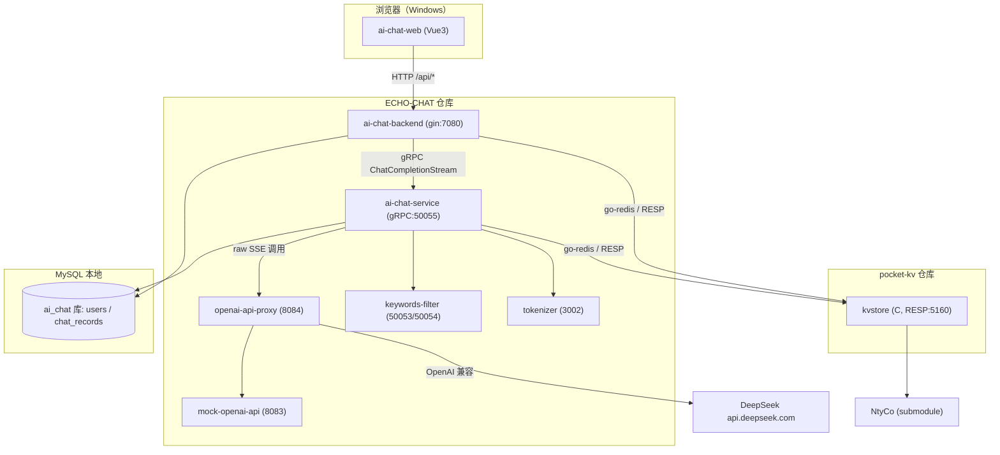
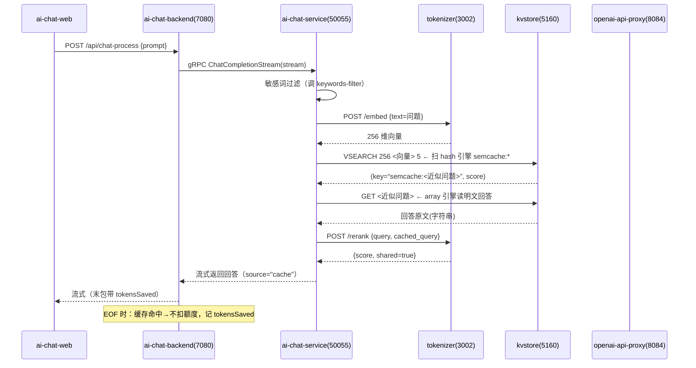
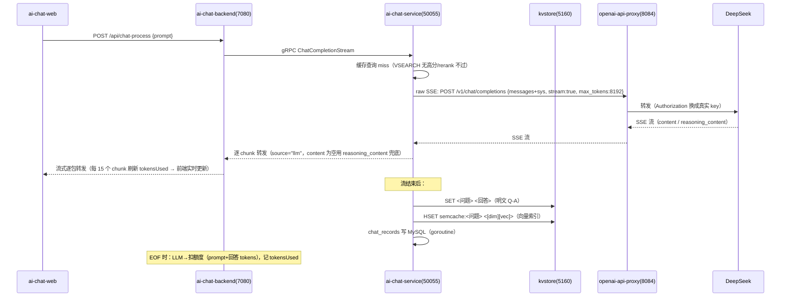
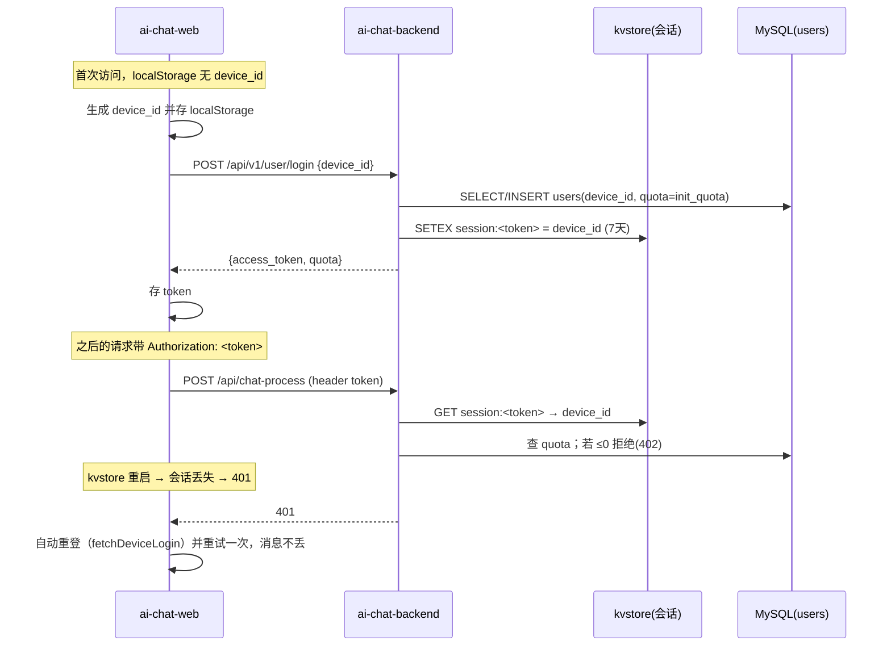

# ECHO-CHAT 项目结构与调用关系

> 更新时间：2026-09-02
> 本文档描述 ECHO-CHAT（ai 助手）与 pocket-kv（自研 KV 存储）两个独立仓库的结构、组件职责与完整调用关系。

---

## 1. 仓库总览（两个独立 repo）

```
github.com/robotlover-1/
├── ECHO-CHAT          ← AI 助手仓库（Go/Python/Vue3 微服务组）
│     ├── kvstore/     ← git submodule → pocket-kv（源码形式引入）
│     └── （其余全部 ai 组件）
│
└── pocket-kv          ← 自研 KV 存储仓库（C 语言，RESP 协议兼容 Redis）
      └── kvstore/NtyCo  ← git submodule → github.com/wangbojing/NtyCo
```

| 仓库 | 内容 | submodule |
|---|---|---|
| **ECHO-CHAT** | ai-chat-backend / ai-chat-service / ai-chat-web / openai-api-proxy / mock-openai-api / keywords-filter / tokenizer / ai-chat-stack / monitoring | `kvstore/` → pocket-kv |
| **pocket-kv** | `kvstore/`（C 存储源码）、Makefile、configs | `kvstore/NtyCo` |

**ECHO-CHAT 通过 submodule 拿到 kvstore 源码**，`make` 时编译出二进制 `kvstore/kvstore/kvstore`，运行时作为独立服务监听 5160。

**本地开发路径（当前）**
- ECHO-CHAT 工作副本：`~/Desktop/ls_study/proj/t1/ECHO-CHAT`、`t2/ECHO-CHAT`（t2 正在运行）
- pocket-kv 本地仓：`~/Desktop/ls_study/proj/kvstore`
- 历史大仓库 `9.1-kvstore`：仅作历史参考，不再维护

---

## 2. 组件清单

| 目录 | 技术 | 端口 | 职责 | 依赖 |
|---|---|---|---|---|
| `kvstore/`（submodule） | C | **5160** | 自研 KV 存储：array 引擎（SET/GET）、hash 引擎（HSET/HGET/VSEARCH） | NtyCo |
| `tokenizer/` | Python(nuxt) | **3002** | ①文本嵌入(词面哈希 256 维) ②rerank 关键词校验 ③tiktoken 计数 | 无 |
| `keywords-filter/` | Go(gRPC) | **50053/50054** | 敏感词过滤 / 关键词提取 | 无 |
| `mock-openai-api/` | Go(gin) | **8083** | 离线 mock LLM（无 key 调试用） | 无 |
| `openai-api-proxy/` | Go(gin) | **8084** | DeepSeek 反向代理（key 走环境变量/配置） | DeepSeek |
| `ai-chat-service/` | Go(gRPC) | **50055** | 对话编排核心：过滤→语义缓存→调 LLM；写多轮上下文/chat_records | proxy、keywords、tokenizer、kvstore、MySQL |
| `ai-chat-backend/` | Go(gin) | **7080** | HTTP 网关：鉴权/会话/扣额度/静态前端 | service、tokenizer、kvstore、MySQL |
| `ai-chat-web/` | Vue3+naive-ui | 浏览器 | 前端页面 | backend |

---

## 3. 服务启动顺序（`start.sh` → `lib.sh` 的 SERVICES）

启动顺序即依赖顺序，停止按逆序：

```
kvstore(5160) → tokenizer(3002) → sensitive(50053) → keyword(50054)
    → mock(8083) → proxy(8084) → service(50055) → backend(7080)
```

> 启动前先 `make kvstore`（编译 submodule 里的 C 存储）；`DEEPSEEK_API_KEY` 或 proxy 配置里填真实 key，否则 DeepSeek 401。

---

## 4. 整体调用架构图



---

## 5. 一次聊天的完整时序（两条路径）

### 5.1 路径 A：语义缓存命中（不调 LLM）



### 5.2 路径 B：未命中 → 调 LLM → 回写缓存



---

## 6. 登录 / 免密自动登录流程



---

## 7. 语义缓存内部机制

### 7.1 数据存储（明文，无 hash key）

```
array 引擎：  SET <原始问题> = <原始回答>        ← 人类可读，key/value 均原文
hash 引擎：  HSET semcache:<原始问题> = [u32 dim][float vec[dim]]   ← 向量索引（VSEARCH 只扫 hash）
```

> VSEARCH 只扫 hash 引擎中 `semcache:` 前缀条目，暴力余弦 top-k。

### 7.2 CacheQuery 步骤（ai-chat-service/semcache）

1. 问题 → tokenizer `/embed` → 256 维向量
2. `VSEARCH 256 <vec> 5` → 取 top1 (key, score)
3. score ≥ threshold(0.15)
4. key 剥 `semcache:` 前缀 → 缓存问题原文
5. `GET <缓存问题>` → 明文回答
6. `/rerank`（关键词交集，双方词性关键词都空也视为 shared）→ 通过
7. 命中 → 返回回答

### 7.3 缓存不命中/污染防护

- **空回答不写缓存**（防污染）
- **finish_reason=length（被截断）不写缓存**
- 截断时给前端补一句"⚠ 回答因长度限制被截断"

---

## 8. Tokens 统计与额度扣减

| 场景 | 动作 |
|---|---|
| LLM 回答（source="llm"） | EOF 时 tokenizer 数 `prompt+回答` → `DeductQuota`（扣 MySQL quota）；前端记 tokensUsed |
| 缓存命中（source="cache"） | 不扣额度；前端记 tokensSaved |
| 前端显示 | 总消耗=Σ tokensUsed；总节省=Σ tokensSaved（每次命中都计入，不封顶） |
| 实时刷新 | LLM 流式时后端每 15 个 chunk 更新一次 tokensUsed，前端随包刷新 |

> tokenizer 估算与真实计费偶尔差 ±1~2 tokens，属正常噪声。

---

## 9. 存储分工

| 数据 | 存储 | 读写方 |
|---|---|---|
| 用户 + 额度 | MySQL `users`(device_id/quota) | backend |
| 聊天记录 | MySQL `chat_records` | service |
| 会话 token | kvstore `session:<token>` | backend |
| 多轮上下文 | kvstore `ai_chat_service_*` | service |
| 语义缓存 Q-A（明文） | kvstore array `SET <问题> <回答>` | service |
| 语义缓存向量索引 | kvstore hash `semcache:<问题>` | service |
| DeepSeek key | proxy 配置/env（不提交 git） | 手动 |

---

## 10. 关键配置

| 配置 | 位置 |
|---|---|
| 服务端口/启动顺序 | `lib.sh` SERVICES |
| kvstore 端口/免密 | `configs/kvstore-ai.conf` |
| service 模型/redis/语义阈值/max_tokens | `ai-chat-service/dev.config.yaml`（max_tokens 8192） |
| backend 模型/init_quota/redis | `ai-chat-backend/dev.config.yaml` |
| proxy DeepSeek base_url/key | `openai-api-proxy/dev.config.yaml`（key 可用环境变量 DEEPSEEK_API_KEY 覆盖） |
| MySQL 连接 | 各 Go 组件 `dev.config.yaml` redis/mysql 段（root/123456，库 ai_chat） |

---

## 11. 维护备注（踩过的坑）

1. **推理模型截断**：deepseek-v4-flash 是推理模型，复杂题 content 常为空、答案在 `reasoning_content`；服务端 raw SSE 兜底显示 reasoning，且 **length 截断不写缓存**。
2. **删仓库/重新 clone 后 404**：旧进程残留占 7080，CWD 被删导致静态文件找不到 → 先 `./stop.sh` 清残留再 `./start.sh`。
3. **缓存命中只显示一部分**：缓存回答改为**每 100 字符一个 chunk** 流式（原来逐字符，8000 字符产生 8000 条 gRPC/HTTP 消息拖垮链路）。
4. **"红黑树是什么"这类短问题缓存不命中**：tokenizer rerank `shared` 需在双方词性关键词都空时视为共享。
5. **重启踢会话**：kvstore 重启后 session 全丢，前端遇 401 自动重登重试。
6. **ssh 限流**：高频 git 操作会触发 github SSH 风控；备用走 HTTPS + PAT（存 `~/.git-credentials`）。
